# 制造业CPQ深度研究报告 V2.0

> **适配行业**：装备制造 / 设备制造 / 组件制造 / 半导体设备制造  
> **版本**：V2.0（基于三专家评估修订）  
> **日期**：2026年6月6日  
> **定位**：用作CPQ产品设计参考的综合性方案文档

---

## 目录

- [第一部分：CPQ认知框架](#第一部分cpq认知框架)
  - [1.1 CPQ的本质定义](#11-cpq的本质定义)
  - [1.2 CPQ在Lead-to-Cash价值链中的定位](#12-cpq在lead-to-cash价值链中的定位)
  - [1.3 CPQ的产品形态演进](#13-cpq的产品形态演进)
  - [1.4 CPQ的业务价值量化](#14-cpq的业务价值量化)
- [第二部分：制造业CPQ场景分析](#第二部分制造业cpq场景分析)
  - [2.1 制造业四种生产模式与CPQ关系](#21-制造业四种生产模式与cpq关系)
  - [2.2 制造业CPQ的核心痛点](#22-制造业cpq的核心痛点)
  - [2.3 CPQ的九大基础数据域](#23-cpq的九大基础数据域)
  - [2.4 产品目录的5层结构模型](#24-产品目录的5层结构模型)
  - [2.4 扩展：产品生命周期状态机与EOL策略](#24-扩展产品生命周期状态机与eol策略)
  - [2.5 销售BOM与生产BOM的关系](#25-销售bom与生产bom的关系)
  - [2.5 扩展：多层级BOM全链路工程模型](#25-扩展多层级bom全链路工程模型)
  - [2.5 销售BOM与生产BOM的关系](#25-销售bom与生产bom的关系)
- [第三部分：CPQ关键能力框架](#第三部分cpq关键能力框架)
  - [3.1 配置引擎](#31-配置引擎)
  - [3.1 深化：配置器交互模型与需求翻译层](#31-深化配置器交互模型与需求翻译层)
  - [3.2 定价引擎](#32-定价引擎)
  - [3.2 定价引擎](#32-定价引擎)
  - [3.3 报价引擎](#33-报价引擎)
  - [3.4 审批工作流](#34-审批工作流)
  - [3.5 系统集成框架](#35-系统集成框架)
  - [3.6 售前协同与方案交付物体系](#36-售前协同与方案交付物体系)
  - [3.7 竞品对标与差异化配置引擎](#37-竞品对标与差异化配置引擎)
  - [3.8 销售赋能工具与知识管理体系](#38-销售赋能工具与知识管理体系)
  - [3.9 交期承诺(ATP/CTP)与配置联动](#39-交期承诺atpctp与配置联动)
  - [3.9 补充：生产约束+多工厂+包装物流](#39-补充生产约束多工厂包装物流)
- [第四部分：CPQ产品架构设计](#第四部分cpq产品架构设计)
  - [4.1 整体技术架构](#41-整体技术架构)
  - [4.2 核心数据模型](#42-核心数据模型)
  - [4.3 规则引擎设计](#43-规则引擎设计)
  - [4.3.X 配置引擎算法与工程实现](#43x-配置引擎的算法与工程实现)
  - [4.3 扩展：配置版本管理与What-if分析](#43-扩展配置版本管理与what-if分析)
  - [4.4 ATO模式设计](#44-ato模式设计)
  - [4.4.XA SBOM→MBOM→工艺BOM全链路转换](#44xa-sbommbom工艺bom全链路转换)
  - [4.4.XB MRP联动与BOM仿真验证](#44xb-mrp联动与bom仿真验证)
  - [4.5 安全权限与审计模型](#45-安全权限与审计模型)
  - [4.6 性能架构设计](#46-性能架构设计)
  - [4.4 ATO模式设计](#44-ato模式设计)
  - [4.4.XA SBOM→MBOM→工艺BOM全链路转换](#44xa-sbommbom工艺bom全链路转换)
  - [4.4.XB MRP联动与BOM仿真验证](#44xb-mrp联动与bom仿真验证)
  - [4.5 安全权限与审计模型](#45-安全权限与审计模型)
  - [4.6 性能架构设计](#46-性能架构设计)
- [第五部分：实施方法论](#第五部分实施方法论)
  - [5.1 CPQ实施路线图](#51-cpq实施路线图)
  - [5.X 数据迁移与系统切换策略](#5x-数据迁移与系统切换策略)
  - [5.Y 配置变更管理(ECN/ECO)流程](#5y-配置变更管理ecneco流程)
  - [5.2 关键成功要素](#52-关键成功要素)
  - [5.3 数据治理框架](#53-数据治理框架)
- [第六部分：市场格局与选型参考](#第六部分市场格局与选型参考)
  - [6.1 CPQ市场竞争格局](#61-cpq市场竞争格局)
  - [6.2 制造业CPQ选型矩阵](#62-制造业cpq选型矩阵)
  - [6.3 自研vs采购决策框架](#63-自研vs采购决策框架)
- [第七部分：AI+CPQ未来趋势](#第七部分ai-cpq未来趋势)
- [附录](#附录)

---

## 第一部分：CPQ认知框架

### 1.1 CPQ的本质定义

**CPQ = Configure + Price + Quote**，即**配置-定价-报价**的一体化业务流程。

CPQ不是一套软件功能，而是连接"客户购买意愿"到"企业收入实现"的关键业务流程。从Accenture的CPQ实践框架来看，CPQ的本质是：

> **通过产品知识的结构化、定价规则的自动化和报价流程的标准化，将复杂的"产品→客户"匹配过程从依赖个人经验的知识密集型工作，转化为可复用、可管控、可优化的系统化能力。**

从Apttus（现为Conga）的定义来看，CPQ是Quote-to-Cash（报价到现金）流程的核心组件。传统CRM管理"销售过程"和"客户关系"，但在报价环节往往出现断层——100%依赖人工记忆和Excel。CPQ填补了CRM与ERP之间的"配置-定价-报价"真空地带。

**CPQ的三个核心动作**：

| 动作 | 核心价值 | 解决的问题 |
|------|----------|-----------|
| **Configure（配置）** | 将产品知识转化为可结构化的选择规则 | 产品太多记不住、配置组合不会搭配、兼容性问题要到下单后才发现 |
| **Price（定价）** | 将定价策略转化为可执行的定价规则 | 折扣混乱、定价不一致、利润不可控、审批流程冗长 |
| **Quote（报价）** | 将配置和定价结果转化为专业报价文档 | 报价慢、错误多、格式不统一、无法追踪 |

### 1.2 CPQ在Lead-to-Cash价值链中的定位

根据Accenture的Lead-to-Cash流程模型，CPQ处于中心位置：

```
                      Lead to Cash 端到端价值链
┌─────────────┬──────────────┬───────────────┬──────────────┬──────────┐
│  Marketing   │  Opportunity  │    CPQ        │    Order     │ Contract │
│  Management  │  Management   │ (核心流程)     │  Management  │   +      │
│              │               │               │              │ Billing  │
├─────────────┼──────────────┼───────────────┼──────────────┼──────────┤
│ 市场活动      │ 商机生成       │ 配置          │ 订单编排      │ 合同创建   │
│ 线索生成      │ 销售预测       │ 定价管理       │ 订单履行      │ 发票创建   │
│ 需求生成      │ 区域管理       │ 报价管理       │ 供应链集成    │ 收入确认   │
│              │ 客户信用       │ 方案生成       │              │           │
└─────────────┴──────────────┴───────────────┴──────────────┴──────────┘
        上游流程                                              下游流程
                         基础设施（客户/产品/合作伙伴数据）
```

**CPQ不是孤岛**：它在Lead-to-Cash链中扮演"承上启下"的角色：
- **承上**：从CRM获取商机、客户、销售区域信息
- **启下**：向ERP/订单系统输出订单数据，向合同系统输出合同条款

PwC在多个CPQ项目中强调：CPQ流程与上游（市场营销、商机管理）和下游（订单管理、合同管理、计费发票）流程**必须一体设计**，否则会出现数据断点。

### 1.3 CPQ的产品形态演进

从PwC的知识分享和Mindray方案来看，CPQ经历了三代演进：

```
传统CPQ                        新一代CPQ                        AI驱动的CPQ
(Classic CPQ)                  (Modern CPQ)                    (AI-Powered CPQ)
                                                                  (2024+)
   │                              │                               │
   ├─ 产品配置器                   ├─ 传统CPQ全部能力               ├─ 生成式AI智能推荐
   ├─ 价格引擎                     ├─ 价值定价工具                  ├─ 自然语言配置
   ├─ 报价系统                     ├─ Guided Selling向导式销售      ├─ Agentic AI自主决策
   └─ 审批流程                     ├─ ROI/TCO计算器                ├─ 预测性洞察
                                  ├─ Sales Playbooks             └─ 跨渠道统一智能体
                                  ├─ 方案管理
                                  └─ 电子签章
```

**关键洞察**：从Mindray的方案来看，CPQ已不再是单纯的报价工具，而是**"可销售产品"从定义、配置、定价到交付的全生命周期管理**。新一代CPQ必须解决：
1. **产品设计的模块化** → 使配置选择可衍生
2. **基于价值的定价建模** → 使定价不再是成本加成
3. **销售效率提升** → 向导式销售降低对"牛人"的依赖

### 1.4 CPQ的业务价值量化

根据Aberdeen Group的研究数据（Apttus引用）：

| 指标 | 改善幅度 |
|------|---------|
| 平均交易规模提升 | **105%** |
| 报价方案产出量提升 | **49%** |
| 销售周期缩短 | **28%** |
| 达到配额的销售代表比例提升 | **26%** |
| 线索转化率提升 | **17%** |

实际客户案例（Apttus）：
- 新增交易规模增长 **30%**
- 续约合同价值增长 **20%**
- 非正常折扣减少 **25%**
- 报价时间缩短 **80%**
- 合同流程加速 **80%**

---

## 第二部分：制造业CPQ场景分析

### 2.1 制造业四种生产模式与CPQ关系

制造业的CPQ复杂度与生产模式密切相关。根据Mindray方案中的分析：

```
生产模式复杂度递增 →
┌──────────────┬──────────────┬──────────────┬──────────────┐
│     MTS      │     ATO      │     MTO      │     ETO      │
│ 按库存生产     │  按订单装配    │  按订单生产    │  按订单设计    │
├──────────────┼──────────────┼──────────────┼──────────────┤
│ 标准成品       │ 标准部件装配    │ 按客户需求     │ 为特定客户     │
│ 提前生产       │ 提前生产部件    │ 重新生产       │ 全新设计       │
│ 从库存发货     │ 按单组装       │ 按单采购原料    │ 每单可能不一样  │
├──────────────┼──────────────┼──────────────┼──────────────┤
│ CPQ复杂度：低  │ CPQ复杂度：高  │ CPQ复杂度：高  │ CPQ复杂度：最高 │
│ 标准SKU选择    │ 部件级配置     │ 参数化配置     │ 设计级配置     │
│ 简单定价       │ 复杂规则约束    │ 规则+定制      │ 完全定制       │
└──────────────┴──────────────┴──────────────┴──────────────┘
```

**制造业CPQ主要覆盖ATO和MTO场景**。以海能达（Hytera）为例：

**标准配置模式（国内）**：
- 梳理所有可下单的标准编码
- 在CPQ中通过筛选（产品系列→参数→定位）定位到具体SKU
- 646款机型，1056款配件
- 经过归一化梳理后预计减少40%-50%

**ATO定制模式（海外）**：
- 以标准配置为基础，通过增减配件形成定制配置
- PD785标准配置包含：主机 + 电池 + 充电器 + 电源适配器 + 天线 + 皮带夹...
- 海外定制需求包括：增减/替换配件（结构化）+ 定制语言/Logo/包装/软件（非结构化备注）
- 海外4976个整机编码中大部分为客户定制

**关键设计原则**：CPQ中的配置必须是**客户可理解的可销售产品**，其粒度不需要达到生产配置的要求。**销售BOM和生产BOM是两个不同的体系**。

### 2.2 制造业CPQ的核心痛点

综合Mindray、海能达、奥芯明三个实际案例，制造业CPQ的三大核心痛点具有高度共性：

#### 痛点一：产品目录与资料的统一发布

| 问题表现 | 根因 | 影响 |
|---------|------|------|
| 不知道公司可卖什么产品 | 没有统一的可销售产品目录 | 销售找不到产品，客户体验差 |
| 产品介绍材料难找到 | 产品资料分散，无统一知识库 | 销售效率低，信息准确性差 |
| 不知道产品是否停产 | 未建立统一的产品生命周期管理 | 卖了停产产品才发现，客户信任受损 |

#### 痛点二：产品销售、配置、报价的自动化管理

| 问题表现 | 根因 | 影响 |
|---------|------|------|
| 不知道怎么搭配产品 | 可销售产品的销售配置未标准化 | 依赖技术牛人，新销售上手慢 |
| 配置规则不清晰 | 产品间关系没有明确定义 | 报价错误，后续交付出问题 |
| 定价规则不透明 | 不同配置/区域/渠道价格缺少规则 | 利润不可控，折扣混乱 |

#### 痛点三：销售与供应链协作

| 问题表现 | 根因 | 影响 |
|---------|------|------|
| 销售预测不准确 | 缺少标准化的产品配置数据支撑 | 供应链计划不可靠，产能浪费 |
| 订单变更频繁 | 前期配置不准确，后期频繁修正 | 交付效率低，库存积压 |

#### 痛点总结：CPQ常见问题分析框架

从奥芯明项目的问题诊断来看，CPQ问题可归为三类：

| 类别 | 典型问题 |
|------|---------|
| **数据规范问题** | SBOM无数据源头、缺少数据规则无法集成、ATO编码复用率低、协议产品粒度太细 |
| **数据流程问题** | 审批找不到人（离职/调动）、ATO编码回填谁维护、线上线下并存有断点 |
| **系统工具问题** | 报价界面优化难、不支持系统产品配置、项目型销售被迫拆单 |

### 2.3 CPQ的九大基础数据域

CPQ项目的成功，**70%取决于数据准备情况**。来自Mindray和奥芯明方案的"九大基础数据"是制造业CPQ的**核心数据依赖**：

```
CPQ所依赖的九大基础数据
┌─────────────────────────────────────────────────────────────┐
│                                                             │
│  ⑨ 统计及分析模板          ① 产品目录                       │
│     价位分析、授权测算         销售产品目录、型号               │
│                                                             │
│  ⑧ 订单&交付数据管理       ② 解决方案&服务&备件              │
│     销售/生产/交付/验收       解决方案、服务、备件报价          │
│                                                             │
│  ⑦ MBOM及配置规则          ③ 基础属性集成                   │
│     MBOM及SBOM→MBOM         产品的销售范围、生命周期            │
│     转换规则                 产品重量、体积、功耗等            │
│                                                             │
│  ⑥ 价格信息集成            ④ SBOM及配置规则                 │
│     全球目录价、区域价        销售清单SBOM及配置规则            │
│     渠道价格                                              │
│                             ⑤ 报价参数及配置规则              │
│                                销售/售前确认的产品关键参数       │
│                                提示和校验规则                  │
└─────────────────────────────────────────────────────────────┘
```

**数据就绪度检查清单**（每个数据域必须在CPQ实施前至少达到60%就绪度）：

| 数据域 | 就绪度判断标准 | 准备责任方 |
|--------|-------------|-----------|
| ① 产品目录 | 有完整的可销售产品清单，按5层结构组织 | 产品管理/GTM |
| ② 解决方案&服务&备件 | 服务产品、备件与主机产品的关系已定义 | 服务/备件管理 |
| ③ 基础属性 | 产品重量/体积/功耗等数据可获取 | 研发/PLM |
| ④ SBOM及配置规则 | 销售BOM已定义，配置规则已梳理 | 研发/产品线 |
| ⑤ 报价参数及配置规则 | 关键参数已识别，校验规则已定义 | 售前/产品线 |
| ⑥ 价格信息 | 目录价、区域价、渠道价已梳理 | 定价/财务 |
| ⑦ MBOM及配置规则 | 生产BOM已定义，SBOM→MBOM转换规则明确 | 研发/供应链 |
| ⑧ 订单&交付数据 | 订单状态、交付节点数据可获取 | 供应链/IT |
| ⑨ 统计及分析模板 | 报价分析、授权测算模板已定义 | 业务运营 |

**关键经验**：海能达项目中CPQ项目组投入了**24.5人/天**的数据梳理人力（涉及供应链、营销、研发多部门），且反复强调"希望每个产品线CPQ接口人与项目组**集中办公**"——这说明CPQ数据梳理是**高度跨部门协作**的工作，单纯的IT项目无法完成。

### 2.4 产品目录的5层结构模型

从海能达和Mindray的实际项目经验中，制造业产品目录需要遵循**5层结构**：

```
层级       名称           定义                              示例(海能达)
──────────────────────────────────────────────────────────────────
Lvl.1     产品线          面向市场的最高分类                   窄带对讲机与集群
           (Product Line)
──────────────────────────────────────────────────────────────────
Lvl.2     产品族          技术规格大致相同的产品群              DMR/PDT数字对讲机
           (Product       用于市场推广、产品手册、
            Family)       营销/销售分析
──────────────────────────────────────────────────────────────────
Lvl.3     产品系列        按功能/特性参数归类                   BD300系列
           (Product       贯穿业务与研发的中间层
            Series)       销售预测的颗粒度
──────────────────────────────────────────────────────────────────
Lvl.4     产品/机型       能独立销售的产品实体                  BD300, BD302
           (Product/      拉通公司产品分层，所有目录
            Model)        最终归集到此层
──────────────────────────────────────────────────────────────────
Lvl.5     产品编码/配置    产品的唯一配置组合                   10040010000001
           (Product Code/ 用于研发内部管理产品生命周期
            Configuration) CPQ配置器规则的颗粒度
──────────────────────────────────────────────────────────────────

外部销售视角 ←──── 分类和场景 ────→ 内部管理视角
        (L1-L3)                    (L4-L5)
```

**CPQ中的功能分层**：
- **Feature Category**：功能大类（对应L1-L2）
- **Feature**：功能项（对应L3）
- **Options**：可选项（对应L4-L5的配置参数）

**"定价项"与"交付项"分离原则**：
- CPQ中的报价颗粒（定价项）可能与实际交付的物理实体（交付项）不一致
- 例如：一个解决方案报价包含"主机+配件+服务+License"，但交付时主机和配件可能分为不同的物理包装


---

### 2.4 扩展：产品生命周期状态机与EOL策略

## 2.4 扩展 — 产品生命周期状态机与EOL策略

### 一、完整的生命周期状态机

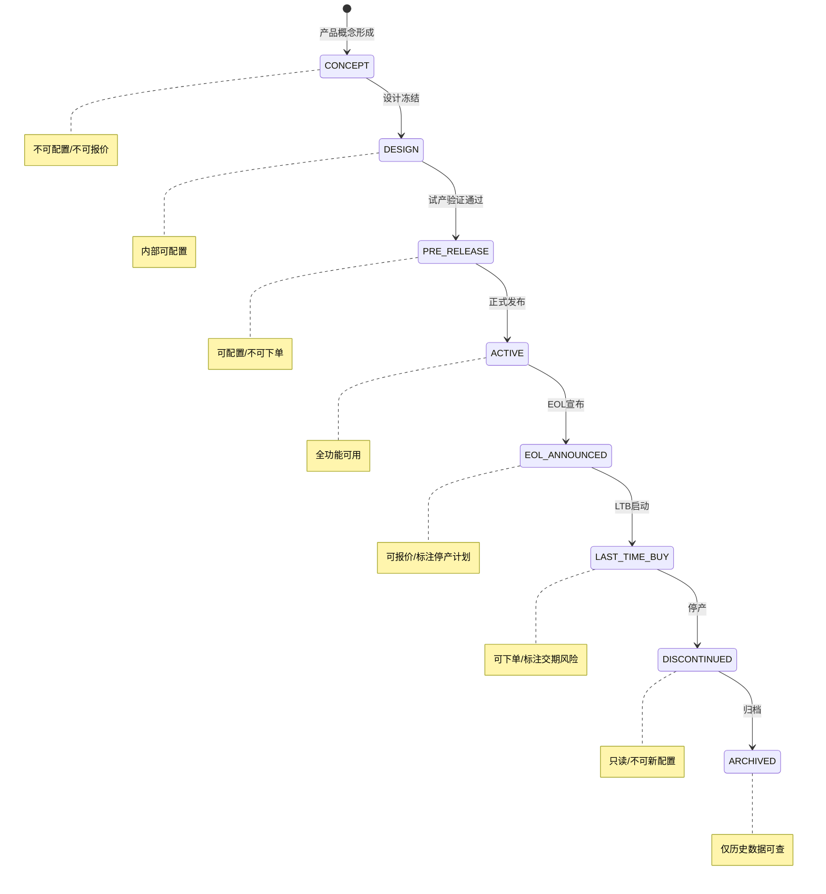

### 二、各状态操作矩阵

| 状态 | 可配置 | 可报价 | 可下单 | 可生产 | 可搜索 | 说明 |
|------|:---:|:---:|:---:|:---:|:---:|------|
| **CONCEPT** | ✗ | ✗ | ✗ | ✗ | ✗ | 仅研发内部可见 |
| **DESIGN** | ✓(内部) | ✗ | ✗ | ✗ | ✗ | 产品经理可预览配置 |
| **PRE_RELEASE** | ✓ | ✓(预报价) | ✗ | ✗ | ✓ | 售前可出方案，不可下单 |
| **ACTIVE** | ✓ | ✓ | ✓ | ✓ | ✓ | 全功能激活 |
| **EOL_ANNOUNCED** | ✓ | ✓ | ✓ | ✓ | ✓ | 标注"即将停产"、"替代型号XXX" |
| **LAST_TIME_BUY** | ✓(限制) | ✓ | ✓ | ✓(最后批次) | ✓ | 标注交期风险、MOQ调整 |
| **DISCONTINUED** | ✗ | ✗ | ✗ | ✗ | ✓(只读) | 历史数据保留 |
| **ARCHIVED** | ✗ | ✗ | ✗ | ✗ | ✓(归档) | 仅在数据归档库可查 |

### 三、EOL管理策略

**EOL宣布后的处理规则**：

```
EOL宣布 → 已发出报价单处理矩阵
═══════════════════════════════════════════════════════

报价单状态    处理规则
─────────────────────────────────────────────────────
草稿(DRAFT)     系统自动标注"含EOL产品"，建议销售联系客户确认
已提交(SUBMITTED) 报价有效期缩短为30天（原可能90天）
已批准(APPROVED)  保留原有效期，但新下单时强制提示EOL风险
已过期(EXPIRED)  重新报价时自动推荐替代产品
```

**Last Time Buy (LTB) 期的特殊处理**：

| 维度 | LTB期处理规则 |
|------|-------------|
| **配置** | 仍可配置，但选项旁标注"LTB"标记 |
| **交期** | 自动标识为"存在交期风险"，交期承诺需人工确认 |
| **数量** | 不设MOQ限制（原MOQ=50，LTB期可单台下单） |
| **价格** | 可能上浮（反映小批量生产成本，需审批） |
| **库存** | 提前锁定LTB预测库存，避免超卖 |

### 四、产品升级路径（Upgrade Path）

**N→M替代关系模型**：

```
替代关系矩阵
═══════════════════════════════════════════════════════

替代类型分类：
┌──────────┬──────────────────────────────────────────┐
│ 完全替代  │ PD785 → PD785G (新一代)                   │
│ (F-F)    │ 功能完全覆盖，价格差 +15%                   │
├──────────┼──────────────────────────────────────────┤
│ 条件替代  │ BD302 (国内) → BD352 (国内)               │
│ (F-C)    │ 新功能：增加蓝牙，成本增加                   │
│          │ 如客户不需要蓝牙 → 推荐BD312               │
├──────────┼──────────────────────────────────────────┤
│ 拆分替代  │ 单一产品被多个专用产品取代                   │
│ (1:N)    │ 例：通用电源→按功率分3款专用电源            │
├──────────┼──────────────────────────────────────────┤
│ 聚合替代  │ 多个旧产品被一个新产品覆盖                   │
│ (N:1)    │ 例：3款不同频段机型→全频段机型              │
└──────────┴──────────────────────────────────────────┘
```

**升级费用计算模型**：

```
升级费用 = 新设备价格 − 折旧残值 + 升级服务费 + 兼容性适配费

其中：
- 折旧残值 = 原购买价 × (1 − 已使用月数 / 折旧月数)
- 升级服务费 = 现场安装 + 数据迁移 + 培训
- 兼容性适配费 = 原有配件是否需要更换（如不兼容）
```

### 五、配置兼容性窗口与产品兼容性矩阵

```
产品兼容性矩阵设计
═══════════════════════════════════════════════════════

          配件/外设
          天线V1  天线V2  电池2000  电池2500  充电器D1  充电器D2
主机  ────────────────────────────────────────────────────────
PD785      ✓       ✓       ✓        ✗         ✓        ✗
PD785G     ✗       ✓       ✓        ✓         ✗        ✓
BD302      ✓       ✗       ✓        ✗         ✓        ✗
BD352      ✓       ✓       ✓        ✓         ✗        ✓

图例：✓ 兼容  ✗ 不兼容
```

**兼容性窗口管理**：当新旧版本产品处于过渡期时，配件兼容期的管理策略是：新配件发布后保留旧配件供应至少6个月，确保存量设备维护需求；旧配件停产前3个月通知所有存量客户并提供最后采购窗口。

---

### 2.5 销售BOM与生产BOM的关系

这是制造业CPQ**最核心的概念区分**之一，直接来自Mindray方案：

```
                    面向客户/销售                 面向内部/生产
                    ────────────                 ────────────
                    
                    销售BOM(SBOM)                生产BOM(MBOM)
                    ┌──────────┐                ┌──────────┐
                    │ 可销售产品 │ ──转换──▶      │ 可生产产品 │
                    │ 客户语言   │                │ 工程语言    │
                    │ 非唯一     │                │ 必须唯一    │
                    │ 可重用     │                │ 精确粒度    │
                    └──────────┘                └──────────┘
                         │                            │
                         ▼                            ▼
                    CPQ配置器                     ERP/MES
                    (销售使用)                    (生产使用)
```

**为什么需要两套BOM？**

1. **销售BOM是面向客户的**：使用客户语言（如"高配版"、"含GPS"、"2000mAh电池"），粒度不需要精确到产线识别
2. **生产BOM是面向产线的**：使用工程语言（如物料编码、工艺路线），必须是唯一且精确的
3. **转换的必要性**：销售配置是**属性驱动**的（客户选"频段=66-88MHz"），而生产BOM是**物料驱动**的（对应特定天线型号AN0375H10）。两个体系服务于不同的管理领域，不能混淆。

**SBOM→MBOM转换的四种典型场景**：

| 场景 | 说明 | 示例 |
|------|------|------|
| 1:1直接映射 | 销售配置唯一对应一个生产BOM | 标准成品 |
| N:1聚合映射 | 多个销售配置对应同一个生产BOM | 仅包装/标签不同 |
| 1:N分解映射 | 一个销售配置需拆分为多个生产工单 | 解决方案含多个独立产品 |
| 参数驱动生成 | 销售配置参数动态推导生产BOM | ATO定制配置 |

---


---

### 2.5 扩展：多层级BOM全链路工程模型

## 2.5 扩展——多层级BOM全链路工程模型

> **原报告基础**：2.5 销售BOM与生产BOM的关系（销售BOM vs 生产BOM两套体系）  
> **新增深度**：五级BOM链、Phantom处理、变体BOM、展开/压缩/差异分析引擎

### 2.5.1 BOM层级全链路（5级BOM模型）

制造业产品从"工程设计"到"最终交付"经历了多个BOM视图的转换。只管理SBOM和MBOM是不够的，完整链路是**五级BOM模型**：

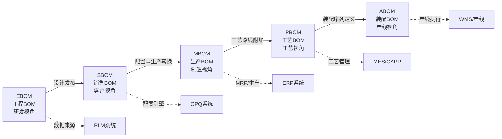

**五级BOM对比表**：

| BOM层级 | 所有者 | 数据特征 | 粒度 | 变动频率 | 典型属性 |
|---------|--------|---------|------|:------:|---------|
| **EBOM** | 研发/PLM | 设计结构、功能层级 | 功能组件 | 低 | 设计版本、图纸号、材料规格 |
| **SBOM** | 销售/CPQ | 可销售产品、配置选项 | 销售单元 | 中 | 目录价、替换组、必选/可选标记 |
| **MBOM** | 工艺/ERP | 制造物料、加工步骤 | 制造物料 | 中 | 物料编码、用量、损耗率、替代料 |
| **PBOM** | 工艺/CAPP | 工艺路线、工时定额 | 工序级 | 低 | 工作中心、标准工时、工装夹具 |
| **ABOM** | 产线/MES | 装配顺序、站位分配 | 装配步 | 低 | 站位号、装配顺序、节拍时间 |

**以海能达PD785对讲机的五级BOM链**：

| BOM层级 | 典型结构 | 示例 |
|---------|---------|------|
| **EBOM** | PD785整机 → 射频模块 → 天线匹配电路 → 电容/电感... | 研发版本v3.2，图纸DW785-001 |
| **SBOM** | PD785整机 → 主机 + 天线(GPS/VHF/UHF可选) + 电池(标准/高容可选) + 充电器 | 客户选择的配置组合 |
| **MBOM** | PD785整机 → 主板组件(编码MC-785) → 物料清单(电阻R23-1KΩ×2...) | 含损耗率(主板良率98%) |
| **PBOM** | MC-785主板 → SMT贴片(工序10) → 回流焊(工序20) → AOI检测(工序30) | 工作中心WC-SMT1，工时15min |
| **ABOM** | 整机总装 → 站位1:装入主板 → 站位2:焊接天线座 → 站位3:扣合外壳 | 站位1工时45s，站位2工时30s |

### 2.5.2 Phantom Item（虚项/幻影项）处理

**虚项定义**：SBOM中需要展示给客户的结构节点，但在MBOM中不作为独立物料编号存在——其子项在SBOM→MBOM转换时"上浮"到父节点。

**典型场景**：

| 场景 | 虚项示例 | 原因 |
|------|---------|------|
| **销售套包** | "车载套包"（虚项）→ 车载充电器 + 吸盘天线 + 手咪 | 客户认知为一个"套包"，但生产就是3个独立物料 |
| **工艺中间件** | "焊接前主板组件"（虚项）→ PCB + 元件A + 元件B | 工艺步骤的产物，非独立库存物料 |
| **暂态组合** | "测试后成品"（虚项）→ 主机 + 测试夹具 | 仅在产线上存在，不入库 |
| **特征组合** | "防水处理套件"（虚项）→ 密封圈×3 + 防水胶×1 | 仅是工艺流程的标记，非销售/库存物品 |

**SBOM→MBOM转换时的虚项跳过+子项上浮算法**：

```
function FLATTEN_BOM_WITH_PHANTOM_SKIP(sbom_node):
    // 递归展开SBOM树，跳过虚项节点，将子项提升到父节点层级
    
    result_items = []  // 最终的MBOM物料列表
    
    for each child in sbom_node.children:
        if child.is_phantom:
            // 虚项：跳过自身，递归展开子项直接挂到当前层级
            flattened_children = FLATTEN_BOM_WITH_PHANTOM_SKIP(child)
            // 子项的用量乘以虚项的用量系数
            for each fc in flattened_children:
                fc.quantity *= child.quantity
            result_items.extend(flattened_children)
        else:
            // 非虚项：保留该物料
            mfg_item = CONVERT_TO_MFG_ITEM(child)
            result_items.append(mfg_item)
            // 继续展开子项（子项归属该物料）
            if child.children:
                mfg_item.components = FLATTEN_BOM_WITH_PHANTOM_SKIP(child)
    
    return result_items

// 示例：
// SBOM: PD785车载套包(虚项, qty=1)
//         ├─ 车载充电器(实项, qty=1)
//         └─ 天线套包(虚项, qty=2)
//               ├─ 吸盘底座(实项, qty=1)
//               └─ 天线杆(实项, qty=1)
//
// MBOM转换后:
//   车载充电器(实项, qty=1)
//   吸盘底座(实项, qty=2)   ← 子项上浮，qty=1×2=2
//   天线杆(实项, qty=2)     ← 子项上浮，qty=1×2=2
```

### 2.5.3 变体BOM与150% BOM模式

**150% BOM概念**：定义包含产品**所有可能配置变体**的超集BOM（即"150%"的物料），再通过**配置规则过滤**出特定客户订单实际需要的物料子集（即"100% BOM"）。

**150% BOM vs 多套独立BOM对比**：

| 维度 | 150% BOM + 配置过滤 | 多套独立BOM |
|------|:------------------:|:----------:|
| **BOM维护量** | 单一超集BOM，一处更新 | N套BOM需逐套维护 |
| **一致性保证** | 天然一致 | 需要工具保证一致性 |
| **新增变体成本** | 仅添加配置规则 | 创建全新BOM |
| **查询复杂度** | 需要规则过滤 | 直接查询 |
| **适用场景** | 高变体、同平台产品 | 异构产品、低变体 |
| **BOM膨胀风险** | 超集BOM可能很大 | 分散在N个文件中 |
| **配置可视化** | 需要规则引擎配合 | 简单直接 |

**150% BOM过滤算法**：

```
function FILTER_150_PCT_BOM(bom_150pct, config_selections):
    // 输入: 150% BOM超集 + 用户配置选择
    // 输出: 100% BOM（仅含该配置需要的物料）
    
    result = BOMNode(type="100%_BOM")
    
    for each node in bom_150pct:
        // 检查该节点的"有效性条件"
        if node.effectivity_condition is not None:
            if not EVALUATE_CONDITION(node.effectivity_condition, config_selections):
                continue  // 该节点对当前配置无效，跳过
        
        // 检查该节点与已选配置的兼容性
        if not CHECK_COMPATIBILITY(node, config_selections):
            continue
        
        // 复制节点到结果
        filtered_node = COPY_NODE(node)
        result.add_child(filtered_node)
    
    return result

// 示例：150% BOM片段
// 天线节点:
//   ├─ VHF天线 [条件: 频段∈{66-88, 136-174}]        ← 用户选350-400MHz，跳过
//   ├─ UHF天线 [条件: 频段∈{350-400, 806-941}]      ← 有效，保留
//   ├─ GPS天线 [条件: 功能含GPS]                      ← 用户含GPS，保留
//   └─ 通用天线 [条件: 频段∈{66-941} ∧ 无特殊需求]   ← 条件冲突，跳过
```

### 2.5.4 BOM展开引擎

**BOM展开算法**：从顶层产品递归解析所有物料需求。

```
// BFS层序遍历展开（适合需要按层级展示的场景）
function BOM_EXPAND_BFS(product, quantity):
    result = []  // 展开后的BOM行列表
    queue = [(product, quantity, 0)]  // (节点, 需求量, 层级)
    
    while queue is not empty:
        (node, req_qty, level) = queue.dequeue()
        
        if node.type == MATERIAL:  // 叶子物料节点
            result.append({
                level: level,
                item_code: node.code,
                item_name: node.name,
                quantity: req_qty,
                unit: node.unit
            })
        else:  // 装配件，继续展开
            for each child in node.children:
                child_qty = req_qty * child.quantity
                queue.enqueue((child, child_qty, level + 1))
    
    return result

// DFS深度优先展开（适合物料需求合并、多层汇总）
function BOM_EXPAND_DFS_WITH_MERGE(product, quantity):
    material_map = {}  // 物料编码 → 汇总数量
    
    function DFS_EXPAND(node, parent_qty):
        if node.type == MATERIAL:
            material_map[node.code] = material_map.get(node.code, 0) + parent_qty
        else:
            for each child in node.children:
                DFS_EXPAND(child, parent_qty * child.quantity)
    
    DFS_EXPAND(product, quantity)
    return material_map  // 扁平化物料需求清单（同类物料已合并）
```

**多层缓存策略**：

| 缓存层 | 缓存内容 | 缓存键 | TTL | 失效触发 |
|--------|---------|--------|:--:|---------|
| **L1: 节点缓存** | 单个BOM节点的展开结果 | `node_id + config_hash` | 永久(规则不变时) | 该节点BOM变更 |
| **L2: 产品缓存** | 完整产品的展开结果 | `product_id + config_hash` | 24小时 | 产品BOM/SBOM变更 |
| **L3: 热点缓存** | 高频配置的展开结果 | `config_signature + qty` | 1小时 | 规则/价格变更 |
| **L4: 分布式缓存** | 跨实例共享的展开结果 | 同上 | 同上 | 同上 |

### 2.5.5 BOM差异分析（BOM Diff）引擎

给定两个配置产生的BOM，计算它们之间的增/删/改差异。

```
// BOM差异分析算法
function BOM_DIFF(bom_a, bom_b):
    diff = DiffResult()
    
    // 步骤1: 构建物料索引
    map_a = INDEX_BY_CODE(FLATTEN_BOM(bom_a))
    map_b = INDEX_BY_CODE(FLATTEN_BOM(bom_b))
    
    all_codes = UNION(keys(map_a), keys(map_b))
    
    for each code in all_codes:
        item_a = map_a.get(code)
        item_b = map_b.get(code)
        
        if item_a is None:
            diff.added.append(item_b)  // B新增、A没有
        elif item_b is None:
            diff.removed.append(item_a) // A有、B删除
        elif item_a.quantity != item_b.quantity:
            diff.modified.append({      // 数量变更
                item: item_a,
                old_qty: item_a.quantity,
                new_qty: item_b.quantity,
                delta: item_b.quantity - item_a.quantity
            })
        // else: 相同，不列入差异
    
    // 步骤2: 结构化层级差异
    diff.structure_changes = COMPUTE_STRUCTURAL_DIFF(bom_a, bom_b)
    
    return diff

struct DiffResult:
    added: List[BOMItem]           // 新增物料
    removed: List[BOMItem]         // 删除物料
    modified: List[ModifiedItem]   // 数量变更
    structure_changes: List[str]   // 结构层级变化描述
    cost_delta: Decimal            // 成本变化汇总
```

### 2.5.6 BOM压缩（BOM Implosion）

给定一组物料需求，反向推导最优产品组合。

```
function BOM_IMPLOSION(material_demands, catalog):
    // 输入: 物料需求 {物料编码: 数量}，产品目录
    // 输出: 最优产品组合（最少产品数量满足所有物料需求）
    
    candidates = []
    
    for each product in catalog:
        // 展开每个候选产品的BOM
        product_bom = BOM_EXPAND(product, qty=1)
        
        // 计算该产品能覆盖多少物料需求
        coverage = {}
        for each item in product_bom:
            if item.code in material_demands:
                covered = min(item.quantity, material_demands[item.code])
                coverage[item.code] = covered
        
        if coverage:
            candidates.append({
                product: product,
                coverage: coverage,
                coverage_pct: sum(coverage.values()) / sum(material_demands.values())
            })
    
    // 贪心选择：优先选择覆盖度最高的产品
    candidates.sort_by(coverage_pct, descending=true)
    
    result = []
    remaining = material_demands.copy()
    
    for each candidate in candidates:
        if not remaining:
            break
        
        // 计算需要该产品的数量
        needed_qty = INFINITY
        for each (code, qty) in candidate.coverage:
            if qty > 0:
                needed_qty = min(needed_qty, floor(remaining[code] / qty))
        
        if needed_qty > 0:
            result.append({product: candidate.product, qty: needed_qty})
            // 扣减已满足的需求
            for each (code, qty) in candidate.coverage:
                remaining[code] -= needed_qty * qty
    
    return result
```

---

## 第三部分：CPQ关键能力框架

### 3.1 配置引擎（Configure）

#### 3.1.1 配置引擎的核心能力矩阵

基于Accenture产品建模设计原则和PwC配置策略，制造业CPQ的配置引擎需要具备以下核心能力：

```
配置引擎能力矩阵
┌─────────────────────────────────────────────────────────────┐
│                                                             │
│  ① 约束型配置规则 (Constraint-Based Rules)                  │
│     ├─ 兼容性规则：Part A 与 Part B 能否共存               │
│     ├─ 必选/可选规则：选A必须同时选C                         │
│     ├─ 互斥规则：选A就不能选B                               │
│     ├─ 数量规则：选A则B的数量必须在[1,5]                     │
│     └─ 依赖规则：选A的前提是已选B                           │
│                                                             │
│  ② 多模式配置体验                                           │
│     ├─ 向导式配置（Guided Selling）：问答式引导              │
│     ├─ 专家模式：直接操作全部选项                            │
│     ├─ 方案模板：预置行业方案一键选择                        │
│     └─ 搜索式配置：按参数搜索定位产品                        │
│                                                             │
│  ③ 配置策略能力                                             │
│     ├─ Custom Model：动态定制模型                            │
│     ├─ Recommended Products：智能推荐                        │
│     ├─ Industry Solution Package：行业方案包                 │
│     ├─ Feasibility Approval：可行性审批                       │
│     ├─ Sales Bundle：销售捆绑                                │
│     └─ Selling Guidance：销售引导                            │
│                                                             │
│  ④ 产品建模设计原则（Accenture）                             │
│     ├─ 属性驱动规则 > 产品驱动规则                           │
│     ├─ 数据驱动规则 > 硬编码规则                             │
│     ├─ 组合式建模（大模型由小模型组装）                       │
│     ├─ 声明式 > 过程式                                       │
│     └─ 批量验证 > 实时逐条验证                               │
└─────────────────────────────────────────────────────────────┘
```

#### 3.1.2 Accenture产品建模六大设计原则

| 原则 | 说明 | 举例 |
|------|------|------|
| **属性驱动规则** | 用产品属性而非具体产品来写规则 | "所有支持GPS的设备必须配GPS天线" 而非 "PD785-GPS配AN0375" |
| **数据驱动规则** | 规则行为由可动态更新的数据控制 | 价格规则从"if product=X then price=Y"变为"从价格表中读取对应行" |
| **组合式建模** | 大模型由小模型装配而成 | 主机模型 + 配件模型 + 服务模型 = 完整销售配置 |
| **引导式 vs 专家式** | 根据销售团队构成选择交互模式 | 新销售用引导模式，资深销售用专家模式 |
| **自助 vs 呼叫中心** | 面向最终客户还是内部销售 | 客户端：防止混淆、提供帮助信息；内部：更多交叉销售和向上销售 |
| **一模型 vs 多模型** | 权衡模型复用和维护成本 | 小模型易复用但数量多难管理；大模型性能可能下降 |

#### 3.1.3 制造业配置引擎的特殊要求

| 能力 | 说明 | 典型场景 |
|------|------|---------|
| **BOM感知配置** | 配置选择能实时反映BOM变化 | 选择不同频段→自动切换天线型号 |
| **ATO参数化配置** | 支持属性级别的装配件选择 | 海能达：频段+声码器+功率+语言的多维参数组合 |
| **可行性校验** | 配置阶段即检查技术可行性 | 选配的组件组合是否可实现 |
| **替代品推荐** | 停产产品自动推荐替代方案 | 某型号停产，推荐功能等效的新型号 |
| **定制需求捕获** | 支持非结构化的定制需求录入 | 语言定制、Logo定制、包装定制等 |
| **多级配置校验** | 组件级→产品级→方案级的逐级校验 | 配件兼容→整机可行→方案完整 |


---

### 3.1 深化：配置器交互模型与需求翻译层

## 3.1 深化 — 配置器交互模型与需求翻译层

*(本章节是对原报告3.1配置引擎的深化补充)*

### 配置状态机

一个配置方案从创建到完成的全生命周期通过状态机进行管理：

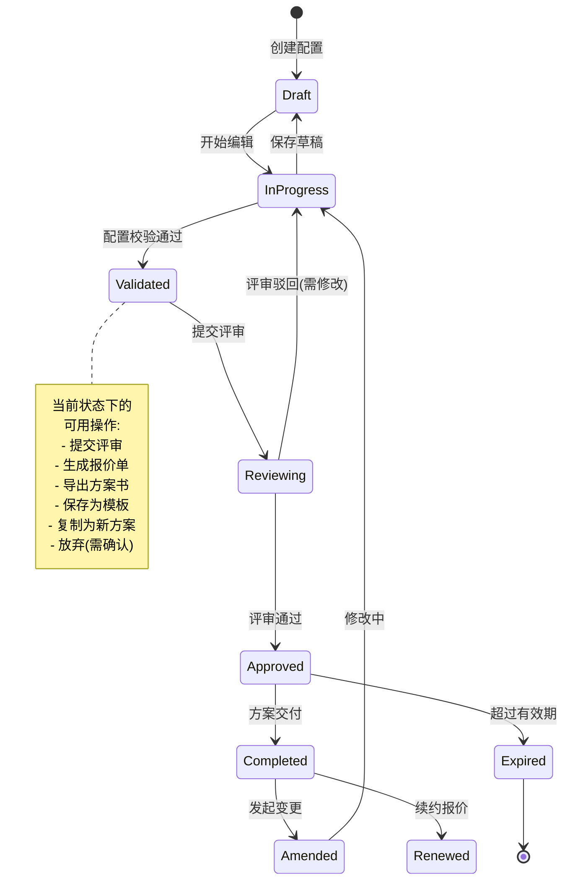

**状态转换权限控制**：

| 状态转换 | 可操作角色 | 前置条件 |
|---------|-----------|---------|
| Draft → InProgress | 销售/售前 | 配置至少有一个产品行 |
| InProgress → Validated | 系统自动 | 所有必选配置项完成+兼容性校验通过 |
| Validated → Reviewing | 售前/销售 | 非标准配置必须评审 |
| Reviewing → Approved | 评审人 | 所有评审维度通过或条件通过 |
| Completed → Amended | 销售/售前 | 配置未被锁定(交付前允许修改) |

### Option Availability Model

配置器中每个选项（Option）有四种可用性状态，直接决定了UI呈现：

| 状态 | 含义 | UI呈现 | 触发条件示例 |
|------|------|--------|------------|
| **Available** | 可选择，标准可用 | 正常显示 | 无冲突的选项 |
| **Disabled(reason)** | 不可选择，带原因说明 | 灰色+问号图标+hover显示原因 | 与已选项冲突、不兼容 |
| **Hidden** | 不可选择，不显示 | 完全隐藏 | 当前选择模式下永不可用 |
| **Recommended** | 推荐选择 | 绿色高亮+推荐标签 | 基于最佳实践/利润最优/库存充沛 |

**Option状态计算的JSON Schema**：

```json
{
  "optionAvailability": {
    "optionId": "OPT-BATTERY-3000",
    "optionLabel": "高容量电池 BP-3000",
    "states": {
      "current": "AVAILABLE",
      "statusHistory": [
        {"state": "HIDDEN", "when": "productFamily != 'DMR'"},
        {"state": "DISABLED", "when": "selected: chargeMode='desktop'", "reason": "BP-3000仅支持座充模式"},
        {"state": "RECOMMENDED", "when": "scenario='outdoor_long_range' AND budget='high'", "reason": "户外长距离场景续航优先"}
      ]
    },
    "disabledReasons": [
      {
        "reasonCode": "COMPATIBILITY_CONFLICT",
        "message": "高容量电池与当前选择的座充模式不兼容",
        "conflictingOption": "chargeMode: desktop_charger"
      }
    ]
  }
}
```

**状态计算引擎架构**：

```
用户每次选项变更
        │
        ▼
┌───────────────────────────┐
│  规则评估引擎              │
│  对所有未选Option重新计算   │
│  状态(基于当前配置快照)     │
└───────────┬───────────────┘
            │
            ▼
┌───────────────────────────┐
│  状态分配                  │
│  ├─ 有冲突 → DISABLED      │
│  ├─ 被依赖规则隐藏 → HIDDEN │
│  ├─ 推荐规则匹配 → RECOMMENDED │
│  └─ 默认 → AVAILABLE      │
└───────────┬───────────────┘
            │
            ▼
    前端UI实时更新选项呈现
```

### 渐进式披露（Progressive Disclosure）

在复杂制造业配置中（数百个可配置参数），一次性展示所有选项会导致认知过载：

```
渐进式披露设计原则
═══════════════════════════════════════

阶段1: 需求场景确认 (3-5个问题)
  ├─ "客户所属行业？" → 石油化工 / 公共安全 / 轨道交通 / ...
  ├─ "主要使用场景？" → 日常巡检 / 应急指挥 / 调度中心 / ...
  └─ "项目预算级别？" → 经济型 / 标准型 / 高端型

阶段2: 核心参数选择 (5-10个关键参数)
  ├─ "通信制式？" → DMR / TETRA / PDT
  ├─ "频段范围？" → VHF 66-88MHz / UHF 350-400MHz / ...
  └─ "覆盖范围？" → 单站 / 多站 / 组网

阶段3: 详细配置 (根据阶段1-2确定的范围展开)
  ├─ 配件选择（天线/电池/充电器/耳机...）
  ├─ 软件选项（加密/定位/调度...）
  └─ 服务选项（质保/培训/运维...）

每阶段根据前序选择动态调整后续选项范围
```

**披露规则引擎**：

```json
{
  "disclosureRule": {
    "ruleId": "DR-021",
    "name": "石油化工场景→防爆相关选项展开",
    "trigger": {
      "when": "scenario='petrochemical'",
      "expandSections": ["explosion_proof_options", "intrinsically_safe_accessories"],
      "collapseSections": ["non_industrial_accessories"]
    },
    "optionFilter": {
      "showOnly": ["certLevel='ATEX' OR certLevel='IECEx'"],
      "recommendTop": ["BD302-Ex", "BP-2000-IS"]
    }
  }
}
```

### 产品搜索和匹配增强

#### 多模态搜索入口

| 搜索入口 | 适用场景 | 技术实现 |
|---------|---------|---------|
| **关键词搜索** | 销售知道产品型号或关键特征 | 全文检索(Elasticsearch) + 模糊匹配 |
| **场景导航** | 销售知道客户行业和应用场景 | 标签树导航 + 场景→产品映射知识图谱 |
| **参数筛选** | 销售有明确技术参数要求 | 多条件筛选(类似电商筛选器) |
| **历史方案复用** | 类似客户/类似需求快速复制 | 历史方案向量检索 + 相似度排序 |

#### 基于客户应用场景的智能需求匹配

```
场景→产品映射知识图谱
═══════════════════════════════════════

应用场景层级         →    产品参数映射
─────────────────────────────────────────
L1 行业: 石油化工
  │
  ├── L2 场景: 日常巡检
  │     ├── 需求: 轻便 → weight < 300g
  │     ├── 需求: 防爆 → ATEX认证
  │     └── 需求: 续航 → batteryLife ≥ 16h
  │         → 推荐产品: BD302-Ex
  │
  ├── L2 场景: 应急指挥
  │     ├── 需求: 大功率 → txPower ≥ 10W
  │     ├── 需求: 大范围 → 中继台部署
  │     └── 需求: 抗噪 → AI降噪
  │         → 推荐产品: RD985S + SmartOne
  │
  └── L2 场景: 气体检测
        ├── 需求: 传感器 → 气体传感器模组
        └── 需求: 实时上报 → 4G/5G网络
            → 推荐产品: PD985-GAS
```

**知识图谱查询示例**：

```json
{
  "scenarioMatch": {
    "query": {
      "industry": "石油化工",
      "scenario": "日常巡检",
      "constraints": ["防爆", "预算≤¥3000/台"]
    },
    "result": {
      "recommendedProducts": [
        {
          "productCode": "BD302-Ex",
          "matchScore": 0.94,
          "matchReasons": [
            "ATEX/IECEx双防爆认证 ✓",
            "重量280g，满足巡检轻便需求 ✓",
            "目录价¥2,800，在预算范围内 ✓"
          ]
        }
      ],
      "knowledgePath": [
        "石油化工 → 日常巡检 → 防爆 → ATEX认证 → BD302-Ex"
      ]
    }
  }
}
```

### 需求澄清对话式引导

从模糊的客户需求到精准的产品配置，通过结构化提问逐步收敛：

```
需求澄清对话式引导流程
═══════════════════════════════════════

销售输入: "客户是做化工厂的，需要一批对讲机"
        │
        ▼
系统理解 → 生成澄清问题:
┌─────────────────────────────────────────────┐
│ Q1: 主要用于什么场景？                        │
│   ○ 日常巡检  ○ 应急指挥  ○ 生产调度          │
│   ○ 门禁值班  ○ 其他                        │
├─────────────────────────────────────────────┤
│ (选择: 日常巡检)                              │
│                                              │
│ Q2: 化工厂是否有防爆区域要求？                  │
│   ● 有，需要防爆认证  ○ 无防爆要求             │
│   ○ 不确定                                   │
├─────────────────────────────────────────────┤
│ (选择: 有防爆要求)                            │
│                                              │
│ Q3: 预计使用区域面积多大？                      │
│   ○ <1万㎡(手持即可)                           │
│   ● 1万-10万㎡(可能需要中继)                    │
│   ○ >10万㎡(需要组网)                          │
└─────────────────────────────────────────────┘
        │
        ▼
配置推荐: BD302-Ex × 50台 + RD985S中继台 × 3台
         + SmartOne调度系统 + 3年质保服务
```

**对话引导的决策树引擎**：

```json
{
  "clarificationTree": {
    "root": {
      "question": "客户所属行业？",
      "type": "SINGLE_CHOICE",
      "options": [
        {
          "value": "petrochemical",
          "label": "石油化工",
          "nextQuestion": "hasExZone"
        },
        {
          "value": "public_safety",
          "label": "公共安全",
          "nextQuestion": "deploymentScale"
        }
      ]
    },
    "hasExZone": {
      "question": "是否有防爆区域？",
      "type": "SINGLE_CHOICE",
      "options": [
        {"value": "yes", "applyFilter": "certLevel='ATEX'"},
        {"value": "no", "nextQuestion": "coverageArea"}
      ]
    }
  }
}
```

### 需求语言→配置语言的翻译层

销售和客户使用"需求语言"（行业场景、业务需求、使用条件），CPQ配置引擎需要"配置语言"（技术参数、产品编码、BOM组成）。中间的**翻译层**是需求和配置之间的桥梁：

```
需求本体模型 → 配置参数映射
═══════════════════════════════════════

需求语言层                         配置语言层
(客户/销售可理解)                   (系统/工程可执行)
─────────────────────────────────────────────────

┌──────────────────┐          ┌──────────────────┐
│ 应用环境           │          │ 技术参数           │
│ ├─ 室内/室外       │──────────▶│ ├─ 防护等级(IPxx)  │
│ ├─ 温度范围        │          │ ├─ 工作温度范围      │
│ ├─ 湿度/粉尘       │          │ └─ EMC等级         │
│ └─ 海拔            │          └──────────────────┘
├──────────────────┤          ┌──────────────────┐
│ 使用条件           │          │ 功能配置           │
│ ├─ 通话距离        │──────────▶│ ├─ 发射功率         │
│ ├─ 用户数量        │          │ ├─ 信道容量         │
│ ├─ 话音质量要求    │          │ └─ 声码器类型       │
│ └─ 数据业务需求    │          └──────────────────┘
├──────────────────┤          ┌──────────────────┐
│ 性能要求           │          │ 组件选择           │
│ ├─ 续航时间        │──────────▶│ ├─ 电池类型+容量    │
│ ├─ 便携性          │          │ ├─ 天线类型         │
│ └─ 可靠性          │          │ └─ MTBF等级        │
├──────────────────┤          ┌──────────────────┐
│ 合规要求           │          │ 认证/许可           │
│ ├─ 行业认证        │──────────▶│ ├─ ATEX/IECEx     │
│ ├─ 地区法规        │          │ ├─ FCC/CE         │
│ └─ 客户审计要求    │          │ └─ 特定合规证书     │
├──────────────────┤          ┌──────────────────┐
│ 预算约束           │          │ 产品/方案选择        │
│ ├─ 单台预算        │──────────▶│ ├─ 产品系列         │
│ ├─ 总体预算        │          │ ├─ 配件等级         │
│ └─ TCO考量         │          │ └─ 服务包选择       │
├──────────────────┤          ┌──────────────────┐
│ 交期要求           │          │ 供应策略           │
│ ├─ 期望交付时间    │──────────▶│ ├─ 标准品/替代品    │
│ └─ 分批交付接受度  │          │ └─ 加急/标准/分批  │
└──────────────────┘          └──────────────────┘
```

**翻译规则示例**：

```json
{
  "translationRule": {
    "ruleId": "TR-ENV-003",
    "name": "室内/室外环境→防护等级",
    "input": {
      "requirementDimension": "应用环境",
      "requirementValue": "室外-多雨多尘"
    },
    "output": {
      "configDimension": "防护等级",
      "configValue": ">= IP67",
      "explanation": "室外多雨多尘环境要求至少IP67防护等级（完全防尘+1m水深30分钟）"
    },
    "constraints": {
      "appliesToProductTypes": ["手持终端", "中继台户外单元"],
      "excludesProductTypes": ["室内调度台"]
    }
  }
}
```

**翻译链路的可视化**：

当销售输入需求"化工厂室外巡检，需要防爆，通话距离3公里"，系统展示翻译链路：

```
需求输入
    │
    ▼
[化工厂] ──────▶ [行业=石油化工] ──────▶ [认证要求=ATEX]
[室外]    ──────▶ [环境=室外]    ──────▶ [防护≥IP67]
[巡检]    ──────▶ [场景=日常巡检] ──────▶ [便携: weight<300g]
[防爆]    ──────▶ [合规=防爆]    ──────▶ [认证=ATEX/IECEx]
[3公里]   ──────▶ [覆盖=中距离]  ──────▶ [功率≥5W, 需中继]
    │
    ▼
推荐配置: BD302-Ex × 30台 + RD985S × 2台
```

---

> **编写说明**：以上5个章节（3.6/3.7/3.8/3.9/3.1深化）为V2.0报告中销售业务组的新增/深化内容，聚焦于售前方案交付、竞品对标、销售赋能、交期承诺和配置交互体验。每章节均基于原报告框架和专家反馈中的高优先级缺失项进行设计和撰写。

### 3.2 定价引擎（Price）

#### 3.2.1 定价引擎的核心策略

基于PwC的定价策略框架：

```
定价引擎六大策略
┌────────────────────────────────────────────────────────────┐
│                                                            │
│  ① Pricing Guidance（定价引导）                             │
│     为每个配置行项目显示可见的审批级别                        │
│     在加速审批的同时静默保护利润                             │
│                                                            │
│  ② Pricing Strategy（定价策略）                             │
│     多维度定价：产品 × 国家/区域 × 渠道 × 配置              │
│     一个产品在不同维度下有不同的价格                          │
│                                                            │
│  ③ Price Spread（价格分摊）                                 │
│     先定方案总价，再按最优方式分摊到各明细行                   │
│     确保总价竞争力，同时各项成本可控                          │
│                                                            │
│  ④ Contract Pricing（合同定价）                             │
│     基于历史合同的定价快速审批                                │
│     复用已验证的定价，减少重复审批                            │
│                                                            │
│  ⑤ Combined Pricing（组合定价）                             │
│     将高利润产品与战略产品捆绑销售                            │
│     在整体报价中平衡利润结构                                  │
│                                                            │
│  ⑥ Recommended Price（推荐价格）                            │
│     AI和大数据分析历史报价，建议最优销售价格                   │
│     从"拍脑袋定价"到"数据驱动定价"                           │
└────────────────────────────────────────────────────────────┘
```

#### 3.2.2 制造业定价模型

```
定价层次结构
┌────────────────────────────────────────┐
│  基础价格层                             │
│  ├─ 全球标准目录价 (Global List Price)   │
│  ├─ 区域价格 (Regional Price)           │
│  │   ├─ 亚太价                           │
│  │   ├─ 欧洲价                           │
│  │   └─ 美洲价                           │
│  └─ 渠道价格 (Channel Price)            │
│      ├─ 直销价                           │
│      ├─ 代理商价                         │
│      └─ 经销商价                         │
├────────────────────────────────────────┤
│  定价调整层                             │
│  ├─ 数量折扣 (Volume Discount)           │
│  ├─ 合同折扣 (Contract Discount)         │
│  ├─ 促销折扣 (Promotional Discount)      │
│  ├─ 配置调整 (Configuration Adjustment)  │
│  │   ├─ 配件加减 (±配件差价)             │
│  │   └─ 定制件加成 (Custom Surcharge)    │
│  └─ 特殊折扣 (Special Discount)          │
│      └─ 需审批的特价                      │
├────────────────────────────────────────┤
│  定价管控层                             │
│  ├─ 折扣阈值 (Discount Threshold)        │
│  ├─ 利润率底线 (Margin Floor)            │
│  ├─ 审批触发规则 (Approval Trigger)      │
│  └─ 价格有效期 (Price Validity)          │
└────────────────────────────────────────┘
```

#### 3.2.3 制造业定价的特殊场景

| 场景 | 说明 | CPQ需要支持的能力 |
|------|------|-----------------|
| **标配+选配定价** | 基础配置固定价 + 选配件浮动价 | 配置驱动的动态价格计算 |
| **海外多币种定价** | 不同区域不同货币的目录价管理 | 多币种价格手册 + 汇率联动 |
| **协议价管理** | 经销商/代理商与产品绑定的协议价 | 客户×产品×价格矩阵管理 |
| **ATO定制件定价** | 非标配置的成本核算和定价 | 成本加成计算 + 定制审批流程 |
| **解决方案打包定价** | 多产品组合的统一报价 | 价格分摊 + 整体折扣 |

### 3.3 报价引擎（Quote）

#### 3.3.1 报价引擎的核心策略

基于PwC的报价策略框架：

| 策略 | 说明 | 价值 |
|------|------|------|
| **Industry Base Proposal（行业基础方案模板）** | 预置行业标准方案模板 | 快速生成专业报价 |
| **Rebid（重新报价）** | 基于历史报价快速生成新报价 | 重复报价效率提升 |
| **Inventory Checking（库存检查）** | 配置阶段预检库存状态 | 报价可交付性保障 |
| **Cross Approval（交叉审批）** | 多维度审批矩阵 | 合规性保障 |
| **Pricing Analysis（定价分析）** | 本地化利润/成本分析 | 真实业务价值识别 |
| **Business Case Support（商业案例支持）** | 大额报价附加商业案例 | 战略级报价支撑 |

#### 3.3.2 报价输出的核心能力

从Oracle CPQ和Apttus的产品设计来看：

| 能力 | 说明 |
|------|------|
| **多格式输出** | PDF/Word/RTF/HTML，满足不同场景需求 |
| **动态模板填充** | 报价数据自动填充到模板，无手工复制粘贴 |
| **专业品牌呈现** | 保持企业VI一致性，体现专业性 |
| **灵活个性化** | 在受控范围内允许销售个性化调整 |
| **全审计追踪** | 每次修改自动记录，满足合规要求 |
| **电子签章集成** | 报价→合同→签章一体化 |

### 3.4 审批工作流

制造业CPQ的审批复杂度远高于标准产品CPQ：

```
制造业CPQ审批维度矩阵
┌───────────────────────────────────────────────────────────┐
│                                                           │
│  审批维度              说明              触发条件          │
│  ─────────────────────────────────────────────────────── │
│  价格审批              特价、折扣超标      折扣>X%           │
│  技术审批              配置可行性存疑      新配置组合         │
│  商务审批              合同条款特殊        非标条款           │
│  渠道审批              跨区域/跨渠道销售   渠道冲突           │
│  产品经理审批           软件版本确认        含软件的产品       │
│  包装审批              包材编码确认        出口产品           │
│  计划审批              排程确认            大单/紧急单        │
│  客服审批              工程辅料确认        特殊交付要求       │
│                                                           │
│  审批模式：                                              │
│  ├─ 并行审批：同时发送多个审批人                             │
│  ├─ 串行审批：按层级逐级审批                                 │
│  ├─ 条件审批：满足条件才触发                                 │
│  └─ 自动审批：规则明确时自动通过                             │
└───────────────────────────────────────────────────────────┘
```

**关键设计原则**：
- **审批规则必须可配置**：不能硬编码审批流程，应支持审批矩阵的动态配置
- **支持移动审批**：Salesforce CPQ已支持智能手机审批，Oracle CPQ支持移动端
- **审批人自动路由**：基于组织架构、产品线、金额自动确定审批人

### 3.5 系统集成框架

#### 3.5.1 CPQ的集成全景图

基于奥芯明方案的LTO/IPD流程中的系统关系：

```
                ┌─────────────────┐
                │  公司官网/ESA商城  │
                └────────┬────────┘
                         │ 销售产品目录
                ┌────────▼────────┐
                │      CRM        │
                │  ├─ 销售线索      │
                │  ├─ 客户管理      │
                │  ├─ 商机管理      │
                │  └─ 销售产品目录  │
                └────────┬────────┘
                         │ 配置下单
                ┌────────▼────────┐
                │      CPQ        │◄──── 定价系统
                │  ├─ 配置算法      │      (价格/折扣)
                │  ├─ 报价生成      │
                │  ├─ 订单审批      │
                │  └─ SBOM管理     │
                └──┬──────────┬───┘
                   │          │
       ┌───────────▼──┐  ┌───▼───────────┐
       │     PDM       │  │     EBS/ERP    │
       │  ├─ 研发产品目录│  │  ├─ 订单管理     │
       │  ├─ BOM管理    │  │  ├─ 配置BOM     │
       │  └─ 产品结构    │  │  ├─ Item管理   │
       └───────────────┘  │  ├─ 包材管理     │
                          │  └─ 供应链执行   │
                          └────────────────┘
```

#### 3.5.2 关键集成点

| 集成方向 | 集成内容 | 数据流向 | 关键挑战 |
|---------|---------|---------|---------|
| **CRM→CPQ** | 客户信息、商机信息、销售区域 | 单向同步 | 客户与销售代表关系映射准确性 |
| **PLM→CPQ** | 产品定义、SBOM、产品状态 | 单向同步 | 研发语言到销售语言的翻译 |
| **定价系统→CPQ** | 价格、折扣、定价规则 | 单向/双向 | 多维度价格数据的一致性 |
| **CPQ→ERP** | 订单、配置BOM、报价单 | 单向 | SBOM→MBOM转换的准确性 |
| **CPQ→PDM** | ATO定制需求、新编码申请 | 双向 | 流程断点（编码回填CPQ） |
| **CPQ→官网/商城** | 销售产品目录、可配置选项 | 单向 | 产品信息一致性 |

#### 3.5.3 集成的关键原则

1. **销售产品目录统一**：CRM、ESA商城、官网必须使用同一套销售产品目录。海能达项目中明确提出"拉通CRM、ESA、官网统一销售目录"
2. **产品实体层是锚点**：通过产品实体层（Lvl.4）抓取对应的SBOM，这是各系统数据对齐的关键
3. **定价系统独立**：定价规则和价格数据应有独立的数据源，CPQ是价格的消费者而非定义者
4. **订单与配置分离**：CPQ聚焦报价项配置；订单履行平台聚焦订单成套（非定价项）；ERP聚焦承接订单及配置BOM

---


---

## 3.6 售前协同与方案交付物体系

### 3.6.1 方案交付物体系扩展

传统CPQ的报价输出以"报价单"为核心，但在制造业复杂项目中，销售和售前需要的是一套**完整方案交付套装**，而非单一报价文件。方案交付物体系应从"报价单"升级为涵盖技术方案书、投标文件、汇报PPT、成功案例的多层次交付能力。

#### 核心交付物矩阵

| 交付物类型 | 使用场景 | 核心数据源 | 自动化程度 |
|-----------|---------|-----------|:--------:|
| **标准报价单** | 常规询价、渠道报价 | 配置明细+定价引擎 | 全自动 |
| **技术方案建议书** | 正式投标、大客户方案 | 配置数据+方案模板+知识库 | 半自动+人工审校 |
| **投标文件（商务标+技术标）** | 招投标场景 | 配置数据+评分点模板库 | 半自动 |
| **方案汇报PPT** | 客户现场/线上汇报 | 方案书关键提取+PPT模板 | 一键生成 |
| **成功案例附件** | 增强方案说服力 | 案例库智能匹配 | 自动嵌入 |

#### 技术方案建议书自动生成

方案建议书的章节结构应与CPQ配置数据深度绑定，实现"配置完成 → 方案书初稿自动生成"：

```
方案建议书章节结构 → 数据自动填充映射
═══════════════════════════════════════════════════════════════

章节                      数据来源                         自动化方式
─────────────────────────────────────────────────────────────
① 公司介绍                 公司信息库(资历/认证/专利)         模板→数据填充
② 需求理解                 需求本体→需求描述模板              NLP+模板生成
③ 技术方案总体设计           配置全景树→方案描述模板            自动
④ 系统/产品技术规格         配置参数快照→技术规格表            自动
⑤ 系统架构图               产品拓扑关系→Mermaid/Visio自动绘图  自动+可编辑
⑥ 功能清单                 SBOM展开→功能条目映射             自动
⑦ 项目实施计划             交期CTP→甘特图自动生成             自动
⑧ 验收标准                 配置参数→验收矩阵(参数目标值vs达标)  自动
⑨ 服务承诺                 SLA模板库→匹配填充                 半自动
⑩ 附录                     BOM清单/技术参数表/合规声明         自动
```

**方案书生成流程**：

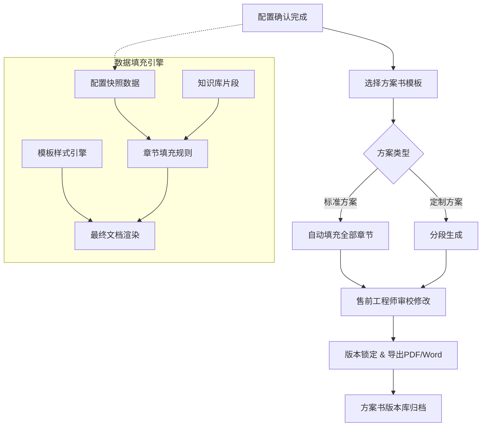

#### 投标文件模块

招投标场景要求CPQ能对**商务标**和**技术标**进行结构化拆分和自动生成：

**评分点应答模板机制**：

```json
{
  "bidTemplate": {
    "bidId": "BID-2024-0035",
    "sections": [
      {
        "sectionType": "TECHNICAL",
        "scoringItems": [
          {
            "scoringId": "SC-T01",
            "scoringPoint": "产品性能指标满足率",
            "maxScore": 15,
            "autoResponse": {
              "source": "configSnapshot.parameters",
              "mapping": {
                "parameterList": ["频段范围", "发射功率", "接收灵敏度"],
                "rule": "FOR_EACH parameter: IF configValue >= requirement THEN '完全满足' ELSE IF configValue >= requirement*0.9 THEN '基本满足' ELSE '部分满足'"
              }
            },
            "evidenceTemplate": "我方{modelName}产品在{parameterList}等核心指标上{resultSummary}，详见附件技术参数表。"
          }
        ]
      }
    ]
  }
}
```

**自动偏离表（Deviation Table）**：

| 客户要求参数 | 要求值 | 我方产品参数 | 实际值 | 偏差状态 | 偏差说明 |
|------------|--------|------------|--------|:------:|---------|
| 发射功率 | ≥10W | DMR终端发射功率 | 12W | 优于 | 超出要求20% |
| 防护等级 | IP67 | DMR终端防护等级 | IP67 | 满足 | - |
| 电池续航 | ≥24h | DMR终端电池续航 | 18h | 不满足 | 建议增配高容量电池 |

**偏离表生成逻辑**：读取`configSnapshot.parameters`与标书要求参数逐一比对，自动判定"优于/满足/不满足"，对不满足项自动标记红色并触发推荐替代配置。

#### 方案介绍PPT一键生成

基于方案书的关键内容自动提取和结构化重组，生成专业级方案汇报PPT：

```
方案书内容 → PPT结构化转换
═══════════════════════════════════════

方案书章节                    PPT幻灯片
─────────────────────────────────────
公司介绍                →  Slide 1: 封面
需求理解                →  Slide 2: 项目背景与需求概述
技术方案总体设计         →  Slide 3-5: 技术方案设计
系统架构图              →  Slide 4: 系统架构图(自动渲染)
功能清单                →  Slide 6: 功能与配置清单
项目实施计划            →  Slide 7: 实施计划与里程碑
验收标准 & 服务承诺       →  Slide 8: 质量保障与服务承诺
报价总览                →  Slide 9: 商务报价概览(可选隐藏)
成功案例                →  Slide 10: 相关案例与经验
                        Slide N: 感谢页
```

**关键设计**：PPT生成不是简单的"文字搬家"，而是基于内容理解和视觉设计的结构化重组。每页幻灯片自动提取3-5个核心信息点，配合产品拓扑图/架构图自动渲染。

#### 成功案例库智能匹配和嵌入

案例库以标签体系组织，依据当前方案的行业/产品/规模/场景多维标签自动匹配：

| 案例标签维度 | 示例值 | 匹配权重 |
|------------|--------|:------:|
| 行业 | 石油化工、公共安全、轨道交通 | 0.3 |
| 产品线 | 窄带对讲、宽带集群 | 0.25 |
| 项目规模 | 1000+台、500-999台、小规模 | 0.2 |
| 应用场景 | 生产调度、应急指挥、巡检 | 0.15 |
| 区域 | 国内、海外-亚太、海外-欧洲 | 0.1 |

匹配算法：`相似度 = Σ(标签匹配 × 权重)`，Top-3案例自动嵌入方案书附录。

#### 交付物关联管理和版本一致性保障

方案交付物之间存在**数据关联依赖**，核心机制：

1. **主数据锚点**：方案书是主交付物，所有其他交付物（投标文件、PPT、报价单）数据来源指向同一配置快照
2. **版本联动**：配置变更 → 所有关联交付物标记"待更新" → 提醒售前批量刷新
3. **变更差异高亮**：配置修改后，更新后的交付物中变更部分高亮显示（如价格变动标黄、配置变动标蓝）
4. **交付物完整度检查**：根据客户阶段（询价/投标/签约）自动检查所需交付物是否齐备

### 3.6.2 售前-销售协同工作台

CPQ不仅是配置工具，更是销售和售前团队日常协作的核心平台。三类角色的工作台需分别设计：

#### 销售视图 — "我的方案请求中心"

```
销售工作台核心功能
═══════════════════════════════════════

┌─────────────────────────────────────────────────┐
│  + 发起方案请求                                  │
│  ┌─────────────────────────────────────────────┐│
│  │ 客户名称：___  行业：___  预算：___          ││
│  │ 需求简述：___（可录音转文字+AI提取关键需求）   ││
│  │ 期望交期：___  竞品情况：___                ││
│  │ 指定售前：___（可选） 优先级：高/中/低       ││
│  │ [提交] [保存草稿]                           ││
│  └─────────────────────────────────────────────┘│
│                                                  │
│  我的方案列表                                     │
│  ┌──────┬────────┬────────┬────────┬──────────┐  │
│  │ 状态  │ 客户    │ 方案编号 │ 进度   │ 操作     │  │
│  ├──────┼────────┼────────┼────────┼──────────┤  │
│  │ 处理中 │ 某石化厂 │ SQ-042  │ ████░  │ 查看详情 │  │
│  │ 待确认 │ 某电力  │ SQ-038  │ ██████ │ 提交客户 │  │
│  │ 已完成 │ 某地铁  │ SQ-015  │ 已完成  │ 下载套装 │  │
│  └──────┴────────┴────────┴────────┴──────────┘  │
└─────────────────────────────────────────────────┘
```

#### 售前视图 — "我的方案任务台"

```
售前工作台核心功能
═══════════════════════════════════

任务接收 → 方案编辑 → 内部评审 → 交付销售 → 工作量统计
    │          │          │          │          │
    ▼          ▼          ▼          ▼          ▼
 ┌──────┐ ┌───────┐ ┌───────┐ ┌──────┐ ┌──────────┐
 │任务池 │ │配置器  │ │评审台  │ │交付物 │ │本月：8方案 │
 │优先级 │ │方案编辑│ │历史参考│ │打包   │ │平均周期： │
 │SLA倒计│ │在线批注│ │审批流转│ │导出   │ │3.2天      │
 │时提醒 │ │配置快照│ │版本追溯│ │通知   │ │通过率：92% │
 └──────┘ └───────┘ └───────┘ └──────┘ └──────────┘
```

#### 管理视图 — "售前运营仪表盘"

| 管理指标 | 统计维度 | 数据来源 |
|---------|---------|---------|
| **团队工作量分布** | 按人/按产品线/按区域 | 任务分配记录 |
| **方案响应SLA** | 响应时长/完成时长/逾期率 | 任务时间戳 |
| **方案质量分析** | 一次通过率/修改次数/客户反馈 | 评审记录+客户签收 |
| **售前产能利用率** | 人均月方案数/趋势 | 工作量统计 |

#### 方案在线批注与讨论线程

每个配置方案关联一个**讨论线程面板**，支持：
- 销售/售前/产品经理之间的异步沟通
- 对特定配置行的批注（如"这个天线选型需要和研发确认"）
- 批注状态管理（待处理/已回复/已关闭）
- 批注历史归档→评审知识库沉淀

#### 售前资源智能路由

```
售前任务自动分配引擎
═══════════════════════════════════════

输入信号：
┌─────────────────────────────────────────────────┐
│  任务属性              售前能力画像               │
│  ├─ 产品线              ├─ 能力标签（产品线×行业×  │
│  ├─ 行业场景                  区域×熟练度）        │
│  ├─ 预估工作量          ├─ 当前任务数              │
│  ├─ 优先级              ├─ 历史完成质量            │
│  └─ 区域                └─ 当前工作负荷%           │
└─────────────────────────────────────────────────┘
                        │
                        ▼
            ┌─────────────────────┐
            │  智能匹配引擎        │
            │  匹配度 = 能力匹配    │
            │  × 负荷系数 × 质量分 │
            │  → 推荐Top-3售前     │
            └──────────┬──────────┘
                       │
                       ▼
            自动分配或管理人确认 → 任务下发
```

### 3.6.3 方案可行性评审工作台

对于非标配置组合或大额方案，需要多角色参与的**结构化评审**：

#### 评审上下文面板

评审人可见的完整决策信息面板：

| 信息模块 | 内容 | 来源 |
|---------|------|------|
| **配置全景树** | 当前方案的完整配置层次结构，含组件关系 | 配置引擎 |
| **BOM清单（标注库存状态）** | 展开后的SBOM/BOM，每项标注库存(有货/低库存/无货) | ERP+WMS |
| **兼容性校验结果** | 绿/黄/红三级：绿色=全部通过，黄色=有警告项，红色=有阻塞项 | 规则引擎 |
| **成本与利润概览** | 整体成本、标准毛利、当前折扣下的实际毛利 | 定价引擎 |
| **历史相似方案** | Top-3相似配置方案及其评审结论 | 评审知识库 |

**兼容性校验结果颜色语义**：

| 颜色 | 含义 | 示例 | 对评审的影响 |
|:----:|------|------|------------|
| 绿色 | 全部兼容，标准可行 | "所有组件均为标准化装配件" | 可通过 |
| 黄色 | 存在警告，需关注 | "天线AN0375H10库存偏低(仅剩50pcs)，建议确认交期" | 有条件通过 |
| 红色 | 存在阻塞，不可通过 | "选配的电源模块PS-550与主机BD302不兼容" | 必须驳回 |

#### 历史相似方案参考

基于配置向量的相似度检索，匹配历史评审案例：

```
相似度计算维度：
├─ 产品线/系列的余弦相似度 (权重 0.3)
├─ 配置参数向量的Jaccard相似度 (权重 0.4)
└─ 客户行业/场景的标签匹配 (权重 0.3)

检索流程：
当前配置 → 配置向量提取 → 评审知识库检索 → Top-5历史案例
→ 展示每个案例的配置相似度 + 评审结论 + 交付结果
```

#### 结构化评审意见

评审结论不是简单"通过/不通过"，而是结构化的决策信息：

```json
{
  "reviewResult": {
    "reviewId": "REV-2024-0142",
    "configId": "CFG-8921",
    "overallDecision": "CONDITIONAL_APPROVE",
    "decisions": [
      {
        "dimension": "TECHNICAL_COMPATIBILITY",
        "decision": "APPROVE",
        "comment": "所有组件兼容性校验通过"
      },
      {
        "dimension": "SUPPLY_CHAIN",
        "decision": "CONDITIONAL",
        "requirement": "天线AN0375H10需确认供应商交期，当前库存不足",
        "suggestedAction": "替换为AN0375H12(功能等效，库存充足)"
      },
      {
        "dimension": "COST",
        "decision": "REJECT",
        "reason": "方案整体毛利率15.2%，低于公司底线18%",
        "suggestedAction": "调整折扣率从8.5折至9折，或移除赠送配件"
      }
    ],
    "modificationItems": [
      {
        "itemId": "LINE-003",
        "itemName": "高容量电池BP-3000",
        "changeType": "REPLACE",
        "suggestedReplacement": "BP-2500(标准电池，成本降低12%)",
        "reason": "客户场景为室内使用，不需要3000mAh续航"
      }
    ],
    "reviewerId": "R-045",
    "reviewerRole": "产品线专家",
    "reviewDate": "2024-03-15T14:30:00Z"
  }
}
```

#### 修改→重新评审闭环

```
修改闭环流程：
┌──────────┐    ┌──────────┐    ┌──────────┐    ┌──────────┐
│  原始评审  │───▶│ 修改项    │───▶│ 重新评审   │───▶│ 评审通过   │
│  (驳回)    │    │ 高亮标记   │    │ (自动匹配   │    │ 版本锁定   │
│           │    │ 修改原因   │    │  原始评审人) │    │          │
└──────────┘    └──────────┘    └──────────┘    └──────────┘
     │                                                    │
     └────────── 修改未通过，继续修改 ──────────────────────┘

关键机制：
- 修改项自动高亮：重新提交时所有修改过的配置行以黄色标记
- 修改原因自动记录：每次修改记录原因（评审意见驱动/客户需求变更/供应链驱动）
- 评审人自动匹配：基于"上次评审人"优先路由，保持评审连续性
```

#### 评审知识库

评审结论不是一次性资产，而是可沉淀、标签化、可检索的组织知识：

```
评审结论标签体系
═══════════════════════════════════════

┌─────────────────────────────────────────────────────┐
│  技术类标签             商务类标签             供应链标签      │
│  ├─ "天线选型不兼容"      ├─ "毛利率不达标"       ├─ "关键物料短缺"  │
│  ├─ "电源配置不足"        ├─ "折扣突破授权"       ├─ "交期不满足"    │
│  ├─ "接口标准不匹配"      ├─ "缺少服务合同"       ├─ "长交期物料"    │
│  ├─ "功耗超出设计"        ├─ "协议价不适用"       ├─ "最小起订量"    │
│  └─ "EMC不达标"          └─ "付款条款不合格"      └─ "停产物料替代"  │
└─────────────────────────────────────────────────────┘

检索能力：
├─ 按标签检索：选择标签组合 → 返回相关评审案例
├─ 按产品检索：选择产品线/产品系列 → 该产品的常见评审问题
├─ 按场景检索：行业×配置模式 → 同类场景的典型问题和解决方案
└─ 统计分析：高频标签TOP10、各产品线一次通过率趋势
```

---


---

## 3.7 竞品对标与差异化配置引擎

### 竞品数据库结构设计

竞品信息是售前和销售的核心武器，需要结构化管理四大类数据：

```json
{
  "competitorProduct": {
    "basicInfo": {
      "competitorId": "CP-017",
      "brand": "Motorola Solutions",
      "model": "MTP3550",
      "positioning": "高端公共安全数字对讲机",
      "targetIndustries": ["公共安全", "轨道交通", "能源"],
      "marketShare": "全球中高端市场约25%",
      "priceRange": {"min": 3500, "max": 5000, "currency": "USD"}
    },
    "techSpecs": {
      "frequencyBand": "350-400MHz",
      "txPower": "5W",
      "waterproof": "IP68",
      "batteryLife": "22h",
      "weight": "280g",
      "channelCapacity": 1024,
      "digitalProtocol": "TETRA"
    },
    "swotTags": {
      "strengths": [
        {"tag": "品牌影响力", "description": "全球公共安全领域第一品牌认知度"},
        {"tag": "TETRA生态完善", "description": "TETRA系统设备、终端、网管完整生态"}
      ],
      "weaknesses": [
        {"tag": "价格高", "description": "同级别产品价格为我方的1.5-2倍"},
        {"tag": "定制灵活性低", "description": "不提供小批量定制"},
        {"tag": "交期长", "description": "标准交期8-12周，紧急订单无保障"}
      ],
      "opportunities": [
        {"tag": "DMR替代TETRA趋势", "description": "DMR价格优势+功能趋近，中端市场替代窗口打开"}
      ],
      "threats": [
        {"tag": "品牌溢价防守", "description": "高端客户仍因品牌惯性选择竞品"}
      ]
    },
    "channelStrategy": {
      "salesModel": "直销+认证代理商",
      "discountPolicy": "大客户可至目录价7折",
      "serviceModel": "5年标准质保+可选延保"
    }
  }
}
```

### 竞品参数自动对比赛

当客户提及竞品型号时，CPQ自动拉取我方对应产品，生成并排对比矩阵：

```
参数对比矩阵（示例：DMR手持终端）
═══════════════════════════════════════════════════════

参数项              竞品 A (MTP3550)    我方 (PD785)     差异评价
────────────────────────────────────────────────────────
频段范围             350-400MHz          66-520MHz        我方更广
发射功率             5W                  5W               持平
防护等级             IP68                IP67             竞品略优
电池续航             22h                 24h              我方更优
重量                 280g                310g             竞品更轻
信道容量             1024                1024             持平
数字协议             TETRA               DMR             不同标准
目录价               $4,200              $2,800           我方低33%
标准交期             10周                4周              我方快60%
────────────────────────────────────────────────────────
综合评分             ★★★★                ★★★★
```

**可视化优劣势展示 — 雷达图**：

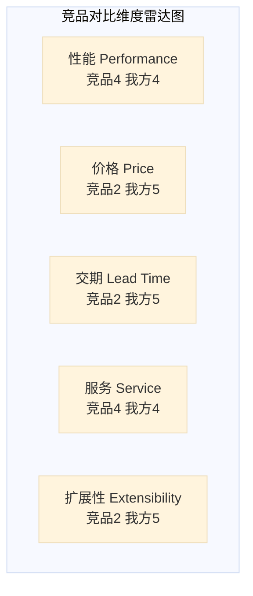

*(注：Mermaid雷达图语法限制，实际产品中建议使用ECharts/D3.js实现交互式雷达图)*

**对比矩阵JSON输出**：

```json
{
  "comparisonMatrix": {
    "ourProduct": {"modelId": "PD785", "modelName": "Hytera PD785"},
    "competitorProduct": {"competitorId": "CP-017", "modelName": "Motorola MTP3550"},
    "parameters": [
      {
        "paramName": "frequencyBand",
        "paramLabel": "频段范围",
        "ourValue": "66-520MHz",
        "competitorValue": "350-400MHz",
        "evaluation": "OURS_BETTER",
        "score": {"ours": 5, "competitor": 3}
      }
    ],
    "overallScore": {"ours": 4.2, "competitor": 3.1},
    "totalCostComparison": {
      "ourTotalCost": "¥19,600/台(含3年服务)",
      "competitorTotalCost": "¥33,600/台(含3年服务)",
      "savingPercent": "41.7%",
      "savingAmount": "¥14,000/台"
    }
  }
}
```

### 差异化配置推荐引擎

核心逻辑：**识别竞品劣势 → 自动推荐我方优势配置项 → 生成差异化话术**。

```
差异化推荐引擎工作流
═══════════════════════════════════════

输入：客户提及的竞品型号(可多个) + 客户需求场景
                        │
                        ▼
          ┌────────────────────────┐
          │  Step 1: 竞品弱项识别   │
          │  读取SWOT-Weaknesses   │
          │  读取参数低于域值项     │
          └───────────┬────────────┘
                      │
                      ▼
          ┌────────────────────────┐
          │  Step 2: 我方强项匹配   │
          │  对每个Weakness，       │
          │  匹配我方优势Feature    │
          └───────────┬────────────┘
                      │
                      ▼
          ┌────────────────────────┐
          │  Step 3: 差异化配置推荐  │
          │  为每个优势Feature      │
          │  推荐具体配置Option     │
          └───────────┬────────────┘
                      │
                      ▼
          ┌────────────────────────┐
          │  Step 4: 话术生成       │
          │  LLM生成差异化话术      │
          │  结合客户场景定制       │
          └───────────┬────────────┘
                      │
                      ▼
          输出：差异化配置方案 + 竞品对比页 + 销售话术卡片
```

**话术生成示例**：

```
输入：
  竞品弱点: "交期长(8-12周)"
  我方优势: "标准交期4周"
  客户场景: "某化工厂紧急扩容"

生成话术:
  "考虑到贵司近期有产线扩容的紧急需求，交期将是一个关键考量因素。
   行业内某主流品牌的同类产品标准交期为8-12周，我们在国内设有
   本地化生产和仓储中心，标准交期仅需4周，且有备货机制可支持
   紧急订单2周内交付，确保不因设备到货延误产线投产。"
```

### 竞争情报管理流程

竞品信息是动态变化的，需要建立**四步闭环**管理：

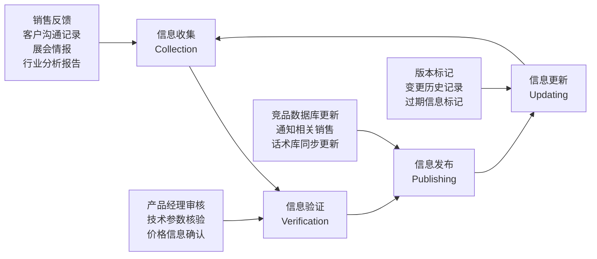

| 管理环节 | 责任人 | 工具支持 | 周期 |
|---------|--------|---------|:--:|
| **信息收集** | 全体销售/售前/市场 | 竞品信息提交表单(含证明附件上传) | 实时 |
| **信息验证** | 产品线经理/区域产品专家 | 审核工作台(参数比对+来源验证) | 3个工作日 |
| **信息发布** | 竞品情报管理员 | 竞品数据库更新+对比引擎刷新+订阅通知 | 验证后即时 |
| **信息更新** | 同上 | 版本管理+过期标记+替代关系维护 | 每季度全面Review |

---


---

## 3.8 销售赋能工具与知识管理体系

### 产品知识库设计

以原报告定义的5层产品结构为骨架，每个节点挂载结构化的知识资产：

```
产品知识库架构（5层骨架 + 知识节点）
═══════════════════════════════════════════════════════════

L1 产品族: 窄带对讲机与集群
│
├── L2 产品线: DMR/PDT数字对讲机
│   │
│   ├── L3 产品系列: BD300系列
│   │   │
│   │   ├── L4 产品/机型: BD302
│   │   │   │
│   │   │   └── [知识节点]
│   │   │       ├─ 技术参数: 频段/功率/防护等级/...
│   │   │       ├─ 应用场景: [石油化工巡检] [公共安全执法]
│   │   │       ├─ 竞争定位: 中端DMR, 对标Moto MTP3100
│   │   │       ├─ 常见问题: 防水性能/电池兼容/配件可选
│   │   │       ├─ 成功案例: 链接到案例库
│   │   │       └─ 培训材料: 产品操作视频/配置指南
│   │   │
│   │   └── L4 产品/机型: BD305
│   │       └── [知识节点] ...
```

**知识节点数据模型**：

```json
{
  "knowledgeNode": {
    "nodeId": "KN-BD302-OVERVIEW",
    "productCode": "BD302",
    "nodeType": "PRODUCT_OVERVIEW",
    "content": {
      "elevatorPitch": "BD302是面向石油化工行业的中高端DMR数字对讲机",
      "keySellingPoints": ["IP68防护", "24h续航", "AI降噪"],
      "typicalApplication": ["石化巡检", "港口调度"],
      "technicalHighlights": [
        {"feature": "AI降噪", "benefit": "110dB环境仍可清晰通话", "evidence": "实测报告链接"}
      ]
    },
    "relatedKnowledge": ["KN-BD302-TECH", "KN-DMR-STANDARD"],
    "lastUpdated": "2024-03-01",
    "updatedBy": "产品经理-张工"
  }
}
```

### 销售话术库 — 三层话术体系

话术库与配置方案联动，根据当前配置方案的**产品组合、客户场景、竞品情况**自动推荐:

| 话术层级 | 内容 | 触发条件 | 示例 |
|---------|------|---------|------|
| **L1 标准产品介绍** | 产品的核心价值主张和标准介绍语 | 选择产品时 | "BD302采用军工级AI降噪技术，即使在110dB噪音环境下..." |
| **L2 客户异议处理** | 常见客户质疑的标准应答 | 识别到潜在异议时 | 客户问"为什么比XX品牌贵？" → "BD302采用IP68防护级别，是同类产品中..." |
| **L3 价值主张** | 结合客户场景的定制化价值陈述 | 确定客户行业/场景后 | "对于贵司化工厂巡检场景，BD302的防爆认证和长续航将..." |

**话术联动推荐机制**：

```
销售进入CPQ配置页面
        │
        ▼
系统识别：客户行业=石油化工，选定产品=BD302
        │
        ▼
自动加载话术卡片：
┌─────────────────────────────────────────┐
│ 🎯 推荐话术（基于当前配置）                │
│                                          │
│ L2-客户异议-价格:                          │
│ "BD302相比普通对讲机价格更高，但考虑到..."   │
│                                          │
│ L3-价值主张-石油化工:                      │
│ "对于化工厂的日常巡检和应急处置场景..."      │
│                                          │
│ [复制话术] [插入方案书] [自定义编辑]        │
└─────────────────────────────────────────┘
```

### 产品演示材料库

| 材料类型 | 检索标签 | 存储方式 | 使用场景 |
|---------|---------|---------|---------|
| 产品演示视频 | 产品型号+功能点 | 视频链接/CDN | 客户远程展示 |
| 3D产品展示 | 产品型号+视角 | WebGL链接 | 客户现场交互展示 |
| Demo环境 | 产品线+版本 | 环境URL+账号密码 | POC测试 |
| 客户案例视频 | 行业+产品+客户规模 | 视频链接(脱敏版本) | 增强方案说服力 |
| 产品操作手册 | 产品型号+语言 | PDF下载 | 售后交付 |

**检索API设计**：

```json
{
  "searchMaterials": {
    "request": {
      "productCodes": ["BD302", "RD985S"],
      "scenario": "石油化工巡检",
      "materialTypes": ["DEMO_VIDEO", "CASE_VIDEO"],
      "language": "zh-CN"
    },
    "response": {
      "results": [
        {
          "materialId": "MAT-4582",
          "title": "BD302石油化工智能巡检方案演示",
          "type": "DEMO_VIDEO",
          "url": "https://cdn.example.com/demo-bd302-petro.mp4",
          "duration": "5:30",
          "relatedProducts": ["BD302", "SmartOne"],
          "tags": ["石油化工", "防爆", "智能巡检"]
        }
      ]
    }
  }
}
```

### 培训-考试-认证闭环

```
销售认证体系闭环
═══════════════════════════════════════

┌──────────┐     ┌──────────┐     ┌──────────┐     ┌──────────┐
│ 在线课程   │────▶│ 知识测试   │────▶│ 实操配置   │────▶│ 认证授牌   │
│ Learning  │     │ Testing   │     │ Practice  │     │ Certified  │
└──────────┘     └──────────┘     └──────────┘     └──────────┘
     │                │                │                │
     ▼                ▼                ▼                ▼
  ├─ 产品知识       ├─ 客观题        ├─ CPQ模拟环境   ├─ 初级销售
  │  (视频+文档)    │  (单选/多选)    │  完成指定配置   │  中级销售
  ├─ 竞品对比       ├─ 情景题        │  任务            │  高级销售
  ├─ 行业知识       │  (案例分析)    ├─ 审核评分       │  专家销售
  └─ 销售技巧       └─ 60分及格      └─ 80分及格       └─ 有效期1年
```

**认证与方案权限联动**：

| 认证等级 | 可操作权限 | 需要续证周期 |
|---------|-----------|:----------:|
| 初级销售 | 浏览产品、标准报价 | 12个月 |
| 中级销售 | 标准配置+10%以内折扣 | 12个月 |
| 高级销售 | 复杂配置+15%折扣+方案书生成 | 12个月 |
| 专家销售 | ATO定制配置+特价申请+投标方案 | 18个月 |

### 销售能力看板

追踪每个销售人员的多维能力画像：

| 能力维度 | 数据来源 | 展示形式 |
|---------|---------|---------|
| **产品知识掌握度** | 培训考试成绩+知识测试记录 | 雷达图(按产品线) |
| **配置操作熟练度** | CPQ操作日志(平均配置时长/配置错误率) | 进度条 |
| **报价成单率** | CRM商机数据(报价→赢单转化率) | 趋势图 |
| **竞品知识** | 竞品考试+竞品信息贡献 | 徽章系统 |
| **方案质量** | 评审一次通过率+方案修改次数 | 评分卡 |

### 产品通知机制

```json
{
  "productNotification": {
    "notificationTypes": ["NEW_PRODUCT", "EOL", "PRICE_CHANGE", "ECO_IMPACT", "SUPPLY_ALERT"],
    "subscribeRules": {
      "byProductLine": "销售订阅自己负责的产品线",
      "byCustomer": "当客户使用产品的变更时自动通知负责销售",
      "byQuote": "当进行中报价方案涉及变更产品时自动通知"
    },
    "deliveryChannels": ["CPQ系统内消息", "企微/钉钉/邮件推送", "每周汇总简报"],
    "acknowledgmentRequired": true
  }
}
```

**消息推送矩阵**：

| 事件类型 | 紧急程度 | 推送方式 | 是否需要确认 |
|---------|:------:|---------|:----------:|
| 新产品上线 | 中 | 系统消息+周报 | 否 |
| 产品EOL | 高 | 即时推送(企微+邮件) | 是 |
| 价格调整 | 高 | 即时推送+生效倒计时 | 否 |
| 物料短缺影响配置 | 紧急 | 即时推送+影响方案列表 | 是 |
| 竞品情报更新 | 低 | 周报摘要 | 否 |

---


---

## 3.9 交期承诺(ATP/CTP)与配置联动

### ATP三层检查模型

ATP（Available to Promise）是回答"承诺交期前能生产/交付多少"的核心能力：

```
ATP三层检查模型
════════════════════════════════════════════

层级             检查内容                数据来源         响应时间要求
────────────────────────────────────────────────────────
L1 库存ATP       已完工库存+在途库存     WMS/ERP库存      实时(<1s)
   (Stock ATP)    可承诺量

L2 物料ATP       关键物料库存+           ERP物料主数据    近实时(<3s)
   (Material ATP) 采购在途(PR/PO状态)     +SRM采购系统

L3 产能ATP       关键工作中心可用产能     MES排产系统      近实时(<5s)
   (Capacity ATP) 当前负荷+维护计划
```

**ATP检查的决策逻辑**：

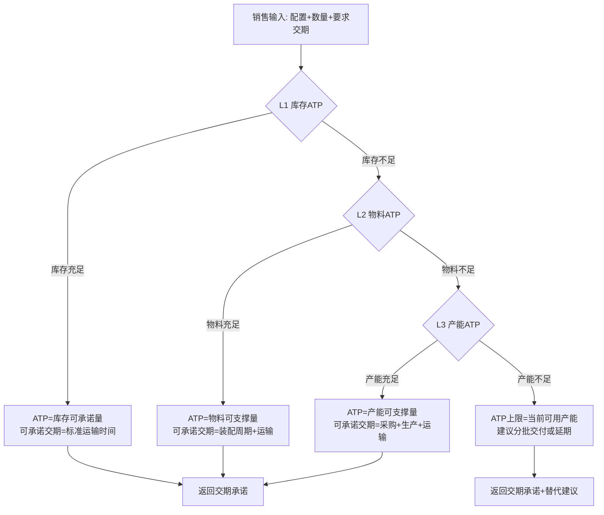

**ATP检查结果的JSON Schema**：

```json
{
  "atpResult": {
    "configId": "CFG-8921",
    "requestedQty": 500,
    "requestedDate": "2024-06-15",
    "layers": [
      {
        "layer": "STOCK_ATP",
        "availableQty": 120,
        "gapQty": 380,
        "source": "WMS-华东仓",
        "status": "INSUFFICIENT"
      },
      {
        "layer": "MATERIAL_ATP",
        "criticalMaterials": [
          {"materialCode": "MT-AN0375H10", "name": "VHF天线", "availableQty": 800, "requiredQty": 500, "status": "SUFFICIENT"},
          {"materialCode": "MT-PS550", "name": "电源模块", "availableQty": 200, "requiredQty": 500, "status": "INSUFFICIENT"}
        ],
        "overallStatus": "INSUFFICIENT",
        "earliestCompleteDate": "2024-07-20"
      },
      {
        "layer": "CAPACITY_ATP",
        "workCenters": [
          {"wcCode": "WC-ASSEMBLY-01", "availableHours": 120, "requiredHours": 200, "status": "OVERLOAD"}
        ],
        "earliestCompleteDate": "2024-07-15"
      }
    ],
    "overallATP": {
      "confirmedQty": 200,
      "partialDeliveryAvailable": true,
      "earliestCompleteDate": "2024-07-20",
      "confidenceLevel": "HIGH"
    }
  }
}
```

### CTP（Capable to Promise）

ATP回答"现有资源和库存能否满足"，CTP回答"如果不够，最早什么时候能满足"：

#### 产能余量交期推算逻辑

```
CTP交期计算公式（简化模型）
═══════════════════════════════════════════

CTP_Date = Today + MAX(
  Material_Complete_Date,    -- 物料齐套时间
  Production_Start_Date +    -- 最早可排产时间
  Production_Cycle_Time      -- 生产周期
) + Logistics_Time           -- 物流时间

其中：
  Material_Complete_Date = MAX(各关键物料(当前日期 + 采购提前期))
    - 有库存物料 = Today
    - 在途物料 = ETA
    - 需采购物料 = Today + 供应商标准交期
  
  Production_Start_Date = Today + 排产等待时间
    排产等待时间 = 瓶颈工序负荷 / 可用产能
    
  Production_Cycle_Time = Σ(各工序标准工时) × (1 + Buffer%)
  
  Logistics_Time = 运输天数 + 清关天数(出口)
```

#### CTP参数定义

| 参数 | 定义 | 来源 | 更新频率 |
|------|------|------|:------:|
| `material_lead_time[i]` | 物料i的采购提前期 | SRM/采购主数据 | 每季度 |
| `wc_capacity[d]` | 工作中心d的日可用产能(小时) | MES | 每日 |
| `wc_load[d]` | 工作中心d的当前积压负荷(小时) | MES | 实时 |
| `process_time[i][d]` | 物料i在工作中心d的标准工时 | 工艺BOM | 每产品变更 |
| `buffer_rate` | 产能缓冲系数(如0.15=15%缓冲) | 生产计划 | 每月调整 |
| `logistics_time[region]` | 区域物流时间 | 物流系统 | 每季度 |

### 交期感知配置

将交期信息实时嵌入到配置选择的交互中：

```
配置界面中的交期感知
═══════════════════════════════════════

┌────────────────────────────────────────────────┐
│  产品配置: PD785                                │
│  ┌────────────────────────────────────────────┐│
│  │  频段选择:                                  ││
│  │  ◉ VHF 66-88MHz         交期: 4周  ✓推荐   ││
│  │  ○ UHF 350-400MHz       交期: 6周          ││
│  │  ○ 定制频段 150-174MHz   交期: 12周         ││
│  ├────────────────────────────────────────────┤│
│  │  电池选择:                                  ││
│  │  ◉ 标准电池 BP-2000     交期: 4周          ││
│  │  ○ 高容电池 BP-3000     ⚠ 库存紧张 交期8周 ││
│  └────────────────────────────────────────────┘│
│                                                │
│  当前配置预估总交期: 【6周】(基于最晚交期部件)    │
│  ⚡ 如需更短交期，推荐替代配置:                   │
│  ├─ 方案A: 选择UHF频段 → 交期缩短至4周          │
│  └─ 方案B: 减少数量至50台以内 → 交期缩短至3周    │
└────────────────────────────────────────────────┘
```

**交期不满足时的替代推荐逻辑**：

```json
{
  "deliveryAlternatives": {
    "trigger": "requestedDate < earliestCompleteDate",
    "alternatives": [
      {
        "alternativeId": "ALT-01",
        "type": "CONFIG_CHANGE",
        "description": "将VHF天线AN0375H10替换为AN0375H12",
        "originalDeliveryDate": "2024-07-20",
        "newDeliveryDate": "2024-06-25",
        "daysSaved": 25,
        "impact": {
          "compatibility": "FULL_COMPATIBLE",
          "priceChange": "-¥180/台",
          "performanceChange": "无影响"
        }
      },
      {
        "alternativeId": "ALT-02",
        "type": "QUANTITY_SPLIT",
        "description": "先交付200台(4周)，剩余300台分批(8周)",
        "firstBatch": {"qty": 200, "deliveryDate": "2024-07-04"},
        "secondBatch": {"qty": 300, "deliveryDate": "2024-08-04"},
        "impact": {"partialDeliveryFee": "¥5,000"}
      }
    ]
  }
}
```

### 加急机制

#### 加急费用计算模型

```
加急费 = 基础加急费 + 产能重排费 + 物料加急采购溢价

其中：
  基础加急费 = 订单金额 × 加急费率(基于缩短天数阶梯)
  
  加急费率表：
  ┌──────────────────────────────────┐
  │  缩短天数     费率               │
  │  1-5天        2%                │
  │  6-15天       5%                │
  │  16-30天      10%               │
  │  30天以上     需要特别审批       │
  └──────────────────────────────────┘
  
  产能重排费 = 插单影响的工单数 × 单工单重排成本
  物料加急溢价 = Σ(加急采购物料 × (加急价 - 标准价))
```

#### 加急产线重排逻辑

```
加急订单插入排产流程:
1. 识别加急订单的工序路径和所需工作中心
2. 在已排产工单队列中查找可压缩/可后移的时间窗口
3. 评估受影响工单的客户SLA（加急不能导致其他订单SLA违约）
4. 生成重排方案→计算加急费→生成加急审批单
5. 审批通过→执行排产重排→通知受影响工单负责人
```

### 交期SLA追踪

```
承诺交期 vs 实际交期偏差监控
═══════════════════════════════════════

┌─────────────────────────────────────────────────────────────┐
│  交期SLA仪表盘                                               │
│                                                             │
│  按时交付率:  ████████████░░░░  87.3%  (目标: ≥90%)         │
│  平均偏差:    +3.2天  (目标: ≤+2天)                          │
│  严重逾期率:  ██░░  5.1%  (超期>7天, 目标: ≤3%)             │
│                                                             │
│  偏差根因分析(Top-5):                                        │
│  1. 关键物料供应商交期延误  32%                               │
│  2. 产能预估偏差          28%                               │
│  3. 质检不合格返工         18%                               │
│  4. 客户临时变更           12%                               │
│  5. 物流运输延误           10%                               │
└─────────────────────────────────────────────────────────────┘

持续优化闭环：
偏差记录 → 根因标注 → 参数修正 → 下一轮交期预测优化
```

**交期偏差根因驱动的参数自动修正**：

| 偏差根因标签 | 触发的参数调整建议 |
|------------|-----------------|
| "供应商交期延误" | 建议上调该物料的`material_lead_time`系数 |
| "产能预估偏差" | 建议上调`buffer_rate`或调整`wc_capacity`基准值 |
| "质检返工" | 建议增加该产品线的工艺缓冲时间 |

---

## 第四部分：CPQ产品架构设计

### 4.1 整体技术架构

基于上述分析，适配装备/设备/组件/半导体制造业的CPQ产品建议采用以下分层架构：

```
┌─────────────────────────────────────────────────────────────────┐
│                        用户交互层 (UI Layer)                      │
│  ┌──────────┐ ┌──────────┐ ┌──────────┐ ┌──────────┐ ┌────────┐ │
│  │ 销售工作台 │ │ 渠道门户  │ │ 管理后台  │ │ 移动端   │ │开放API  │ │
│  │Sales Desk │ │Partner   │ │Admin     │ │Mobile    │ │REST/   │ │
│  │           │ │Portal    │ │Console   │ │          │ │GraphQL │ │
│  └──────────┘ └──────────┘ └──────────┘ └──────────┘ └────────┘ │
├─────────────────────────────────────────────────────────────────┤
│                        业务能力层 (Business Capability Layer)     │
│  ┌──────────────────┐ ┌──────────────────┐ ┌──────────────────┐  │
│  │   配置引擎         │ │   定价引擎         │ │   报价引擎         │  │
│  │  ├─ 约束求解器     │ │  ├─ 价格计算引擎    │ │  ├─ 模板引擎       │  │
│  │  ├─ 产品配置器     │ │  ├─ 折扣管理       │ │  ├─ 文档生成器     │  │
│  │  ├─ 向导式销售     │ │  ├─ 多维度定价     │ │  ├─ 版本管理       │  │
│  │  ├─ BOM展开引擎    │ │  ├─ 成本核算       │ │  └─ 电子签章       │  │
│  │  └─ 可行性校验     │ │  └─ 定价分析       │ │                   │  │
│  └──────────────────┘ └──────────────────┘ └──────────────────┘  │
│  ┌──────────────────┐ ┌──────────────────┐ ┌──────────────────┐  │
│  │   审批引擎         │ │   方案管理         │ │   AI智能层        │  │
│  │  ├─ 审批规则引擎   │ │  ├─ 方案模板库     │ │  ├─ 智能推荐       │  │
│  │  ├─ 多级审批路由   │ │  ├─ 方案版本管理   │ │  ├─ 定价建议       │  │
│  │  ├─ 移动审批       │ │  ├─ 方案对比       │ │  ├─ 配置校验       │  │
│  │  └─ 审批分析       │ │  └─ 方案评审       │ │  └─ 预测洞察       │  │
│  └──────────────────┘ └──────────────────┘ └──────────────────┘  │
├─────────────────────────────────────────────────────────────────┤
│                        数据服务层 (Data Service Layer)           │
│  ┌──────────────────┐ ┌──────────────────┐ ┌──────────────────┐  │
│  │   规则引擎         │ │   产品数据服务     │ │   集成服务         │  │
│  │  ├─ 配置规则库     │ │  ├─ 产品目录       │ │  ├─ CRM连接器      │  │
│  │  ├─ 定价规则库     │ │  ├─ BOM管理        │ │  ├─ ERP连接器      │  │
│  │  ├─ 审批规则库     │ │  ├─ 价格库         │ │  ├─ PLM连接器      │  │
│  │  └─ 规则版本管理   │ │  └─ 知识库         │ │  └─ 消息队列       │  │
│  └──────────────────┘ └──────────────────┘ └──────────────────┘  │
├─────────────────────────────────────────────────────────────────┤
│                        基础设施层 (Infrastructure Layer)          │
│  ┌──────────┐ ┌──────────┐ ┌──────────┐ ┌──────────┐ ┌────────┐ │
│  │ 多租户    │ │ 权限管理  │ │ 审计日志  │ │ 国际化   │ │ 可观测性│ │
│  └──────────┘ └──────────┘ └──────────┘ └──────────┘ └────────┘ │
└─────────────────────────────────────────────────────────────────┘
```

### 4.2 核心数据模型

#### 4.2.1 实体关系概览

```
核心实体关系图
────────────────────────────────────────────────────────────

┌─────────┐        ┌─────────────┐        ┌─────────────┐
│ Product │───────▶│ ProductModel │───────▶│ ProductItem │
│ Catalog │        │ (可销售产品)   │        │ (销售BOM行)  │
└─────────┘        └──────┬───────┘        └─────────────┘
                          │
         ┌────────────────┼────────────────┐
         ▼                ▼                 ▼
┌─────────────┐  ┌─────────────┐  ┌─────────────┐
│ ConfigRule  │  │ PriceRule   │  │ Constraint  │
│ 配置规则      │  │ 定价规则      │  │ 约束条件      │
└─────────────┘  └─────────────┘  └─────────────┘
         │                │                 │
         └────────────────┼─────────────────┘
                          ▼
                  ┌─────────────┐
                  │   Quote     │
                  │   报价单     │
                  └──────┬──────┘
                         │
                         ▼
                  ┌─────────────┐
                  │ QuoteLine   │
                  │ 报价行项目    │
                  └─────────────┘
```

#### 4.2.2 核心实体定义

**产品目录 (Product Catalog)**

| 字段 | 类型 | 说明 |
|------|------|------|
| catalog_id | PK | 目录ID |
| catalog_name | String | 目录名称（如"国内市场终端产品目录"） |
| catalog_type | Enum | 目录类型：SALES/CHANNEL/INTERNAL |
| effective_date | Date | 生效日期 |
| expiry_date | Date | 失效日期（可选） |
| status | Enum | DRAFT/PUBLISHED/RETIRED |

**可销售产品 (Product Model)**

| 字段 | 类型 | 说明 |
|------|------|------|
| model_id | PK | 产品ID |
| catalog_id | FK | 所属目录 |
| product_line | String | 产品线（L2） |
| product_family | String | 产品族（L1） |
| product_series | String | 产品系列（L3） |
| model_code | String | 产品编码/型号（L4） |
| model_name | String | 产品名称 |
| description | String | 产品描述 |
| lifecycle_status | Enum | 生命周期状态：ACTIVE/EOL/DISCONTINUED |
| successor_model_id | FK(自引用) | 替代产品ID |
| base_price | Decimal | 基础目录价 |
| currency | String | 币种 |
| min_order_qty | Integer | 最小起订量 |
| lead_time_days | Integer | 标准交期（天） |
| config_type | Enum | 配置类型：STANDARD/ATO/CTO/ETO |

**产品属性 (Product Attribute)**

| 字段 | 类型 | 说明 |
|------|------|------|
| attribute_id | PK | 属性ID |
| model_id | FK | 所属产品 |
| attr_category | String | 属性分类（Feature Category） |
| attr_name | String | 属性名称（Feature） |
| attr_value | String | 属性值（Option） |
| is_configurable | Boolean | 是否可配置 |
| is_required | Boolean | 是否必选 |
| display_order | Integer | 显示顺序 |
| data_type | Enum | 数据类型：STRING/NUMBER/BOOLEAN/ENUM |

**销售BOM (Sales BOM)**

| 字段 | 类型 | 说明 |
|------|------|------|
| sbom_id | PK | SBOM行ID |
| model_id | FK | 所属产品 |
| item_code | String | 物料编码 |
| item_name | String | 物料名称 |
| item_type | Enum | 物料类型：HOST/ACCESSORY/SERVICE/LICENSE/SOFTWARE |
| quantity | Decimal | 数量 |
| unit | String | 单位 |
| is_required | Boolean | 是否标配（必选） |
| is_replaceable | Boolean | 是否可替换 |
| replacement_group | String | 替换组（同组内可选其他物料） |
| min_qty | Decimal | 最小数量 |
| max_qty | Decimal | 最大数量 |
| price_impact | Enum | 价格影响：FIXED/VARIABLE/NONE |

**配置规则 (Configuration Rule)**

| 字段 | 类型 | 说明 |
|------|------|------|
| rule_id | PK | 规则ID |
| rule_name | String | 规则名称 |
| rule_type | Enum | 规则类型：COMPATIBILITY/REQUIREMENT/EXCLUSION/CONDITIONAL/QUANTITY |
| model_id | FK | 适用产品（可为空，表示全局规则） |
| condition_expr | String/JSON | 条件表达式 |
| action_expr | String/JSON | 动作表达式 |
| error_message | String | 违反规则时的提示信息 |
| severity | Enum | 严重级别：ERROR/WARNING/INFO |
| is_active | Boolean | 是否启用 |
| effective_date | Date | 生效日期 |
| expiry_date | Date | 失效日期 |
| priority | Integer | 优先级（数字越小越高） |

**定价规则 (Pricing Rule)**

| 字段 | 类型 | 说明 |
|------|------|------|
| price_rule_id | PK | 规则ID |
| price_book_id | FK | 所属价格手册 |
| rule_type | Enum | PRICE_OVERRIDE/DISCOUNT/VOLUME_TIER/PROMOTION/CONTRACT |
| condition | JSON | 适用条件（区域/渠道/客户类型/数量范围） |
| price_adjustment | JSON | 价格调整（固定值/百分比/公式） |
| approval_threshold | Decimal | 触发审批的阈值 |
| approver_role | String | 审批人角色 |

**报价单 (Quote)**

| 字段 | 类型 | 说明 |
|------|------|------|
| quote_id | PK | 报价单ID |
| quote_number | String | 报价单编号 |
| opportunity_id | FK | 关联商机 |
| account_id | FK | 客户ID |
| quote_type | Enum | 报价类型：STANDARD/RENEWAL/REVISION |
| currency | String | 币种 |
| status | Enum | 状态：DRAFT/SUBMITTED/APPROVED/REJECTED/EXPIRED/WON/LOST |
| subtotal | Decimal | 小计 |
| discount_total | Decimal | 折扣总额 |
| tax_total | Decimal | 税费 |
| grand_total | Decimal | 总计 |
| valid_until | Date | 有效期至 |
| created_by | String | 创建人 |
| submission_date | Date | 提交日期 |

**报价行项目 (Quote Line Item)**

| 字段 | 类型 | 说明 |
|------|------|------|
| line_id | PK | 行项目ID |
| quote_id | FK | 所属报价单 |
| line_number | Integer | 行号 |
| model_id | FK | 产品ID |
| sbom_id | FK | SBOM物料ID（可选，用于配件行） |
| item_type | Enum | 类型：PRODUCT/ACCESSORY/SERVICE/CUSTOM |
| quantity | Decimal | 数量 |
| unit_price | Decimal | 单价 |
| list_price | Decimal | 目录价 |
| discount_pct | Decimal | 折扣百分比 |
| discount_amount | Decimal | 折扣金额 |
| net_price | Decimal | 净价 |
| line_total | Decimal | 行总计 |
| configuration_snapshot | JSON | 配置快照（记录当时的配置选择） |
| custom_requirements | Text | 定制需求描述 |
| parent_line_id | FK(自引用) | 父行项目（用于捆绑关系） |

### 4.3 规则引擎设计

#### 4.3.1 规则引擎架构

```
规则引擎四层架构
┌─────────────────────────────────────────────────────────────┐
│                                                             │
│  第一层：规则定义层 (Rule Definition Layer)                   │
│  ├─ 规则类型注册：兼容性/必选/互斥/条件/数量/定价/审批         │
│  ├─ 规则DSL（领域特定语言）或可视化规则编辑器                  │
│  └─ 规则模板库：常用规则模式预置                              │
│                                                             │
│  第二层：规则执行层 (Rule Execution Layer)                    │
│  ├─ 规则编译：将规则定义编译为可执行的逻辑                      │
│  ├─ 规则排序：按优先级排列执行顺序                            │
│  ├─ 规则冲突检测：识别并解决规则之间的冲突                      │
│  └─ 增量重算：只重算受影响的规则（配置变更时）                  │
│                                                             │
│  第三层：规则验证层 (Rule Validation Layer)                   │
│  ├─ 实时验证：用户每次选择即时校验                            │
│  ├─ 批量验证：提交前全量检查                                  │
│  ├─ 可行性验证：技术可行性检查（对接PLM）                      │
│  └─ 业务规则验证：合规性、价格合理性检查                       │
│                                                             │
│  第四层：规则管理层 (Rule Management Layer)                   │
│  ├─ 规则版本管理：每次修改生成新版本，支持回滚                   │
│  ├─ 规则生效管理：定时生效/即时生效                           │
│  ├─ 规则模拟：新规则上线前的沙箱模拟                           │
│  └─ 规则影响分析：修改一条规则影响的配置范围分析                │
└─────────────────────────────────────────────────────────────┘
```

#### 4.3.2 规则类型详解

**配置规则四大类型**：

| 规则类型 | 表达式示例 | 触发时机 | 处理方式 |
|---------|-----------|---------|---------|
| **兼容性** (Compatibility) | `if model.频段 == "66-88MHz" then antenna.type == "VHF"` | 选择属性时 | 过滤不兼容选项 |
| **必选** (Requirement) | `if accessory.type == "GPS" then accessory.GPS_antenna required` | 选择GPS配件时 | 自动添加必选项 |
| **互斥** (Exclusion) | `model.制式 == "DMR" excludes model.制式 == "模拟"` | 已选DMR | 隐藏/禁用互斥选项 |
| **条件** (Conditional) | `if qty > 100 then price_tier = "BULK" and lead_time_days += 15` | 更改数量时 | 触发连锁调整 |

**定价规则分类**：

| 规则类型 | 说明 | 示例 |
|---------|------|------|
| **价格覆盖** (Price Override) | 特定条件下的固定价格 | 战略客户固定折扣价 |
| **阶梯定价** (Volume Tier) | 按数量阶梯自动调整单价 | 1-10台：目录价；11-50台：9折；51+：8折 |
| **促销规则** (Promotion) | 限时促销定价 | Q4促销：全线产品95折 |
| **合同定价** (Contract Price) | 基于已签合同的协议价 | 代理商年框协议价 |
| **组合定价** (Bundle Pricing) | 捆绑销售的打包价格 | 主机+3年服务 = 打包价 ¥9,999 |

#### 4.3.3 制造业特有的规则复杂度

制造业CPQ的规则数量和质量决定项目成败。以海能达为例：
- 646款机型 × 1056款配件 = 潜在数十万条兼容性关系
- 需要**属性驱动规则**而非产品驱动规则：规则定义在产品属性级别而非具体产品级别

**规则设计最佳实践**：
1. **属性驱动** > 产品驱动：基于特征（频段/制式/功率）定义规则
2. **组合式** > 单一大模型：小规则可以独立测试、复用
3. **声明式** > 过程式优先：定义"什么可以/不可以"，而非"怎么做"
4. **数据驱动**：规则参数存储在数据表中，可动态更新
5. **版本控制**：每次规则变更生成新版本，支持灰度发布


---

## 4.3.X 配置引擎的算法与工程实现

> **原报告基础**：4.3 规则引擎设计（四层架构、规则类型详解、制造业特有规则复杂度）  
> **新增深度**：CSP形式化建模、求解器选型、规则编译、增量计算、冲突解释

### 4.3.X.1 约束满足问题（CSP）形式化建模

制造业CPQ配置的本质是一个**约束满足问题（Constraint Satisfaction Problem, CSP）**。将配置规则形式化为CSP三元组，使得配置验证从"逐条规则检查"升级为"约束网络搜索"。

**CSP三元组定义**：

```
CSP = ⟨V, D, C⟩

V = {v₁, v₂, ..., vₙ}    — 变量集：所有可配置属性
D = {D₁, D₂, ..., Dₙ}    — 域集：每个变量的可选值集合
C = {c₁, c₂, ..., cₘ}    — 约束集：变量取值必须满足的关系
```

**对海能达案例的CSP建模**（以PD785对讲机为例）：

| CSP要素 | 定义 | 制造业实例 |
|---------|------|-----------|
| **V（变量集）** | 可配置的销售属性 | V = {频段, 声码器, 功率, 加密方式, 电池容量, 天线类型, 语言包} |
| **D（域集）** | 每个属性的合法取值 | D_频段 = {66-88MHz, 136-174MHz, 350-400MHz}<br>D_加密 = {无, AES128, AES256} |
| **C（约束集）** | 属性间的约束关系 | C₁: 频段=66-88MHz ⇒ 天线类型 ∈ {VHF天线}<br>C₂: AES256 ⇒ 声码器 ≠ 模拟<br>C₃: 电池容量>2000mAh ⇒ 主机型号 ≠ BD300 |

**CSP变量依赖图**（以PD785为例）：

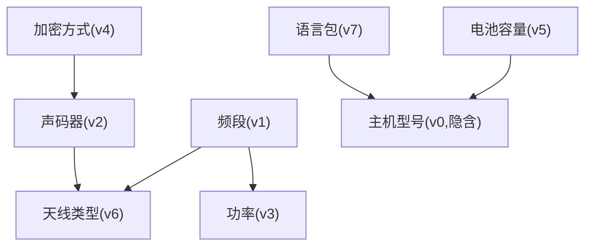

**制造业CPQ的CSP特征**：

| 特征 | 具体表现 | 工程影响 |
|------|---------|---------|
| **高维稀疏** | 100-10,000个变量，但每个变量的域通常<20 | 回溯搜索可行，无需ILP |
| **约束局部化** | 大部分约束只涉及2-5个变量 | 可分区求解，减少组合爆炸 |
| **增量求解** | 用户逐步选择，每步需要快速响应 | 增量传播优于全量重算 |
| **冲突解释** | 需要告诉用户"为什么不能选" | MCS提取是必需功能 |

### 4.3.X.2 约束传播算法：维持弧一致性（MAC）

当用户做出一个选择（如"频段=66-88MHz"），配置引擎需要：
1. **布尔约束传播（BCP）**：从当前赋值推导所有必然结论（如"天线类型=VHF天线"自动选中）
2. **过滤非法选项**：禁用与当前选择冲突的选项（如隐藏"UHF天线"）

**AC-3（Arc Consistency 3）的制造业适配伪代码**：

```
function MAINTAIN_ARC_CONSISTENCY(V, D, C, assignment):
    // V: 变量集, D: 域集, C: 约束集
    // assignment: 用户当前的赋值 {(v, value), ...}
    
    // 步骤1: 缩小域——移除与已赋值变量冲突的值
    worklist = ∅
    for each (vᵢ, val) in assignment:
        Dᵢ = {val}  // 已赋值变量的域收缩为单值
        for each c ∈ constraints_involving(vᵢ):
            for each vⱼ ∈ scope(c) where j ≠ i:
                worklist.add((vⱼ, c))
    
    // 步骤2: AC-3传播
    while worklist ≠ ∅:
        (vₖ, c) = worklist.pop()
        if REVISE_DOMAIN(vₖ, c, D, assignment):
            if Dₖ = ∅:
                return CONFLICT  // 约束不可满足
            for each c' ∈ constraints_involving(vₖ) where c' ≠ c:
                for each vₘ ∈ scope(c') where m ≠ k:
                    worklist.add((vₘ, c'))

    return CONSISTENT

function REVISE_DOMAIN(v, constraint, D, assignment):
    revised = false
    for each val in D_v:
        if not EXISTS_SUPPORT(v, val, constraint, D):
            D_v.remove(val)
            revised = true
    return revised
```

**制造业示例**：用户选择"AES256加密"后：
- AC-3自动禁用"声码器=模拟"（约束C₂）
- AC-3检查"天线类型→频段"约束如果仅有UHF天线可选则产生冲突
- 前端灰显不可用选项，实时减少用户认知负荷

### 4.3.X.3 求解器选型对比

针对制造业CPQ不同规模场景的求解器选型：

| 方案 | 适用场景 | 时间/空间复杂度 | 优点 | 缺点 |
|------|---------|:-------------:|------|------|
| **回溯搜索 + AC-3** | 小规模(<100变量)<br>如单机型配置 | 时间 O(dⁿ) 但AC-3剪枝效果好<br>空间 O(n·d) | 实现简单<br>易于集成冲突解释 | 大规模退化<br>缺乏全局优化 |
| **SAT编码** | 中大规模(100-5000变量)<br>如跨产品线配置 | 时间 取决于SAT求解器<br>空间 O(m·k) m=子句数 | 现代SAT求解器极快<br>天然支持UNSAT核 | 编码复杂度高<br>增量更新较复杂 |
| **BDD编译 + 离线预处理** | 超大规模(5000+变量)<br>高频查询场景 | 编译 O(2ⁿ)一次性<br>查询 O(size of BDD) | 查询极快<br>支持模型计数 | 编译耗时长<br>不适合频繁规则变更 |

**SAT编码示例**：将CPQ兼容性规则编码为布尔公式

```
规则1: 频段=66-88MHz ⇒ 天线类型=VHF天线
SAT编码: ¬X_freq_66_88 ∨ X_ant_VHF

规则2: AES256加密 ⇒ 声码器≠模拟（即声码器=数字）
SAT编码: ¬X_enc_AES256 ∨ X_voc_digital

规则3: 电池容量>2000mAh ⇒ 主机≠BD300
SAT编码: ¬X_bat_high ∨ ¬X_model_BD300

完整公式: φ = (¬X_freq_66_88 ∨ X_ant_VHF) ∧ (¬X_enc_AES256 ∨ X_voc_digital) ∧ ...
```

**制造业CPQ推荐策略**：

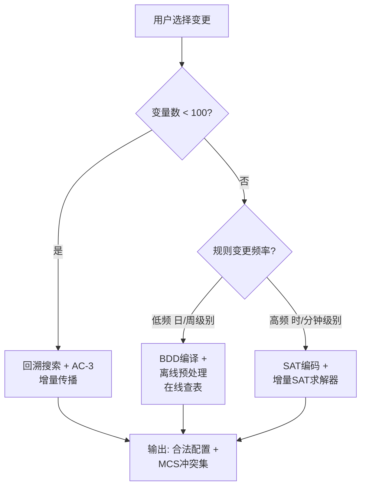

### 4.3.X.4 规则编译策略

CPQ规则的生命周期分为"声明式定义 → 编译 → 执行"三个阶段。制造业CPQ需要支持多种编译目标以适应不同场景。

**规则编译路径对比**：

| 编译目标 | 适用场景 | 编译输入 | 编译输出 | 典型性能 |
|---------|---------|---------|---------|---------|
| **Rete网络** | 事件驱动、增量规则匹配 | 声明式规则集 | 条件节点DAG | 增量匹配 O(Δ) |
| **决策树** | 分类优先、少量变量 | 规则+优先级 | 二叉树 | O(log n) |
| **SQL/Materialized View** | 批量验证、离线分析 | 规则→WHERE子句 | 物化视图+索引 | DB级别优化 |
| **SAT/CNF编译** | 约束求解 | 规则→CNF子句 | 布尔公式 | SAT求解器性能 |

**基于Rete网络的配置规则编译示例**：

```
声明式规则:
  RULE "高频配长天线":
    WHEN model.freq IN ["350-400MHz", "806-941MHz"]
    THEN antenna.length >= 150mm

Rete网络节点图：
  ┌──────────────┐
  │ AlphaNode 1   │── model.freq ∈ {350-400, 806-941}
  │ (类型过滤)     │
  └──────┬───────┘
         │ 匹配的事实进入
  ┌──────▼───────┐
  │ BetaNode 1    │── 同时存在 model.freq 和 antenna.length
  │ (Join节点)    │
  └──────┬───────┘
         │
  ┌──────▼───────┐
  │ TerminalNode  │── 触发动作: antenna.length >= 150mm
  │ (规则激活)     │
  └──────────────┘
```

**规则预编译（Warm-up）机制**：

```
CPQ_STARTUP_WARMUP():
    // 系统启动时的规则预编译流程
    
    // 阶段1: 规则合法性校验
    for each rule in RULE_REPOSITORY:
        VALIDATE_RULE_SYNTAX(rule)
        CHECK_RULE_CONFLICT(rule, active_rules)
    
    // 阶段2: 编译规则到执行格式
    rete_network = BUILD_RETE_NETWORK(config_rules)
    decision_trees = BUILD_DECISION_TREES(pricing_rules)
    cnf_formula = COMPILE_TO_CNF(compatibility_rules)
    
    // 阶段3: 预热缓存
    hot_configs = LOAD_FREQUENT_CONFIGURATIONS(last_30_days)
    for each config in hot_configs:
        PRE_EVALUATE_RULES(config, rete_network)
        CACHE_RESULT(config.hash, evaluation_result)
    
    // 阶段4: 标记就绪
    SYSTEM_READY = true
    log.info("规则引擎预热完成，已预加载{}个热点配置", hot_configs.size())
```

### 4.3.X.5 增量计算设计

制造业CPQ需要增量计算——当用户改变一个选择时，只重算受影响的规则，而非全量重算。

**依赖图（Dependency Graph）设计**：

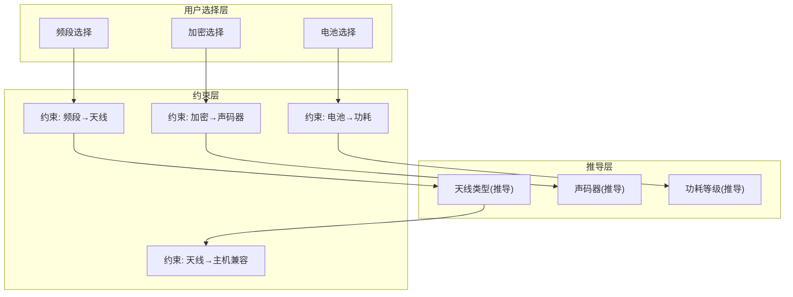

**增量传播算法（基于真值维护系统TMS）**：

```
class IncrementalConfigSolver:
    dependency_graph: DirectedGraph  // 节点=变量/约束，边=依赖
    assignment: Map<Var, Value>      // 当前赋值
    tms_justifications: Map<Var, Set<Constraint>>  // TMS理由
    
    function ON_USER_CHANGE(variable, new_value):
        // 仅传播受影响节点
        affected = dependency_graph.GET_DESCENDANTS(variable)
        
        // 按拓扑序重新计算
        for each node in TOPOLOGICAL_SORT(affected):
            if node.type == DERIVED_VARIABLE:
                old_value = assignment[node]
                new_val = EVALUATE_DERIVED_VAR(node, assignment)
                if new_val != old_value:
                    assignment[node] = new_val
                    // 进一步传播
                    affected.add_all(dependency_graph.GET_DESCENDANTS(node))
            
            elif node.type == CONSTRAINT:
                status = EVALUATE_CONSTRAINT(node, assignment)
                if status == VIOLATED:
                    CONFLICT_SET.add(node)
```

**TMS/ATMS在配置中的伪代码**：

```
// ATMS — 假设式真值维护系统
// 每个推导节点记录其"前提假设集"
// 当用户做出新选择时，ATMS可快速判断哪些推导仍然有效

class ATMS:
    assumptions: Set<Node>      // 用户选择的假设集
    labels: Map<Node, Set<Set<Node>>>  // 每个节点的标签(支持它的最小假设集)
    
    function RECORD_JUSTIFICATION(consequent, antecedents):
        // 记录推导关系
        new_label = UNION_ALL(antecedents.map(a -> labels[a]))
        labels[consequent].add(new_label)
    
    function CHECK_VALIDITY(node, new_assumptions):
        // 检查节点在给定新假设下是否仍然有效
        for each label in labels[node]:
            if label ⊆ new_assumptions:
                return VALID  // 存在至少一组前提假设仍然成立
        return INVALID
    
    function GET_CONFLICTING_ASSUMPTIONS():
        // 找出矛盾的最小假设集
        // 用于冲突解释
        nogoods = SET()
        for each conflict in CONFLICT_NODES:
            for each label in labels[conflict]:
                nogoods.add(label)
        return MINIMAL(nogoods)
```

### 4.3.X.6 冲突解释与QuickXPlain算法

当CPQ配置出现冲突时，不能只告诉用户"配置不合法"，而必须**解释为什么**并**指明如何修复**。

**QuickXPlain算法**（用于生成最小冲突集MCS）：

```
function QUICKXPLAIN(B, C):
    // B: 背景约束（不可协商的硬约束）
    // C: 待检查的约束集（用户选择引入的约束）
    
    if B is CONSISTENT:
        return ∅  // 背景约束本身无冲突
    
    if |C| == 1:
        return C  // 单一约束就是冲突源
    
    // 分治法：将C分为C₁和C₂
    k = |C| / 2
    C₁ = C[0..k], C₂ = C[k+1..|C|]
    
    // 检查C₂是否与B冲突
    Δ₂ = QUICKXPLAIN(B ∪ C₁, C₂)
    if Δ₂ ≠ ∅:
        return Δ₂  // 冲突在C₂中
    
    // 否则检查C₁是否与B∪C₂冲突
    Δ₁ = QUICKXPLAIN(B ∪ C₂, C₁)
    return Δ₁
```

**冲突解释的用户友好输出**：

```
输入: 用户选择了 {频段=350-400MHz, 天线=短天线(80mm), 功率=25W}

QuickXPlain输出最小冲突集MCS:
  {约束3: "频段≥350MHz ⇒ 天线长度≥150mm",
   约束7: "天线长度<100mm ⇒ 功率≤10W"}

用户友好解释:
  ⚠️ 配置冲突：您选择的"UHF频段(350-400MHz)"要求天线长度≥150mm，
     但您选择的是"短天线(80mm)"。
  
  🔧 修复建议（3选1）：
    1. 将天线改为"UHF标准天线(180mm)" ✓ 推荐
    2. 将频段改为"VHF(136-174MHz)" — 可使用短天线
    3. 增加"射频功放器"外接模块 — 弥补短天线增益损失
```

### 4.3.X.7 配置引擎关键接口伪代码

```
// ========== 配置引擎核心API ==========

interface IConfigEngine {
    // 初始化配置会话
    ConfigSession START_CONFIG(
        productModel: ProductModel,
        context: ConfigContext        // 客户、区域、渠道等上下文
    ) -> ConfigSession
    
    // 设置选项值（核心交互方法）
    SetOptionResult SET_OPTION(
        sessionId: String,
        optionPath: String,           // 如 "频段"
        value: Any                    // 如 "350-400MHz"
    ) -> SetOptionResult {
        // 返回：
        //   - affected_options: 受影响的其他选项及新值
        //   - disabled_options: 被禁用的选项列表
        //   - auto_selected: 自动选中的选项
        //   - conflicts: 冲突描述列表
        //   - warnings: 警告信息列表
        //   - is_valid: 当前配置是否合法
    }
    
    // 获取当前可用选项（已过滤不兼容项）
    GET_AVAILABLE_OPTIONS(
        sessionId: String
    ) -> Map<String, List<OptionValue>>
    
    // 冲突解释
    EXPLAIN_CONFLICT(
        sessionId: String,
        targetOption: String          // 用户尝试选择但被禁用的选项
    ) -> ConflictExplanation {
        // 返回：
        //   - minimal_conflict_set: 最小冲突约束集
        //   - resolution_suggestions: 修复建议（排序）
        //   - human_readable: 用户可读解释
    }
    
    // 完整配置验证
    VALIDATE_CONFIG(
        sessionId: String
    ) -> ValidationResult {
        // 返回：
        //   - all_errors: 所有违规
        //   - all_warnings: 所有警告
        //   - completeness: 完整性检查结果
        //   - feasibility: 技术可行性结果
    }
    
    // 生成最终BOM
    GENERATE_BOM(
        sessionId: String
    ) -> SalesBOM
}

// ========== 结果数据结构 ==========

struct SetOptionResult:
    session_id: String
    affected_options: List<AffectedOption>  // 级联影响
    disabled_options: List<DisabledOption>  // 被禁用的
    auto_selected: List<AutoSelectedOption> // 自动选中
    conflicts: List<Conflict>              // 冲突
    warnings: List<Warning>                // 警告
    is_valid: Bool                        // 整体合法性

struct Conflict:
    constraint_id: String
    severity: Enum{ERROR, WARNING}
    involved_options: List<String>        // 涉及的选项
    human_message: String                 // "频段350-400MHz与短天线不兼容"

struct ConflictExplanation:
    minimal_conflict_set: List<String>    // ["约束3", "约束7"]
    resolution_suggestions: List<Suggestion>  // 按优先级排序
    human_readable: String                // 完整可读解释
```

---


---

## 4.3 扩展——配置版本管理与What-if分析

> **原报告基础**：4.3 规则引擎设计（包含规则版本管理的基本概念）  
> **新增深度**：时间胶囊快照、配置Diff引擎、配置继承模型、Event Sourcing变更日志、Scenario Manager、灵敏度分析

### 4.3.X.1 配置"时间胶囊"快照设计

**时间胶囊概念**：报价单不仅是当前配置选择的快照，还需要记录创建时**完整的环境上下文**——包括产品定义版本、规则版本、价格版本——使得未来任意时刻可以完整复现当时的配置结果。

**时间胶囊数据结构**：

```
struct ConfigurationTimeCapsule:
    capsule_id: UUID
    created_at: Timestamp
    
    // 用户配置选择
    config_selections: Map<String, Any>  // {频段: "350-400MHz", 天线: "UHF天线", ...}
    
    // 版本锚点（Point-in-Time）
    version_anchors: {
        product_definition_version: "v3.2.1",     // 产品定义版本
        config_rule_set_version: "rules_2025Q2_v7", // 配置规则集版本
        price_book_version: "PB_APAC_2025_06_01",  // 价格手册版本
        bom_version: "MBOM_PD785_v2.1",            // 生产BOM版本
        routing_version: "RT_PD785_v1.0"           // 工艺路线版本
    }
    
    // 上下文信息
    context: {
        region: "APAC",
        channel: "DIRECT",
        customer_id: "CUST-12345",
        currency: "USD",
        exchange_rate_snapshot: {"CNY": 7.24, "EUR": 0.92}
    }
    
    // 计算结果快照
    computed_snapshot: {
        bom_lines: List<BOMLine>,
        price_breakdown: PriceBreakdown,
        total_amount: Decimal,
        valid_until: Date
    }
    
    // 完整性校验
    checksum: String  // SHA256 of all version anchors + selections
```

**Point-in-Time Recovery机制**：

```
function POINT_IN_TIME_RECOVERY(capsule):
    // 步骤1: 验证版本锚点是否仍然可访问
    for each (version_key, version_value) in capsule.version_anchors:
        if not VERSION_SERVICE.IS_VERSION_AVAILABLE(version_key, version_value):
            return RecoveryResult(
                status: "PARTIAL",
                missing_versions: [version_key],
                warning: "部分版本已归档/清理，使用最近可用版本替代"
            )
    
    // 步骤2: 重建当时的配置环境
    recovery_context = ConfigContext(
        product_definition: VERSION_SERVICE.GET_PRODUCT_DEF(
            capsule.version_anchors.product_definition_version
        ),
        rule_set: VERSION_SERVICE.GET_RULE_SET(
            capsule.version_anchors.config_rule_set_version
        ),
        price_book: VERSION_SERVICE.GET_PRICE_BOOK(
            capsule.version_anchors.price_book_version
        )
    )
    
    // 步骤3: 用当时的规则重新验证配置
    validation_result = CONFIG_ENGINE.VALIDATE_WITH_CONTEXT(
        capsule.config_selections, 
        recovery_context
    )
    
    // 步骤4: 重新计算BOM和价格
    replayed_bom = BOM_ENGINE.EXPAND_WITH_CONTEXT(
        capsule.config_selections, 
        recovery_context
    )
    replayed_price = PRICING_ENGINE.CALCULATE_WITH_CONTEXT(
        capsule.config_selections, 
        recovery_context
    )
    
    // 步骤5: 对比原始快照和重放结果
    comparison = COMPARE_SNAPSHOTS(capsule.computed_snapshot, {
        bom_lines: replayed_bom,
        price_breakdown: replayed_price
    })
    
    return RecoveryResult(
        status: "COMPLETE" if comparison.is_identical else "DRIFT_DETECTED",
        replayed: {bom: replayed_bom, price: replayed_price},
        drift: comparison.differences
    )
```

### 4.3.X.2 配置Diff引擎

两个配置之间的三维差异分析：

| Diff维度 | 对比内容 | 可视化方式 | 典型用途 |
|---------|---------|-----------|---------|
| **BOM差异** | 物料增/删/数量变更 | 差异树图、红绿标注表 | 评估不同配置对供应链的影响 |
| **价格差异** | 分项价格+总价变动 | 瀑布图(Waterfall) | 解释为什么配置B更贵/更便宜 |
| **规则差异** | 生效规则变更 | 规则列表对比 | 理解为什么某个选项在配置A中可用但在B中不可用 |

**配置Diff算法伪代码**：

```
function CONFIG_DIFF(config_a: TimeCapsule, config_b: TimeCapsule):
    diff = ConfigDiff()
    
    // ======== BOM差异 ========
    bom_a = FLATTEN_BOM(config_a.computed_snapshot.bom_lines)
    bom_b = FLATTEN_BOM(config_b.computed_snapshot.bom_lines)
    
    diff.bom = {
        added: bom_b.elements - bom_a.elements,     // 新增物料
        removed: bom_a.elements - bom_b.elements,   // 删除物料
        quantity_changed: QUANTITY_DIFF(bom_a, bom_b), // 数量变化
        total_items_a: len(bom_a),
        total_items_b: len(bom_b),
        item_count_delta: len(bom_b) - len(bom_a)
    }
    
    // ======== 价格差异 ========
    diff.price = {
        total_a: config_a.computed_snapshot.total_amount,
        total_b: config_b.computed_snapshot.total_amount,
        delta: config_b.total - config_a.total,
        delta_pct: (config_b.total - config_a.total) / config_a.total * 100,
        line_item_diffs: PRICE_LINE_DIFF(config_a, config_b),
        discount_diff: {
            a: config_a.discount_total,
            b: config_b.discount_total
        }
    }
    
    // ======== 规则差异 ========
    rules_a = GET_RULES_ACTIVATED(config_a)
    rules_b = GET_RULES_ACTIVATED(config_b)
    
    diff.rules = {
        newly_triggered: rules_b - rules_a,     // 配置B新增触发的规则
        no_longer_triggered: rules_a - rules_b, // 配置A触发但B不触发的规则
        unchanged: rules_a ∩ rules_b
    }
    
    // ======== 选择差异 ========
    diff.selections = {
        changed: CONFIG_SELECTION_DIFF(
            config_a.config_selections, 
            config_b.config_selections
        ),
        added_options: SET_DIFF(config_b.selections, config_a.selections),
        removed_options: SET_DIFF(config_a.selections, config_b.selections)
    }
    
    return diff
```

### 4.3.X.3 配置继承模型

**继承模型**：基础配置(base_config) → 派生配置(derived_config)，支持单向同步/断开继承。

```
┌─────────────────────────────┐
│       基础配置               │
│   BaseConfig: "标准版PD785"  │
│   频段: 136-174MHz          │
│   加密: 无                   │◄─── 此属性由基础配置锁定
│   电池: 标准1200mAh          │
│   天线: VHF标准天线          │
└──────────┬──────────────────┘
           │ inherit
           ▼
┌─────────────────────────────┐
│       派生配置A              │
│   DerivedConfig: "矿业版"    │
│   频段: 136-174MHz ◄─ 继承   │
│   加密: AES256     ◄─ 覆盖   │
│   电池: 2400mAh    ◄─ 覆盖   │
│   天线: VHF增强天线  ◄─ 覆盖  │
└─────────────────────────────┘
           │ inherit
           ▼
┌─────────────────────────────┐
│       派生配置B              │
│   DerivedConfig: "矿业出口版" │
│   频段: 136-174MHz ◄─ 继承   │
│   加密: AES256     ◄─ 继承   │
│   电池: 2400mAh    ◄─ 继承   │
│   天线: GPS/VHF双模 ◄─ 覆盖  │
│   语言: 英文       ◄─ 新增   │
└─────────────────────────────┘
```

**继承同步策略**：

| 同步模式 | 触发条件 | 行为 | 适用场景 |
|---------|---------|------|---------|
| **自动同步** | 基础配置任何变更 | 所有派生配置自动更新被继承的属性 | 标准配置模板，派生配置仅做微调 |
| **通知同步** | 基础配置变更 | 通知派生配置Owner，由Owner决定是否应用 | 有独立审批要求的派生配置 |
| **断开继承** | Owner主动操作 | 配置变为独立配置，不再受基础配置影响 | 客户专属配置，需要独立维护 |
| **单向覆盖** | 派生配置主动选择 | 某些属性永久覆盖基础配置，不受同步影响 | 地区法规要求的强制修改 |

### 4.3.X.4 Event Sourcing变更日志

**Command Event设计**：

```
// 用户操作都被记录为Command Event
type ConfigCommand = 
    | SetOption { option: String, value: Any }
    | RemoveOption { option: String }
    | ChangeQuantity { item: String, new_qty: Integer }
    | AddCustomItem { description: String, specs: Map }
    | ApplyDiscount { line_id: String, amount: Decimal }
    | SubmitForApproval { approver: String }

// 对应的Domain Event
type ConfigEvent =
    | OptionSet { option: String, value: Any, timestamp: DateTime, by: User }
    | OptionRemoved { option: String, timestamp: DateTime, by: User }
    | QuantityChanged { item: String, old: Int, new: Int, timestamp: DateTime, by: User }
    | CustomItemAdded { item_id: String, description: String, timestamp: DateTime, by: User }
    | DiscountApplied { line_id: String, amount: Decimal, timestamp: DateTime, by: User }
    | ConfigurationSubmitted { quote_id: String, timestamp: DateTime, by: User }

// 通过重放事件可以重建任意时间点的配置状态
function REPLAY_CONFIG(events: List<ConfigEvent>, target_time: DateTime):
    config = ConfigSession.empty()
    for each event in events:
        if event.timestamp > target_time:
            break
        APPLY_EVENT(config, event)
    return config
```

### 4.3.X.5 版本依赖图

产品、规则、价格的版本之间存在依赖关系：

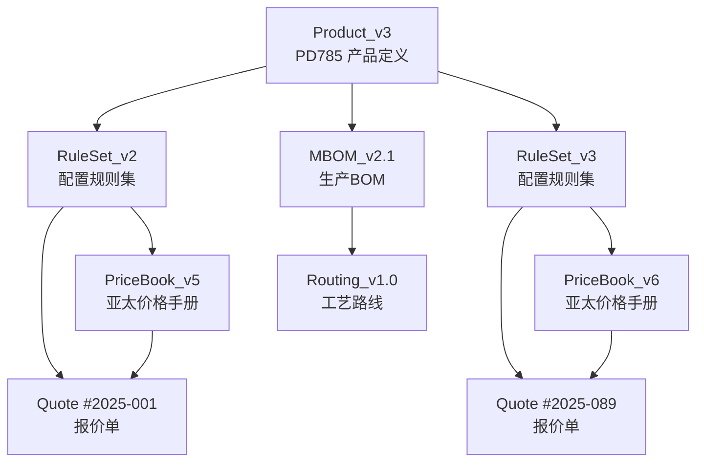

**版本联动策略**：

| 策略 | 描述 | 优点 | 缺点 |
|------|------|------|------|
| **向上兼容标记** | 版本发布时标记与哪些旧版本兼容 | 灵活，不强制同步 | 需要维护兼容矩阵 |
| **冲突检测** | 报价单引用版本不一致时主动告警 | 安全，防止错误 | 可能过于严格 |
| **自动升级** | 规则/价格更新时自动升级关联报价单 | 维护成本低 | 可能改变报价结果 |
| **锁定快照** | 报价单创建后锁定所有版本引用 | 最安全 | 无法享受规则/价格更新红利 |

**推荐策略**：提交前支持自动同步（享受最新规则和价格），审批后锁定快照（保证可追溯性）。

### 4.3.X.6 Scenario Manager

**同一Quote下多Scenario管理**：

```
Quote #Q-2025-0123 "亚太区PD785报价"
├─ Scenario 1: "标准版" (当前激活)
│   ├─ 频段: 136-174MHz
│   ├─ 加密: 无
│   ├─ 电池: 标准1200mAh
│   ├─ BOM行数: 12
│   └─ 总价: $2,450
│
├─ Scenario 2: "高配版"
│   ├─ 频段: 136-174MHz
│   ├─ 加密: AES256
│   ├─ 电池: 2400mAh高容
│   ├─ BOM行数: 15
│   └─ 总价: $3,680
│
├─ Scenario 3: "UHF矿业版"
│   ├─ 频段: 350-400MHz
│   ├─ 加密: AES256
│   ├─ 电池: 2400mAh高容
│   ├─ 天线: UHF增强天线
│   ├─ BOM行数: 16
│   └─ 总价: $4,120
│
└─ Scenario 4: "经济版What-if"
    ├─ 频段: 136-174MHz
    ├─ 加密: 无
    ├─ 电池: 800mAh小容量
    ├─ 免充电器
    ├─ BOM行数: 8
    └─ 总价: $1,860 (降24%)
```

**Scenario管理API**：

```
interface IScenarioManager:
    CREATE_SCENARIO(quote_id, scenario_name, base_scenario_id?) -> Scenario
    SWITCH_SCENARIO(quote_id, scenario_id) -> Scenario
    COMPARE_SCENARIOS(quote_id, scenario_ids[]) -> ScenarioComparison
    MERGE_SCENARIO(quote_id, source_id, target_id) -> Scenario  // 合并两个场景
    SET_ACTIVE_SCENARIO(quote_id, scenario_id)  // 设为最终提交场景
```

### 4.3.X.7 灵敏度分析与What-if模拟

**灵敏度分析矩阵**：

| What-if变量 | 影响维度 | 分析输出 | 典型问题 |
|-------------|---------|---------|---------|
| **数量变化** (±10%/±50%) | 阶梯价格、BOM总量 | 单价变化曲线 | "如果客户订100台而非50台，单价能降多少？" |
| **配件增减** | BOM成本、交期 | 成本瀑布图 | "去掉GPS模块和加密模块，能省多少钱？" |
| **替代物料** | 价格、交期、性能 | 替代方案对比表 | "用国产天线替代进口天线，成本和交期如何变化？" |
| **区域切换** | 价格、税率、合规 | 区域差异对比 | "如果从亚太区发货给欧洲客户，价格差多少？" |
| **汇率波动** (±5%/±10%) | 多币种报价 | 汇率敏感度曲线 | "如果人民币升值5%，美元报价需要调整多少？" |

**灵敏度分析伪代码**：

```
function SENSITIVITY_ANALYSIS(base_config, variables, ranges):
    results = {}
    
    for each (variable, range_values) in zip(variables, ranges):
        variable_results = []
        
        for each value in range_values:
            // 创建变体配置
            variant = DEEP_COPY(base_config)
            APPLY_VARIATION(variant, variable, value)
            
            // 计算变体结果
            variant_bom = BOM_ENGINE.EXPAND(variant)
            variant_price = PRICING_ENGINE.CALCULATE(variant)
            variant_lead_time = ATP_ENGINE.ESTIMATE(variant_bom)
            
            variable_results.append({
                variation: {variable: value},
                bom_lines: len(variant_bom),
                total_cost: variant_price.cost,
                total_price: variant_price.total,
                margin_pct: variant_price.margin_pct,
                lead_time_days: variant_lead_time
            })
        
        results[variable] = variable_results
    
    return SensitivityReport(
        base_case: COMPUTE_CASE(base_config),
        scenarios: results,
        tornado_data: COMPUTE_TORNADO(base_config, results)  // 龙卷风图数据
    )
```

---

> **撰写完成时间**：2026年6月6日  
> **后续建议**：以上5个章节提供了工程化实现的完整深度，可与Group 2（售前业务组）和Group 3（生产衔接组）的章节合并成V2.0完整报告。

### 4.4 ATO模式设计

ATO（Assembly-to-Order，按订单装配）是制造业CPQ最难也是最核心的场景。基于Mindray方案中的ATO分析：

#### 4.4.1 完善的ATO模式

```
完善的ATO流程
════════════════════════════════════════════════════════════

  客户需求          配置生成              生产成套          交付履行
  ─────────        ─────────             ─────────         ─────────
                                                          
  ┌─────────┐     ┌─────────────┐      ┌─────────────┐   ┌────────┐
  │ 客户选择  │────▶│ 配置器       │─────▶│ 装配件B      │──▶│ 交付    │
  │ 配置参数  │     │ ├─ 产品参数化  │      │ 装配件C      │   │        │
  │          │     │ ├─ 装配件选择  │      │ 装配件A      │   └────────┘
  └─────────┘     │ ├─ 配置校验    │      └─────────────┘
                  │ └─ 生成SBOM   │
                  └─────────────┘

三大核心能力要求：
┌────────────────────────────────────────────────────────────┐
│ ① 产品参数化（Owner: 销售+研发）                              │
│    将客户需求转化为结构化的产品属性描述                          │
│    属性使用客户语言（频段、制式、功率）而非研发语言               │
│                                                            │
│ ② 配置部件标准化（Owner: 研发）                                │
│    将装配件定义为标准化的可配置单元                             │
│    每个装配件有明确的BOM、编码和物料清单                        │
│    装配件之间的关系用配置规则定义                               │
│                                                            │
│ ③ 参数可识别为配置部件（Owner: 供应体系）                        │
│    销售配置参数能自动转换为供应体系可识别的物料                   │
│    按单自动形成计划、采购、生产、成套和交付                       │
└────────────────────────────────────────────────────────────┘
```

#### 4.4.2 有欠缺的ATO模式（需要避免）

```
有欠缺的ATO模式
════════════════════════════════════════════════════════════
问题特征：
┌────────────────────────────────────────────────────────────┐
│  ① 装配成套与生产再装配混淆                                    │
│     ● 应有：面向成套产品的装配管理                              │
│     ● 实际：面向订单的定制件生产（本质是MTO/ETO而非ATO）          │
│                                                            │
│  ② 产品编码与成品编码混淆                                      │
│     ● 应有：装配件有预定义编码和BOM（有限、可管理）               │
│     ● 实际：装配件按订单新增编码（无限扩充、无预定义BOM）         │
│                                                            │
│  ③ 标准化装配件管理缺失                                        │
│     ● 应有：装配件预先定义、预先设计、预先生产                    │
│     ● 实际：没有预定义的装配件，按单随需定义和设计                │
└────────────────────────────────────────────────────────────┘

导致的问题：
├─ 面对需求变化的灵活度低
├─ 客户响应慢，满意度低
├─ 供应链计划无法准确生成
├─ 订单交付成本高，效率低
├─ 产品编码数量爆炸式增长，管理难度高
├─ 流程冗长复杂，订单交付周期长
└─ ATO编码复用率低，大量一次性编码
```

#### 4.4.3 ATO模式的管理建议

基于海能达ATO订单管理建议：

```
ATO配置项分类管理
═══════════════════════════════════════════════════════════

  客户需求     →    售前分析配置    →    订单明细
  ────────         ────────────        ────────
                                         │
                    ┌────────────────────┼────────────────────┐
                    ▼                    ▼                    ▼
            ┌──────────────┐    ┌──────────────┐    ┌──────────────┐
            │  可配置件      │    │  不可配置件    │    │  定制件        │
            │  (标准化)      │    │  (标准化)      │    │  (非标)        │
            ├──────────────┤    ├──────────────┤    ├──────────────┤
            │ 频段           │    │ 主机           │    │ 结构定制       │
            │ 加密/扰频      │    │               │    │ (颜色/控制头)  │
            │ 配件(电池等)    │    │               │    │ 基于订单的     │
            │ 软件           │    │               │    │ 特殊需求       │
            │ (语言包等)     │    │               │    │               │
            │ 包装/Logo      │    │               │    │               │
            └──────────────┘    └──────────────┘    └──────────────┘
                    │                    │                    │
                    ▼                    ▼                    ▼
              属性驱动配置          固定SBOM项           定制需求备注
              (结构化的)            (不可更改)           (非结构化)
```

**ATO设计的关键决策**：
1. **哪些可以标准化为可配置件？** — 频段、加密、语言包、配件等
2. **哪些必须保持为定制需求？** — 结构件修改、特殊软件定制等
3. **可配置件的粒度如何设定？** — 太细则编码爆炸，太粗则无法复用
4. **何时生成新编码？何时复用现有编码？** — 需要明确的编码复用规则

---


---

## 4.4.XA 从销售配置到生产交付的全链路转换 — SBOM→MBOM→工艺BOM

### 一、SBOM→MBOM自动转换

SBOM（销售BOM）和MBOM（生产BOM）之间的鸿沟是制造业CPQ能否打通"销售-生产"链路的关键瓶颈。原报告2.5节已阐明两套BOM的概念差异，本节聚焦于**如何实现自动转换**。

#### 1.1 属性映射表（Attribute Mapping Table）结构

属性到物料的多级级联映射是转换的核心数据结构。映射表的基本结构如下：

```
Attribute Mapping Table
┌──────────────────────────────────────────────────────────────────────────┐
│  feature_name  │ option_value    │ material_code │ quantity │ unit │ level │
├────────────────┼─────────────────┼───────────────┼──────────┼──────┼───────┤
│  频段           │ 66-88MHz        │ AN0375H10     │ 1        │ PCS  │ L1    │
│  频段           │ 66-88MHz        │ CONN-003      │ 1        │ PCS  │ L2    │
│  频段           │ 66-88MHz        │ PROT-VHF      │ 1        │ SET  │ L3    │
│  频段           │ 136-174MHz      │ AN0435H09     │ 1        │ PCS  │ L1    │
│  防水           │ IP67            │ SEAL-SIL-007  │ 2        │ PCS  │ L2    │
│  防水           │ IP67            │ GASKET-014    │ 1        │ PCS  │ L2    │
│  认证           │ ATEX防爆        │ ENC-EX-004    │ 1        │ PCS  │ L3    │
│  认证           │ ATEX防爆        │ LABEL-EX-001  │ 1        │ PCS  │ L3    │
└──────────────────────────────────────────────────────────────────────────┘
```

**级联映射示例**——一个配置选项如何触发多级物料展开：

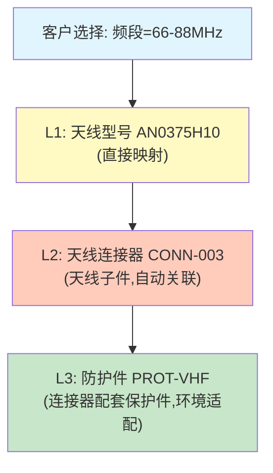

#### 1.2 转换规则的类型建模

转换规则不仅是简单的查表，需要支持多种映射模式：

| 规则类型 | 表达式 | 适用场景 | 示例 |
|---------|--------|---------|------|
| **简单映射 (1:1)** | `IF attribute.X = value THEN material = M` | 频段→天线、功率→电源模块 | 66-88MHz → AN0375H10 |
| **条件选择 (1:N)** | `IF attribute.X = value AND context.region = EU THEN M1 ELSE M2` | 区域法规差异、客户等级差异 | EU客户选配CE认证适配器 |
| **参数驱动生成** | `material_code = f(voltage, current, form_factor)` | 线缆长度、定制规格 | 线缆长度 = 柜间距离+余量 |

**伪代码——条件选择规则执行**：

```
FUNCTION resolve_material(feature_name, option_value, context):
    candidates = mapping_table.lookup(feature_name, option_value)
    IF candidates.count == 1:
        RETURN candidates[0].material_code
    ELSE:
        FOR candidate IN candidates:
            IF eval(candidate.condition, context):
                RETURN candidate.material_code
        RETURN fallback_material  // 无匹配时使用默认物料
    END IF
END FUNCTION
```

#### 1.3 SBOM→MBOM→工艺BOM三层转换模型

```
三层转换架构
═══════════════════════════════════════════════════════════

第1层：SBOM（销售视角）
┌──────────────────────────────────────────────┐
│  数据结构：扁平列表                            │
│  ┌──────────────────────────────────────┐    │
│  │ PD785-GPS-标准配置                    │    │
│  │  ├─ 主机 ×1    (HOST)                │    │
│  │  ├─ 2000mAh电池 ×1 (ACCESSORY)       │    │
│  │  ├─ GPS天线 ×1   (ACCESSORY)         │    │
│  │  ├─ 充电器 ×1    (ACCESSORY)         │    │
│  │  └─ 语言包-CN ×1 (SOFTWARE)          │    │
│  └──────────────────────────────────────┘    │
│  语言：客户语言（"高配版"、"含GPS"）          │
│  粒度：可销售单元，非精确到产线识别             │
└──────────────────┬───────────────────────────┘
                   │ 转换引擎
                   ▼
第2层：MBOM（生产视角）
┌──────────────────────────────────────────────┐
│  数据结构：树状结构                            │
│  ┌──────────────────────────────────────┐    │
│  │ M-PD785-001 (整机成品)               │    │
│  │  ├─ S-PD785-BD (主机半成品)           │    │
│  │  │   ├─ PCB-MAIN-V3 (主板)           │    │
│  │  │   │   ├─ CPU-STM32F4 ×1          │    │
│  │  │   │   ├─ RF-TRX-VHF ×1            │    │
│  │  │   │   └─ MEM-FLASH-16M ×1         │    │
│  │  │   ├─ LCD-240×320 ×1               │    │
│  │  │   ├─ KEYPAD-16KEY ×1              │    │
│  │  │   └─ ENC-PLASTIC-BLK ×1           │    │
│  │  ├─ BAT-LI-2000 ×1                   │    │
│  │  ├─ ANT-GPS-003 ×1                   │    │
│  │  ├─ CHG-DESK-USB ×1                  │    │
│  │  └─ PKG-CARTON-STD ×1                │    │
│  └──────────────────────────────────────┘    │
│  语言：工程语言（物料编码、批次、供应商）       │
│  粒度：精确到可生产和采购的最小单元             │
└──────────────────┬───────────────────────────┘
                   │ 工艺转换
                   ▼
第3层：工艺BOM / Routing（工序视角）
┌──────────────────────────────────────────────┐
│  数据结构：工序序列+资源+工时                   │
│  ┌──────────────────────────────────────┐    │
│  │ M-PD785-001 工艺路线                  │    │
│  │  ┌──────────────────────────────────┐│    │
│  │  │ OP10: SMT贴片    WC-SMT-01       ││    │
│  │  │  工时: Setup 0.5h Run 0.02h/片    ││    │
│  │  │  工装: 钢网ST-785, 治具FX-785     ││    │
│  │  ├──────────────────────────────────┤│    │
│  │  │ OP20: 主板测试    WC-TEST-03     ││    │
│  │  │  工时: Setup 0.3h Run 0.05h/片    ││    │
│  │  │  量具: 综测仪CMU200               ││    │
│  │  ├──────────────────────────────────┤│    │
│  │  │ OP30: 整机装配    WC-ASSY-02     ││    │
│  │  │  工时: Setup 0h Run 0.15h/台      ││    │
│  │  │  工装: 装配夹具AF-785             ││    │
│  │  ├──────────────────────────────────┤│    │
│  │  │ OP40: 老化测试    WC-BURN-01     ││    │
│  │  │  工时: Run 24h/批(50台)           ││    │
│  │  ├──────────────────────────────────┤│    │
│  │  │ OP50: 包装        WC-PKG-01      ││    │
│  │  └──────────────────────────────────┘│    │
│  └──────────────────────────────────────┘    │
│  语言：工序语言（操作步骤、工时、设备、工装）     │
│  粒度：精确到每个加工步骤和标准工时               │
└──────────────────────────────────────────────┘
```

### 二、工艺BOM（Routing）生成

#### 2.1 工艺BOM数据结构设计

工艺BOM的核心实体定义：

| 实体 | 属性 | 说明 |
|------|------|------|
| **Operation（工序）** | op_id, op_name, op_seq, work_center_id | 加工步骤的基本单元 |
| **Work Center（工作中心）** | wc_id, wc_name, capacity_per_day, cost_rate_per_hour, calendar_id | 产能和成本核算的基本单元 |
| **工时（工时四要素）** | setup_time, run_time_per_unit, move_time, queue_time | 标准工时体系 |
| **工装/夹具** | tooling_id, tooling_name, life_cycles, applicable_ops[] | 工序依赖的物理工装 |
| **量具** | gauge_id, gauge_name, accuracy, calibration_cycle | 检验用测量设备 |

**工时四要素的工厂物理建模**：

```
标准工时 = Setup Time / Batch_Qty + Run_Time + Move_Time + Queue_Time

其中：
- Setup Time: 换线准备时间（换模、调机、首件确认），与批量无关
- Run Time: 单位加工时间，与批量线性相关
- Move Time: 工序间物料转运时间
- Queue Time: 工序前排队等待时间（受产线负荷影响）
```

#### 2.2 配置选项→工艺变更映射规则

配置选项会触发工艺路线的变化，映射规则以表格形式管理：

| 配置选项 | 触发条件 | 工艺变更 | 新增工时 | 新增成本 |
|---------|---------|---------|---------|---------|
| 防水处理=IP67 | 任意选择 | 新增OP: 密封装配(SEAL-ASSY) + 加压测试(PRESSURE-TEST) | +2.5h | +¥85 |
| 防爆认证=ATEX | 任意选择 | 新增OP: 防爆壳体加工(EX-MACH) + 防爆测试(EX-TEST) + 认证贴标(LABEL-EX) | +8h | +¥320 |
| 频段=800MHz+ | AND 功率>25W | 替换OP: 功放调试→大功率功放调试(WC-RF-HP) | +1.5h | +¥120 |
| 语言包=定制 | 非标准语言 | 新增OP: 软件烧录定制固件(PROG-CUSTOM) | +0.5h | +¥30 |

**工艺变更触发逻辑伪代码**：

```
FUNCTION generate_routing(base_mbom, configuration_options):
    routing = clone(base_routing)  // 从基础工艺路线拷贝
    
    FOR EACH option IN configuration_options:
        rules = process_change_rules.lookup(option.feature, option.value)
        FOR EACH rule IN rules:
            IF eval(rule.trigger_condition, option):
                CASE rule.action_type OF:
                    "INSERT": routing.insert(rule.position, rule.new_operation)
                    "REPLACE": routing.replace(rule.target_op, rule.new_operation)
                    "APPEND": routing.append(rule.new_operation)
                    "REMOVE": routing.remove(rule.target_op)
                END CASE
            END IF
        END FOR
    END FOR
    
    routing.recalculate_sequence()  // 重新编排工序号
    RETURN routing
END FUNCTION
```

#### 2.3 工艺标准成本自动滚算（Cost Roll-up）

```
成本滚算模型
═══════════════════════════════════════════════════════

产品成本 = Σ(物料成本) + Σ(工序人工成本) + 制造费用 + 外协费用

物料成本（自底向上递归滚算）：
  对于每个MBOM节点：
    IF 节点是采购件: cost = unit_price × qty × (1 + scrap_rate)
    IF 节点是自制件: cost = Σ(子件成本) + 自制工序成本
    
工序人工成本：
  labor_cost = Σ( setup_time / batch_qty + run_time × qty ) × labor_rate
  
制造费用（按工作中心费率分摊）：
  overhead = Σ( machine_hours × wc_overhead_rate )
  
外协费用（外部工序）：
  outsourcing = Σ( outsource_unit_price × qty )
```

**递归成本滚算伪代码（BFS自底向上）**：

```
FUNCTION cost_rollup(bom_node, batch_qty):
    IF bom_node.type == "PURCHASED":
        RETURN bom_node.unit_price × bom_node.qty × (1 + bom_node.scrap_rate)
    
    // 自制件/半成品
    total_cost = 0
    
    // 1. 子物料成本累加
    FOR EACH child IN bom_node.children:
        total_cost += cost_rollup(child, batch_qty)
    
    // 2. 加工工序成本
    FOR EACH op IN bom_node.routing:
        labor = (op.setup_time / batch_qty + op.run_time × bom_node.qty) × op.labor_rate
        overhead = op.machine_hours × op.wc_overhead_rate
        total_cost += labor + overhead
    
    // 3. 外协费用
    IF bom_node.has_outsource:
        total_cost += bom_node.outsource_unit_price × bom_node.qty
    
    RETURN total_cost
END FUNCTION
```

---


---

## 4.4.XB 从销售配置到生产交付的全链路转换 — MRP联动与BOM仿真

### 一、配置驱动的MRP/采购联动

#### 1.1 完整自动化链路

配置确认后的自动化联动链路：

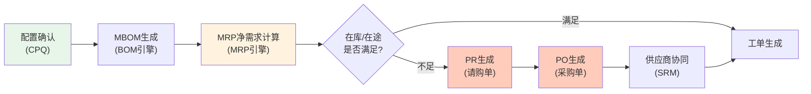

#### 1.2 MRP净需求计算公式

MRP净需求计算是MRP的核心逻辑：

```
Net_Req = Gross_Req − On_Hand + Allocated + Safety_Stock − Scheduled_Receipts

变量定义：
┌───────────────────┬──────────────────────────────────────────┐
│ Gross_Req         │ 毛需求：MBOM展开后每个物料的总需求数量       │
│ On_Hand           │ 现有库存量：仓库当前可用库存                 │
│ Allocated         │ 已分配量：已承诺给其他订单但尚未出库的数量     │
│ Safety_Stock      │ 安全库存：为应对需求波动保留的最低库存水平     │
│ Scheduled_Receipts│ 在途量：已下采购单但尚未入库的预计到货量      │
│ Net_Req           │ 净需求：当 Net_Req > 0 时生成PR             │
└───────────────────┴──────────────────────────────────────────┘

示例计算（物料ANT-GPS-003）：
  Gross_Req         = 200 (当前订单需求)
  On_Hand           = 150 (仓库现有)
  Allocated         = 30  (已预留)
  Safety_Stock      = 50  (安全库存)
  Scheduled_Receipts = 80  (下周到货)
  
  Net_Req = 200 − 150 + 30 + 50 − 80 = 50
  → 需采购 50 PCS
```

#### 1.3 长交期物料预采购机制

在配置确认前触发预采购是缩短交付周期的关键策略：

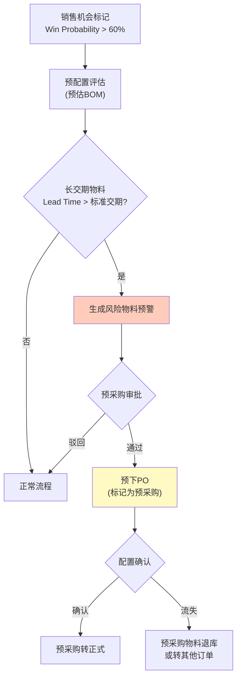

#### 1.4 与ERP MRP模块的对接接口设计

| 接口 | 方向 | 数据内容 | 触发时机 |
|------|------|---------|---------|
| **MPS输入** | CPQ→ERP | 配置确认后的MBOM展算结果（物料×数量×需求日期） | 订单/报价确认时 |
| **MRP输出** | ERP→CPQ | 净需求结果、建议采购量、建议开工日期、预计完工日期 | MRP运行完成后 |
| **例外报告** | ERP→CPQ | 物料短缺、产能不足、交期无法满足的例外项 | MRP运行时实时推送 |
| **执行状态反馈** | ERP→CPQ | PR→PO→收货→入库各环节状态 | 状态变更时 |

**MPS输入的数据结构**：

```
MPS_Input {
    demand_id: "SO-20260606-001",
    demand_date: "2026-07-15",
    items: [
        {
            material_code: "M-PD785-001",
            qty: 100,
            bom: [
                { material: "PCB-MAIN-V3", qty: 100 },
                { material: "BAT-LI-2000", qty: 100 },
                { material: "ANT-GPS-003", qty: 100 },
                ...
            ],
            routing_id: "ROUTE-PD785-001"
        }
    ]
}
```

### 二、BOM完整性仿真验证

#### 2.1 四级验证检查

```
四级验证体系
═══════════════════════════════════════════════════════

Level 1: 结构完整性
┌─────────────────────────────────────────────────┐
│ 检查项：                                         │
│ ├─ 无悬空节点：每个子件都有父件                   │
│ ├─ 无循环引用：A→B→C→A 的循环检测               │
│ └─ BOM层级深度 ≤ 最大允许层级                     │
│ 检测算法：                                      │
│ ├─ 环检测：拓扑排序过程中检测反向边               │
│ └─ 悬空检测：遍历所有节点，验证每个子件引用存在     │
└─────────────────────────────────────────────────┘

Level 2: 物料完整性
┌─────────────────────────────────────────────────┐
│ 检查项：                                         │
│ ├─ 每个BOM节点有有效物料编码                      │
│ ├─ 每个采购件有默认供应商和采购策略(Make/Buy)       │
│ ├─ 每个自制件有关联工艺路线                       │
│ └─ 替代料关系完整（如定义）                       │
└─────────────────────────────────────────────────┘

Level 3: 产能可行性
┌─────────────────────────────────────────────────┐
│ 检查项：                                         │
│ ├─ 排产模拟：关键工作中心负荷 vs 可用产能           │
│ ├─ 资源冲突检测：同时间段同设备是否有排产冲突       │
│ ├─ 物料齐套性：所有物料最晚到货日 > 计划开工日       │
│ └─ 工具/夹具可用性：工装寿命和可用数量检查          │
│ 模拟算法：                                      │
│ ├─ 有限产能排产(Finite Capacity Scheduling)      │
│ └─ 瓶颈工序倒推+前推的混合调度                     │
└─────────────────────────────────────────────────┘

Level 4: 成本合理性
┌─────────────────────────────────────────────────┐
│ 检查项：                                         │
│ ├─ 配置→完整成本BOM自动滚算→利润复核              │
│ ├─ 利润率 = (报价总额 - 滚算成本) / 报价总额       │
│ └─ 利润率 < 底线时触发告警和强制审批               │
└─────────────────────────────────────────────────┘
```

**循环引用检测伪代码**：

```
FUNCTION detect_cycle(bom_root):
    WHITE = 0, GRAY = 1, BLACK = 2  // DFS三色标记
    color_map = {}
    cycle_nodes = []
    
    FUNCTION dfs(node):
        color_map[node] = GRAY
        FOR EACH child IN node.children:
            IF color_map[child] == GRAY:
                cycle_nodes.append(path)  // 发现反向边=存在环
            ELSE IF color_map[child] == WHITE:
                dfs(child)
            END IF
        END FOR
        color_map[node] = BLACK
    END FUNCTION
    
    dfs(bom_root)
    RETURN cycle_nodes.is_empty() ? "OK" : "CYCLE_DETECTED: " + cycle_nodes
END FUNCTION
```

#### 2.2 关键路径分析（CPA）

从订单到交付的完整周期分解：

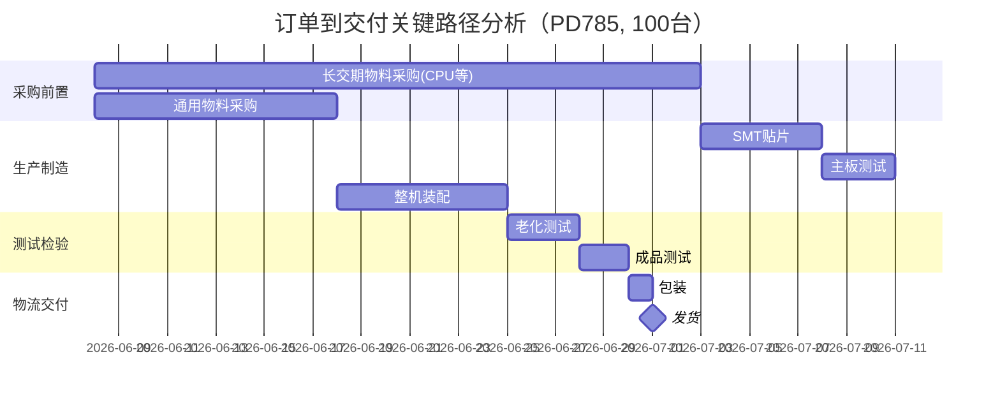

**关键路径计算公式**：

```
对于每个工序节点 i：
  ES(i) = max{ EF(j) | j ∈ predecessors(i) }  // 最早开始时间
  EF(i) = ES(i) + duration(i)                   // 最早完成时间
  LF(i) = min{ LS(k) | k ∈ successors(i) }     // 最晚完成时间
  LS(i) = LF(i) - duration(i)                   // 最晚开始时间
  Float(i) = LS(i) - ES(i)                      // 浮动时间
  
  当 Float(i) = 0 时，工序 i 在关键路径上
```

#### 2.3 变更影响仿真

配置变更前预演影响范围：

```
变更仿真流程
═══════════════════════════════════════════════════════

输入：原配置参数集 vs 新配置参数集
输出：影响评估报告

1. Diff计算：配置参数 Diff → 受影响的BOM节点列表
2. BOM级影响：增/删/改的物料清单
3. 工艺级影响：增/删/改的工序和工时
4. 产能级影响：关键工作中心负荷变化
5. 成本级影响：滚算成本的增量/减量
6. 交期级影响：关键路径长度变化
7. 下游影响：受影响的生产工单、采购订单列表
```

---


---

## 4.5 安全权限与审计模型

> **来源**：架构专家评估 — 报告缺乏ABAC权限模型设计、行级/字段级安全、职责分离检测、审计日志的不可篡改设计  
> **定位**：CPQ作为涉及价格、利润、客户信息的核心业务系统，安全权限设计直接影响客户信任和合规性

### 4.5.1 ABAC（基于属性的访问控制）模型完整设计

**ABAC四元组定义**：

```
Access Decision = f(Subject, Resource, Operation, Environment)

┌─────────────────────────────────────────────────────┐
│                  ABAC 四元组                          │
├─────────────────────────────────────────────────────┤
│  Subject (主体)                                       │
│  ├─ user_id, role, department, product_line_scope    │
│  ├─ clearance_level, cost_visibility_level            │
│  └─ channel_type (直销/代理/经销商)                    │
├─────────────────────────────────────────────────────┤
│  Resource (资源)                                      │
│  ├─ resource_type (报价单/产品/价格手册/审批单)         │
│  ├─ product_line, region                              │
│  ├─ sensitivity_level (公开/内部/机密)                 │
│  └─ owner_id, owning_department                       │
├─────────────────────────────────────────────────────┤
│  Operation (操作)                                      │
│  ├─ CRUD: CREATE/READ/UPDATE/DELETE                   │
│  ├─ SPECIAL: APPROVE/SUBMIT/EXPORT/COPY               │
│  └─ CONFIG: MODIFY_CONFIG, APPLY_DISCOUNT              │
├─────────────────────────────────────────────────────┤
│  Environment (环境)                                    │
│  ├─ time (工作时间/9-18 vs 其他)                       │
│  ├─ location (内网IP/外网IP/指定国家)                   │
│  ├─ device (公司设备/个人设备)                          │
│  └─ risk_score (基于行为分析的实时风险分)               │
└─────────────────────────────────────────────────────┘
```

**ABAC策略JSON Schema示例**：

```json
{
  "policy_id": "POL-CPQ-0012",
  "description": "渠道合作伙伴只能查看自己渠道的报价，且不能看成本",
  "effect": "ALLOW",
  "subject": {
    "role": ["channel_partner", "distributor"],
    "channel_type": "INDIRECT"
  },
  "resource": {
    "resource_type": "Quote",
    "channel_id": "${subject.channel_id}",
    "sensitivity_level": ["PUBLIC", "INTERNAL"]
  },
  "operation": ["READ"],
  "environment": {
    "time": {"gte": "08:00", "lte": "22:00"},
    "ip_range": "NOT_IN_BLACKLIST"
  },
  "priority": 100
}
```

```json
{
  "policy_id": "POL-CPQ-0025",
  "description": "成本可见性——仅财务和产品线负责人可看Full Cost",
  "effect": "DENY",
  "subject": {
    "role": ["sales", "sales_manager", "channel_partner"],
    "cost_visibility_level": "MARGIN_ONLY"
  },
  "resource": {
    "resource_type": "QuoteLineItem",
    "attribute": "cost_price"
  },
  "operation": ["READ"],
  "priority": 200
}
```

### 4.5.2 多维度权限控制矩阵

| 权限维度 | 控制粒度 | 实现方式 | 典型策略示例 |
|---------|---------|---------|------------|
| **产品族ACL** | 产品族(L1)/产品线(L2) | ABAC资源属性匹配 | 销售A只能操作"窄带对讲机"产品族，不能看"集群系统" |
| **区域ACL** | 洲/国家/省份 | ABAC主体+环境属性 | 亚太销售团队只能报亚太区域价格，不能查看美洲价格手册 |
| **价格手册ACL** | PriceBook级别 | ABAC资源+操作 | 经销商可见渠道价手册，直销团队可见直销价手册 |
| **成本可见性** | 多级控制 | ABAC主体属性+字段级安全 | 见下文成本可见性控制详表 |
| **渠道隔离** | Channel维度 | ABAC+RLS | 代理商A不能看到代理商B的报价单 |
| **审批权限** | 审批矩阵+金额阈值 | ABAC+SoD规则 | 折扣>20%需要总监审批，折扣>35%需要VP审批 |

**成本可见性多级控制**：

| 级别 | 可见内容 | 适用角色 | 技术实现 |
|:----:|---------|---------|---------|
| **Level 0 — None** | 不可见任何成本信息 | 渠道合作伙伴、外部经销商 | 字段级安全：`cost_price`字段始终返回`null` |
| **Level 1 — Margin Only** | 可见毛利率(%)，不可见绝对成本 | 销售人员、销售经理 | 数据库/API层：返回`margin_pct = (price - cost) / price`，`cost_price`遮蔽 |
| **Level 2 — Full Cost** | 见完整标准成本 | 产品线负责人、售前工程师 | 显示标准成本，不含供应商真实采购价 |
| **Level 3 — Supplier Cost** | 见供应商真实采购价 | CFO、采购VP、内部审计 | 全部成本字段可见 |

### 4.5.3 行级安全（RLS）与字段级安全（FLS）

**RLS实现方案**：

```sql
-- PostgreSQL RLS示例：销售只能看到自己的报价单
ALTER TABLE quote ENABLE ROW LEVEL SECURITY;

CREATE POLICY quote_owner_policy ON quote
    FOR ALL
    TO sales_role
    USING (created_by = current_user_id());

CREATE POLICY quote_channel_isolation ON quote
    FOR SELECT
    TO channel_partner_role
    USING (channel_id IN (
        SELECT channel_id FROM channel_members WHERE user_id = current_user_id()
    ));

-- 管理者可见其下属的报价单
CREATE POLICY quote_manager_policy ON quote
    FOR SELECT
    TO sales_manager_role
    USING (created_by IN (
        SELECT subordinate_id FROM org_hierarchy WHERE manager_id = current_user_id()
    ));
```

**FLS实现方案**（基于API中间件）：

```
class FieldLevelSecurityMiddleware:
    field_policies: Map<Role, Map<ResourceType, Set<String>>>
    // 示例: {sales: {QuoteLineItem: {mask: ["cost_price", "supplier_cost"]}}}
    
    function APPLY_FLS(response_data, user, resource_type):
        policies = field_policies[user.role][resource_type]
        if policies is None:
            return response_data  // 无限制
        
        return RECURSIVE_MASK(response_data, policies.mask)
    
    function RECURSIVE_MASK(data, masked_fields):
        if data is List:
            return [RECURSIVE_MASK(item, masked_fields) for item in data]
        elif data is Dict:
            result = {}
            for each (key, value) in data:
                if key in masked_fields:
                    result[key] = None  // 遮蔽
                else:
                    result[key] = RECURSIVE_MASK(value, masked_fields)
            return result
        else:
            return data
```

### 4.5.4 职责分离（SoD）规则

**CPQ中的关键SoD规则**：

| SoD规则 | 说明 | 检测机制 | 违规处理 |
|---------|------|---------|---------|
| **报价人与审批人分离** | 创建报价单的人不能审批自己的报价单 | 审批发起时检查`quote.created_by != approver.user_id` | 自动路由到同级其他审批人 |
| **配置者与定价者分离** | 技术配置的人不能同时批准超常规折扣 | 审批流中检查角色`configurer ≠ price_approver` | 强制拆分为两个审批步骤 |
| **成本制定者与销售报价者分离** | 维护标准成本的人不能是销售报价人 | 系统属性级：成本编辑权限与报价创建权限互斥 | 创建角色时硬限制 |
| **审计员独立** | 有审计查看权限的人不能修改任何业务数据 | 审计角色自动排除所有写操作 | 审计角色为只读 |

**SoD检测伪代码**：

```
function CHECK_SOD_VIOLATION(workflow_step, actor, target):
    violations = []
    
    // 检查1: 自我审批
    if workflow_step.type == APPROVAL and target.created_by == actor.user_id:
        violations.append({
            rule: "SOD-001",
            message: "不能审批自己创建的报价单",
            severity: "BLOCK"
        })
    
    // 检查2: 角色冲突
    actor_roles = GET_USER_EFFECTIVE_ROLES(actor, target.product_line)
    for each conflict_rule in SOD_CONFLICT_RULES:
        if conflict_rule.role_a in actor_roles and conflict_rule.role_b in actor_roles:
            violations.append({
                rule: conflict_rule.id,
                message: f"角色冲突: {conflict_rule.role_a} 与 {conflict_rule.role_b} 不可由同一人担任",
                severity: "BLOCK"
            })
    
    if violations:
        REJECT_WORKFLOW_STEP(workflow_step, violations)
    return violations
```

### 4.5.5 审计日志设计

**Event Sourcing模式设计**：

```
// 审计事件定义
struct AuditEvent:
    event_id: UUID                  // 事件唯一ID
    event_type: String              // "QUOTE_CREATED", "CONFIG_CHANGED", "PRICE_OVERRIDEN"
    aggregate_id: String            // 聚合根ID (如 quote_id)
    aggregate_type: String          // "Quote", "ConfigSession", "PriceBook"
    sequence_number: Integer        // 聚合内的顺序号
    timestamp: Timestamp            // 事件发生时间（不可篡改）
    actor: ActorInfo                // 操作人信息
    changes: Map<String, Change>    // 变更内容
    metadata: Map<String, Any>      // 环境信息(IP, UserAgent, ...)
    parent_event_id: UUID?          // 关联的事件ID
    hash: String                    // 链式哈希（防篡改）

struct Change:
    field: String                   // 变更字段
    old_value: Any?                 // 旧值
    new_value: Any?                 // 新值
    change_type: Enum{ADDED, REMOVED, MODIFIED}
```

**TAMPER-PROOF机制**：

```
function APPEND_AUDIT_EVENT(event):
    // 获取上一个事件的哈希（链式防篡改）
    last_event = AUDIT_STORE.GET_LAST_EVENT(event.aggregate_id)
    if last_event:
        event.parent_event_id = last_event.event_id
        event.previous_hash = last_event.hash
    
    // 计算当前事件的哈希（包含上一事件哈希）
    event.hash = SHA256(
        event.event_id + 
        event.sequence_number + 
        JSON.stringify(event.changes) + 
        event.previous_hash
    )
    
    // 写入append-only存储（WORM特性）
    AUDIT_STORE.APPEND(event)
    
    // 可选：写入区块链或外部公证
    if event.event_type in HIGH_VALUE_EVENTS:
        BLOCKCHAIN_NOTARIZE(event.hash)
```

**审计日志查询接口**：

```
interface IAuditService {
    // 查询实体的完整变更历史
    GET_CHANGE_HISTORY(
        aggregate_id: String,
        from_time: DateTime?,
        to_time: DateTime?
    ) -> List<AuditEvent>
    
    // 时间点还原——查看某时刻的数据快照
    POINT_IN_TIME_VIEW(
        aggregate_id: String,
        at_time: DateTime
    ) -> EntitySnapshot
    
    // 验证日志完整性（检测篡改）
    VERIFY_LOG_INTEGRITY(
        aggregate_id: String
    ) -> IntegrityCheckResult
    
    // 谁在什么时候改了什么
    WHO_DID_WHAT_WHEN(
        user_id: String,
        date_range: DateRange
    ) -> List<AuditEvent>
}
```

---


---

## 4.6 性能架构设计

> **来源**：架构专家评估 — 报告缺失性能SLA定义、规则索引策略、分层缓存设计、前端虚拟渲染方案、并发模型分析  
> **定位**：性能是CPQ用户体验的基石，配置响应速度直接影响销售效率和客户满意度

### 4.6.1 性能SLA定义

| 操作 | P95延迟目标 | P99延迟目标 | 可接受最差 | 测试条件 |
|------|:---------:|:---------:|:--------:|---------|
| 配置选项变更响应（单项选择）| **< 200ms** | < 500ms | < 1s | 含规则验证+选项过滤+依赖传播 |
| 完整配置验证（提交前）| **< 2s** | < 5s | < 10s | 1000条规则，500个变量 |
| BOM展开 | **< 2s** | < 5s | < 10s | 5级BOM，2000行 |
| 价格计算（单行）| **< 50ms** | < 100ms | < 200ms | 含阶梯定价+合同折扣 |
| 报价单PDF生成 | **< 5s** | < 10s | < 20s | 50行项目，含图表 |
| 规则批量加载 | **< 1s** | < 3s | < 5s | 10,000条规则 |
| 审批流程启动 | **< 500ms** | < 1s | < 2s | 含审批人路由+SoD检测 |

### 4.6.2 规则索引策略

制造业CPQ可能管理数万条配置规则。每次用户操作遍历全部规则是不可接受的，需要多维索引。

**三种索引方案对比**：

| 索引类型 | 数据结构 | 查询复杂度 | 适用场景 | 空间开销 |
|---------|---------|:---------:|---------|:-------:|
| **Hash索引** | `HashMap<(product_id, attr), Set<Rule>>` | O(1) 精确定位 | 按产品+属性检索规则 | O(n) |
| **Bitmap索引** | `BitSet[option_id] → Set<Rule>` | O(1) 并/交/差 | 多条件组合过滤 | O(n·k) k=选项数 |
| **Trie/前缀树** | `Trie<attr_path → Set<Rule>>` | O(L) L=属性路径长度 | 属性组合→规则 | O(n·avg_path) |

**复合索引实现**：

```
class RuleIndexEngine:
    // 三个索引维度
    hash_index: Map<(ProductId, AttributeName), Set<Rule>>
    bitmap_index: Map<OptionId, BitSet<Rule>>
    trie_index: TrieNode<Set<Rule>>
    
    function BUILD_INDEXES(all_rules: List<Rule>):
        for each rule in all_rules:
            // Hash索引: (产品, 属性) → 规则
            for each (product, attr) in EXTRACT_AFFECTED_ATTRS(rule):
                hash_index[(product, attr)].add(rule)
            
            // Bitmap索引: 选项 → 规则
            for each option in EXTRACT_AFFECTED_OPTIONS(rule):
                bitmap_index[option].set(rule.index)
            
            // Trie索引: 属性路径 → 规则
            for each attr_path in EXTRACT_ATTR_PATHS(rule):
                trie_index.INSERT(attr_path, rule)
    
    function FIND_APPLICABLE_RULES(config_change, context):
        rules = Set()
        
        // 策略1: Hash索引精确查找
        hash_key = (context.product_id, config_change.attribute)
        rules.add_all(hash_index[hash_key])
        
        // 策略2: Bitmap索引合并（当涉及多个选项时）
        if config_change.involves_multiple_options:
            bitmap_result = BIT_AND(
                bitmap_index[option1],
                bitmap_index[option2]
            )
            rules.add_all(bitmap_result)
        
        // 策略3: Trie前缀匹配（当变更可能影响多个属性路径时）
        for path in GENERATE_AFFECTED_PATHS(config_change):
            rules.add_all(trie_index.SEARCH_PREFIX(path))
        
        return rules
```

### 4.6.3 分层缓存架构

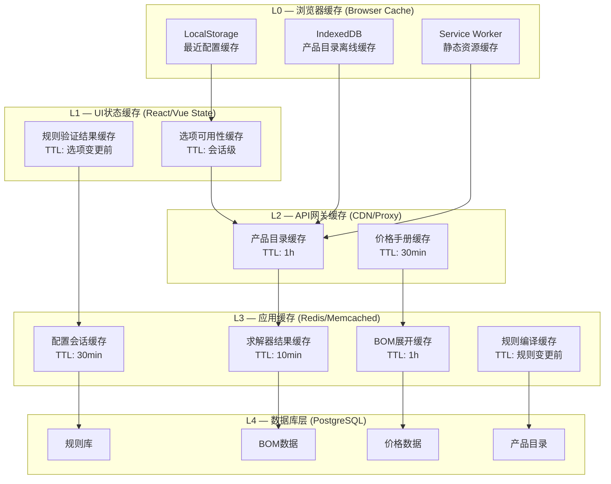

**TTL策略表**：

| 缓存层级 | 缓存键模式 | TTL | 失效策略 | 预热策略 |
|---------|-----------|:--:|---------|---------|
| **求解器结果** | `solver:{product_id}:{config_hash}` | 10min | 规则变更时主动失效 | 热门配置预计算 |
| **BOM展开结果** | `bom:{product_id}:{config_md5}` | 1h | BOM变更时主动失效 | Top100配置预展开 |
| **价格计算** | `price:{price_book}:{product}:{qty}` | 30min | 价格手册更新时失效 | 批量价格预计算 |
| **产品目录** | `catalog:{catalog_id}:{locale}` | 1h | 产品变更时失效 | 启动时全量加载 |
| **规则编译** | `compiled_rules:{product_line}:{version}` | 永久 | 规则版本变更时重新编译 | 预编译+热加载 |
| **配置会话** | `session:{session_id}` | 30min | 用户登出/超时 | 按需创建 |

### 4.6.4 前端渲染优化

**虚拟滚动方案**（处理大型BOM表/选项列表）：

```
// 当BOM行项目超过100行时启用虚拟滚动
class VirtualBOMTable:
    ROW_HEIGHT = 40px
    VISIBLE_BUFFER = 15
    
    function RENDER_VIRTUAL_SCROLL(bom_items, container_height):
        visible_range = CALCULATE_VISIBLE_RANGE(container_height)
        
        // 仅渲染可见行+Buffered行
        rendered_items = bom_items[
            max(0, visible_range.start - VISIBLE_BUFFER) 
            : min(len(bom_items), visible_range.end + VISIBLE_BUFFER)
        ]
        
        // 用padding模拟总高度保证滚动条正确
        return VirtualContainer(
            total_height: len(bom_items) * ROW_HEIGHT,
            visible_items: rendered_items
        )
```

**渐进式加载策略**：

| 阶段 | 加载内容 | 延迟目标 | 用户体验 |
|------|---------|:------:|---------|
| **首屏渲染** | 产品基本信息和第一层选项 | < 500ms | 可立即开始配置 |
| **选项启用** | 第一层选项的规则验证结果 | < 200ms | 选项可交互 |
| **延迟加载** | 深层嵌套选项、可选配件 | 滚动/展开时 | 按需加载 |
| **预加载** | 下一步可能需要的选项规则 | 静默预取 | 基于配置路径预测 |

### 4.6.5 约束求解器优化：编译+运行两阶段

**编译阶段（Build Phase）**：

```
class CompiledSolver:
    // 编译时生成的结构（规则变更时重建）
    constraint_graph: DAG              // 约束依赖图
    variable_ordering: List<Var>       // 最优变量顺序（启发式）
    cnf_formula: CNFFormula            // 预编译的CNF（如用SAT）
    index: RuleIndexEngine             // 规则索引
    
    function COMPILE(rules: List<Rule>, variables: List<Var>):
        // 步骤1: 构建依赖图
        this.constraint_graph = BUILD_DEPENDENCY_GRAPH(rules, variables)
        
        // 步骤2: 启发式排序（最少剩余值+最大度）
        this.variable_ordering = ORDER_VARIABLES(variables, constraint_graph)
        
        // 步骤3: 编译为执行格式（可选：CNF编码用于SAT）
        this.cnf_formula = COMPILE_TO_CNF(rules, variables)
        
        // 步骤4: 构建索引
        this.index = BUILD_RULE_INDEX(rules)
        
        return this
    
    // 运行时—无状态求解（每次请求创建求解实例）
    function CREATE_SOLVER() -> SolverInstance:
        return SolverInstance(this)
    
    class SolverInstance:
        compiler: CompiledSolver
        assignment: Map<Var, Value>
        
        function SOLVE(config_choices, context):
            // 使用预编译的结构 + 索引加速
            applicable = this.compiler.index.FIND_APPLICABLE_RULES(
                config_choices.last_change, context
            )
            
            // 在预编译的图上传播
            return PROPAGATE_ON_GRAPH(
                this.compiler.constraint_graph,
                config_choices,
                applicable
            )
```

**求解结果缓存设计**：

```
class SolverResultCache:
    cache: LRU_Cache<ConfigHash, SolverResult>
    
    function GET_OR_SOLVE(config_partial, context):
        hash = COMPUTE_CONFIG_HASH(config_partial)
        
        // 尝试精确匹配
        if hash in cache:
            return cache[hash]
        
        // 尝试子集匹配（更通用的结果可复用）
        for each (cached_hash, cached_result) in cache:
            if IS_SUBSET_CONFIG(cached_hash, config_partial):
                // 子集结果有效，增量扩展
                return INCREMENTAL_EXTEND(cached_result, config_partial)
        
        // 缓存未命中，全量求解
        result = SOLVE_FULL(config_partial, context)
        cache[hash] = result
        return result
```

### 4.6.6 BOM展开预热策略

```
class BOMWarmupService:
    
    function PREWARM_ON_STARTUP():
        // 系统启动时预热高频BOM组合
        
        // 阶段1: 从分析数据获取Top N最常用配置
        top_configs = ANALYTICS_STORE.GET_TOP_CONFIGS(
            period=LAST_90_DAYS,
            limit=100
        )
        
        // 阶段2: 并行预展开
        PARALLEL_FOR_EACH config in top_configs:
            expanded = BOM_EXPAND_FULL(
                config.product, 
                config.selections, 
                config.quantity
            )
            CACHE_PUT(f"bom:warm:{config.signature}", expanded)
        
        // 阶段3: 预展开产品线基础BOM
        for each product_line in ACTIVE_PRODUCT_LINES:
            base_config = GET_DEFAULT_CONFIG(product_line)
            expanded = BOM_EXPAND_FULL(base_config)
            CACHE_PUT(f"bom:warm:base:{product_line}", expanded)
        
        log.info("BOM预热完成: {}个配置, {}个基础BOM", 
                 len(top_configs), len(ACTIVE_PRODUCT_LINES))
```

### 4.6.7 并发模型对比

| 方案 | 架构 | 优点 | 缺点 | 适用场景 |
|------|------|------|------|---------|
| **共享求解器** | 单例Solver处理所有请求 | 内存占用低<br>规则编译一次<br>缓存共享 | 状态管理复杂<br>隔离性差<br>潜在竞态 | 规则变更低频<br>配置会话短暂的场景 |
| **每请求实例化** | 每次请求new Solver | 隔离性好<br>天然线程安全<br>无状态泄漏 | 内存开销大<br>启动延迟（可预热） | 高并发<br>配置会话长的场景 |
| **求解器池化** | 固定N个Solver实例池 | 兼顾性能和隔离<br>可控资源消耗 | 池管理复杂度<br>状态清理 | **推荐方案** |

**推荐方案**：求解器池化 + 编译分离

```
class SolverPool:
    pool: Queue<SolverInstance>
    pool_size: Integer = CPU_CORES * 2
    compiled: CompiledSolver  // 共享编译结果
    
    function ACQUIRE():
        solver = pool.dequeue()
        if solver is None:
            solver = compiled.CREATE_SOLVER()
        return solver
    
    function RELEASE(solver):
        solver.RESET()  // 清空状态，保留编译结构
        pool.enqueue(solver)

// 配置流处理管道
// Request → Auth → LoadProduct → AcquireSolver → ApplyRules → ReleaseSolver → Response
```

---

## 第五部分：实施方法论

### 5.1 CPQ实施路线图

基于Accenture CPQ方法论和PwC的Sprint实践，建议采用**迭代交付**方式：

```
CPQ实施路线图
═══════════════════════════════════════════════════════════════

Phase 1: 规划与分析 (6-8周)        Phase 2: 概念验证 (4-6周)
──────────────────────────        ──────────────────────────
├─ 供应商/方案选型                  ├─ 搭建CPQ原型实例
├─ 方案架构设计                    ├─ 加载基础产品/价格数据
├─ 商业案例论证                    ├─ 开发关键模型设计原则
├─ 项目规划定稿                    ├─ 构建一个产品的原型模型
├─ 数据问题诊断                    ├─ 识别关键集成点
├─ 应用集成策略                    └─ 识别实施风险点
├─ 项目依赖识别
└─ 产品归一化需求评估

Phase 3: 迭代构建 (8-12周/迭代)    Phase 4: 测试与部署 (4-6周)
──────────────────────────        ──────────────────────────
每个迭代包含：                      ├─ 集成测试
├─ 产品模型设计与开发               ├─ 性能测试
├─ 配置UI与引导式销售                ├─ 用户验收测试(UAT)
├─ 报价UI与工作流                   ├─ 培训
├─ 定价逻辑与执行                   ├─ 割接上线
├─ 方案输出模板                     └─ 上线后支持
├─ CRM/前端系统集成
├─ ERP/后端系统集成
├─ 数据转换
└─ 持续部署：按能力/产品/区域/渠道/集成扩展

Phase 5: 持续优化
─────────────────
├─ Sprint持续交付（PwC模式：2周Sprint）
├─ 需求管理：年度规划→新端到端流程→持续优化→系统切换
├─ 运维与支持
└─ 知识管理
```

**PwC的Sprint管理模式**（参考Hytera项目）：

| Sprint阶段 | 时间节点 | 活动 |
|-----------|---------|------|
| Sprint计划 | Sprint结束前2周 | 确定Sprint候选需求并提交评估 |
| Sprint评审 | Sprint结束前1周 | 评审Story评估量，协商调整 |
| Sprint锁定 | Sprint结束日 | Sprint范围冻结 |
| PPS+回顾 | Sprint结束后2周 | 上线后支持 + Sprint回顾 |

### 5.2 关键成功要素

综合Accenture CPQ方法论和多个项目实践经验，CPQ项目成功的关键要素矩阵：

```
CPQ项目成功要素评估矩阵
═══════════════════════════════════════════════════════════════

                    权重      5分标准              3分标准            2分标准
───────────────────────────────────────────────────────────────────
产品数据就绪度      ★★★★★    SBOM完整，规则清晰    部分产品有SBOM     无SBOM，需从头梳理
价格数据就绪度      ★★★★     价格体系完整          部分价格有缺失     价格数据零散
主数据质量          ★★★★     产品编码统一，        产品编码存在但     产品编码混乱，
                             生命周期明确          不一致             生命周期不清
配置规则明确度      ★★★★★    规则已文档化          口头规则存在       规则靠人脑记忆
跨部门协作度        ★★★★★    专职团队集中办公      兼职参与           各自为政
系统集成准备度      ★★★      集成接口已定义        接口可获取         需全部新建
变革管理投入        ★★★★     高层支持，            中层支持，          抵触情绪强
                             全员培训到位          培训局部覆盖
产品归一化程度      ★★★★     SKU已归一化，         SKU较多但          海量SKU，大量
                             精简40%+             有归一化计划        一次性编码
数据治理机制        ★★★★     有专职数据Owner，     有数据Owner但      无Owner，无流程
                             有变更流程            流程不规范
```

**Accenture的CPQ成功关键原则**（电信行业经验）：
1. **产品配置必须预先合理化**：不能把混乱的产品数据直接导入CPQ
2. **定价策略必须清晰定义**：CPQ不创造定价策略，只执行定价策略
3. **用户体验设计是核心**：引导式vs专家式、自助vs呼叫中心，需根据使用场景设计
4. **数据清理先于系统上线**：70%的工作在数据，30%在系统


---

## 5.X 数据迁移与系统切换策略

### 一、三阶段迁移策略

```
数据迁移三阶段
═══════════════════════════════════════════════════════

阶段一：数据盘点+清洗（1-2周）
┌─────────────────────────────────────────────────┐
│ 活动：                                          │
│ ├─ 识别迁移范围：哪些产品/数据需要迁移              │
│ ├─ 数据质量评估：完整性/一致性/准确性/及时性评分     │
│ ├─ 清洗规则定义：缺失值处理/重复合并/格式标准化      │
│ └─ 输出：数据质量报告 + 清洗规则书                  │
│                                                 │
│ 关键指标：                                       │
│ └─ 数据就绪度 ≥ 80%（低于此值不建议进入阶段二）      │
└─────────────────────────────────────────────────┘
           │
           ▼
阶段二：ETL Mapping+试迁移（2-4周）
┌─────────────────────────────────────────────────┐
│ 活动：                                          │
│ ├─ 字段映射表：源系统→目标系统的字段对应关系        │
│ ├─ 转换规则：数据格式/编码/分类的转换逻辑           │
│ ├─ 小批量验证：选取10-20%数据进行试点迁移           │
│ └─ 输出：映射文档 + 转换脚本 + 试迁移报告            │
│                                                 │
│ 试迁移验收标准：                                  │
│ ├─ 产品数据匹配率 ≥ 95%                          │
│ ├─ 价格数据匹配率 ≥ 98%                          │
│ └─ 配置规则迁移正确率 = 100%                      │
└─────────────────────────────────────────────────┘
           │
           ▼
阶段三：全量迁移+对账+切换（1-2周）
┌─────────────────────────────────────────────────┐
│ 活动：                                          │
│ ├─ 全量数据迁移执行                               │
│ ├─ 数据完整性校验（条数/金额/关联性）               │
│ ├─ 对账报告生成                                  │
│ ├─ 正式系统切换                                  │
│ └─ 切换后72小时值守                              │
└─────────────────────────────────────────────────┘
```

### 二、字段映射表示例

以海能达案例为背景，产品数据的字段映射：

| 源系统字段（ERP/PLM） | 目标系统字段（CPQ） | 转换规则 | 备注 |
|---------------------|-------------------|---------|------|
| `MATNR`（物料编码） | `model_code` | 直接映射 | — |
| `MAKTX`（物料描述） | `model_name` | 直接映射 | — |
| `MATKL`（物料组） | `product_family` | 查表转换：物料组代码→产品族名称 | 需预建映射码表 |
| `MTART`（物料类型） | `config_type` | 规则：FERT→STANDARD, HALB→ATO, HAWA→ACCESSORY | — |
| `MMSTA`（物料状态） | `lifecycle_status` | 规则：01→ACTIVE, 02→EOL, 03→DISCONTINUED | — |
| `STLNR`（BOM编号） | `sbom_id` | 需关联STKO/STPO表展开BOM行 | 复杂转换 |
| `VERPR`（移动平均价） | `base_price` | 直接映射 | 需考虑币种 |

### 三、迁移工具设计

```
迁移工具核心能力
═══════════════════════════════════════════════════════

导入能力：
├─ Excel/CSV批量导入：支持单文件最多100,000行，含导入预览
├─ API批量拉取：对接ERP/PLM REST API，支持分页和增量拉取
└─ 数据库直连：支持JDBC/ODBC连接，配置化抽取SQL

校验引擎：
├─ 必填校验：模型字段的NOT NULL检查
├─ 唯一性校验：model_code、price_rule_id等唯一键检查
├─ 外键校验：catalog_id必须存在于ProductCatalog表
├─ 格式校验：日期格式、数字范围、枚举值校验
├─ 业务规则校验：BOM结构完整性、价格逻辑一致性
└─ 自定义校验脚本：支持JavaScript/Groovy扩展

对账引擎：
├─ 条数对账：源系统 vs 目标系统的各实体记录数
├─ 金额对账：价格/金额类字段的汇总对比
├─ 抽样对账：随机抽取5%数据逐字段比对
└─ 差异报告：自动生成差异明细和根因分析
```

### 四、双轨运行机制

```
双轨运行时间线
═══════════════════════════════════════════════════════

    T0              T+1M              T+3M              T+4M
    │                 │                  │                  │
    ├─────────────────┼──────────────────┼──────────────────┤
    │                 │                  │                  │
    ▼                 ▼                  ▼                  ▼
┌───────┐      ┌──────────┐      ┌──────────┐      ┌──────────┐
│旧系统  │      │ 双轨并行  │      │ 新系统为主│      │ 旧系统退役│
│正式运行│  →   │ 双向同步  │  →   │ 旧系统只读│  →   │ 归档备份  │
└───────┘      └──────────┘      └──────────┘      └──────────┘
                     │
                     ▼
            同步规则：
            ├─ 新系统产生的订单同步回旧系统（备查）
            ├─ 旧系统产生的订单同步到新系统（历史数据完整）
            ├─ 产品主数据以新系统为Source of Truth
            └─ 价格数据以新系统为准（旧系统不更新价格）
```

**数据一致性监控指标**：

| 监控项 | 监控频率 | 告警阈值 |
|--------|---------|---------|
| 产品数量差异 | 每4小时 | > 5条 |
| 价格数据差异 | 每日 | > 0条（价格必须一致） |
| 报价单数量差异 | 每日 | > 1条 |
| 配置规则差异 | 每次规则变更 | > 0条 |
| 同步延迟 | 实时 | > 5分钟 |

### 五、切回/回滚策略

**触发条件矩阵**：

| 触发条件 | 严重级别 | 响应时间 | 回滚动作 |
|---------|:------:|---------|---------|
| 新系统无法生成报价单（核心功能故障） | P0 | 30分钟 | 全量回滚 |
| 价格计算错误率 > 5% | P0 | 1小时 | 全量回滚 |
| 数据同步中断超过4小时且无法恢复 | P0 | 4小时 | 全量回滚 |
| 用户体验严重降级（响应时间>10s） | P1 | 4小时 | 评估后决定 |
| 非核心模块故障（如方案书生成） | P1 | 24小时 | 部分回滚或暂不处理 |
| 小范围数据异常（个别产品数据错误） | P2 | 48小时 | 数据修复即可 |

**回滚流程**：

```
1. 决策：应急委员会（业务Owner + IT负责人 + PM）评估触发条件
2. 通知：全员通知回滚决策和预计恢复时间
3. 执行：恢复旧系统为生产系统，停止新系统写入
4. 补偿：回滚窗口期间的数据手工补录方案
5. 复盘：回滚后48小时内完成根因分析和改进方案
6. 重试：问题修复后安排下次切换窗口
```

### 六、海能达案例数据迁移演示

```
迁移规模量化
═══════════════════════════════════════════════════════

输入数据：
├─ 4976个整机编码（海外）
├─ 646款机型（国内标准配置）
├─ 1056款配件
├─ 经过归一化后：预计减少40%-50%

迁移步骤推演：
┌────────────────────────────────────────────────┐
│ 步骤1：编码归一化                               │
│ ├─ 识别：合并仅包装/标签/语言不同的编码          │
│ ├─ 预期：4976 → ~2500（减少50%）                 │
│ └─ 规则：相同BOM+仅外包装差异 = 同一产品实体      │
│                                                │
│ 步骤2：字段映射                                 │
│ ├─ 产品数据：11个字段映射（直接映射5+转换6）       │
│ ├─ 价格数据：8个字段映射                         │
│ └─ BOM数据：需从PDM/PLM导出STLNR展开             │
│                                                │
│ 步骤3：试迁移验证（取20%样本）                    │
│ ├─ 产品：~500个编码试迁移                        │
│ ├─ 配件：~200个配件试迁移                        │
│ └─ 验收：匹配率 ≥ 95%                            │
│                                                │
│ 步骤4：全量迁移+对账                             │
│ ├─ 全量产品迁移：~2500+条                        │
│ ├─ 对账维度：产品数/价格条目数/配置规则数/         │
│ │            历史报价数/用户数                    │
│ └─ 差异处理：差异项标记、根因分析、补迁移          │
└────────────────────────────────────────────────┘
```

**数据对账模板**：

| 对账维度 | 源系统 | 目标系统 | 差异 | 处理方式 |
|---------|:-----:|:-----:|:--:|---------|
| 产品总数 | 2,500 | 2,498 | -2 | 2条因数据质量问题未迁移，已人工补录 |
| 价格条目数 | 8,200 | 8,200 | 0 | 完全一致 |
| 配置规则数 | 1,856 | 1,856 | 0 | 完全一致 |
| 历史报价单数 | 3,241 | 3,240 | -1 | 1条已删除的无效报价单 |
| 用户账号数 | 85 | 85 | 0 | 完全一致 |

---


---

## 5.Y 配置变更管理（ECN/ECO）流程

### 一、配置变更的五级联动传播链

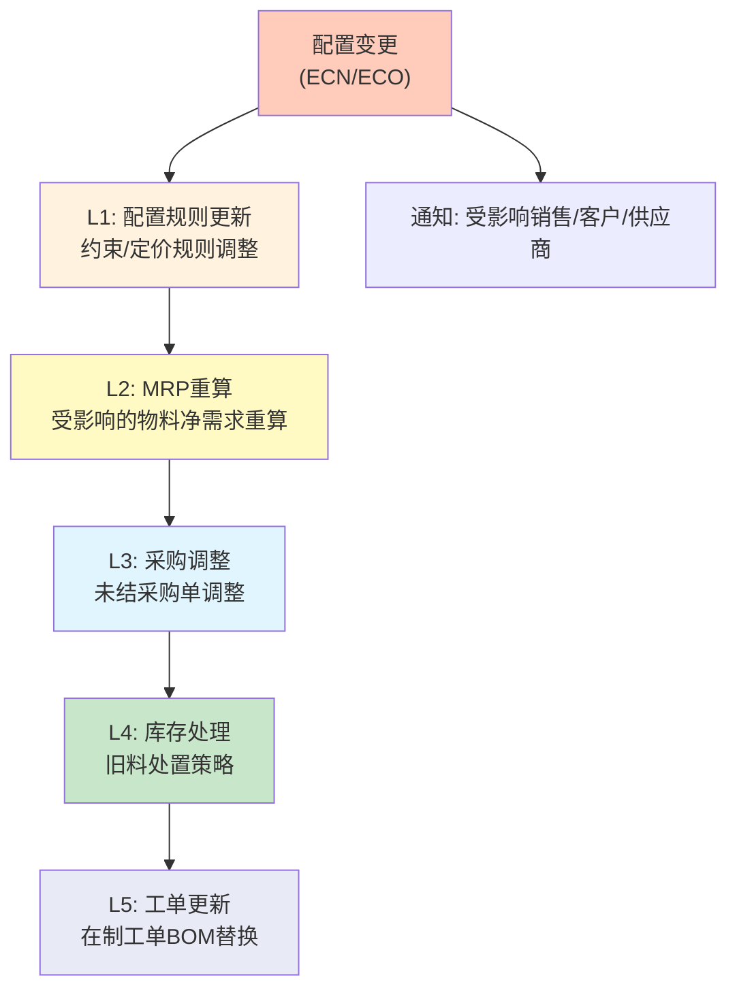

### 二、变更分类体系

| 变更类型 | 场景 | 生效策略 | 审批要求 | 处理窗口 |
|---------|------|---------|---------|---------|
| **紧急ECN** | 安全隐患/合规问题/客户严重投诉 | 立即生效，强制传播 | P0审批（VP级+质量总监） | 24小时内 |
| **常规ECN** | 性能优化/成本降低/供应商变更 | 下一批生效 | P1审批（产品经理+工程） | 下一生产批次 |
| **策略ECN** | 市场调整/产品迭代 | 指定日期生效 | P2审批（产品经理） | 计划生效日 |

**紧急ECN的处理流程**：

```
1. 触发（质量事件/合规通知）→ 1小时内发起ECN
2. 紧急审批环（VP+质量+工程+供应链）→ 2小时内完成
3. 系统执行：
   ├─ CPQ配置规则即时更新
   ├─ 所有在途报价单标注变更通知
   ├─ 未下生产工单强制应用新BOM
   ├─ 已下生产工单评估：继续生产 vs 暂停返工
   └─ 已发货产品：质量追溯+召回评估
4. 通知：受影响客户+销售+供应商→ 4小时内
```

### 三、变更生效策略的决策矩阵

```
决策矩阵：变更适用范围
═══════════════════════════════════════════════════════

                    工单状态
                    ─────────
                    未开工    在制      完工未发货   已发货
变更类型  ─────────────────────────────────────────────
紧急ECN   │          强制替换   暂停评估    冻结发货   召回评估
常规ECN   │          下一批     当前批用完  不处理      不处理
策略ECN   │          指定日期   当前批用完  不处理      不处理
```

### 四、配置变更的下游影响评估

**在途工单影响**：

```
受影响工单查询
═══════════════════════════════════════════════════════

输入：变更物料列表 [OLD_MAT1, OLD_MAT2, ...]
输出：受影响工单清单

查询SQL逻辑：
SELECT DISTINCT wo.work_order_id, wo.status, wo.planned_start_date,
       bom.material_code, bom.qty
FROM work_order wo
JOIN work_order_bom bom ON wo.work_order_id = bom.work_order_id
WHERE bom.material_code IN (OLD_MAT1, OLD_MAT2, ...)
  AND wo.status NOT IN ('COMPLETED', 'CANCELLED')
ORDER BY wo.planned_start_date;

处理决策：
├─ 未开工(PLANNED)：全部替换
├─ 在制(IN_PROGRESS)：评估替换成本和返工可行性
└─ 已完工(COMPLETED)：不处理（除紧急ECN外）
```

**库存影响与处置策略**：

| 旧物料类型 | 处置策略 | 执行方式 |
|-----------|---------|---------|
| 可降级使用 | 优先消耗→用完即止 | 工单分配时优先消耗旧料，设置库存耗尽日期 |
| 不可替代但可回收 | 退回供应商或回收 | 发起RTV流程或报废流程 |
| 客户专用物料 | 联系客户确认 | 如客户已停止使用，通过工单一次性消耗 |
| 通用物料 | 转入安全库存 | 降低安全库存水平，逐步消耗 |

### 五、变更通知机制

```
变更通知传播链
═══════════════════════════════════════════════════════

ECN生效
  │
  ├──→ 受影响销售代表：自动推送变更通知
  │    └─ 内容：变更产品/物料、生效时间、对在途报价的影响、替代建议
  │
  ├──→ 受影响客户：如已发出报价但有变更，通知报价有效期调整
  │    └─ 内容：报价单号、变更项、替代方案、新的有效条件
  │
  ├──→ 受影响供应商：未结采购单的物料变更通知
  │    └─ 内容：PO号、原物料、新物料、数量调整、交付日期调整
  │
  └──→ 内部变更台账：记录每次ECN的完整影响链
       └─ 内容：ECN编号、发起人、影响范围、处理状态、关闭时间
```

### 六、ECN审批与CPQ审批的联动

当ECN触发CPQ配置规则变更时，需要联动审批：

| 联动场景 | CPQ侧处理 | ECN侧处理 |
|---------|---------|---------|
| ECN导致配置可选项增减 | 自动更新配置规则，影响范围超过N个产品时触发产品经理审批 | ECN审批通过后自动触发CPQ配置更新 |
| ECN导致价格变化 | 联动定价规则更新，触发定价审批 | ECN中包含成本影响评估 |
| ECN导致物料替代 | 更新SBOM→MBOM映射表 | ECN中明确旧料处理策略 |

### 七、生产端变更→CPQ反向更新

生产端物料断供是最常见的倒逼CPQ配置变更的场景：

```
物料断供→CPQ反向更新链路
═══════════════════════════════════════════════════════

触发：供应商通知物料断供/停产
  │
  ├──→ L1: 物料可用性状态更新（ERP中标记"断供"）
  │
  ├──→ L2: 替代物料分析
  │    ├─ 完全替代（F-F）：直接替换，需验证
  │    ├─ 条件替代（F-C）：需调整配置规则
  │    └─ 无替代（None）：配置选项需标记为不可用
  │
  ├──→ L3: CPQ配置规则反向同步
  │    ├─ "F-F替代"：更新 mapping_table，material_code 指向新物料
  │    ├─ "F-C替代"：更新配置规则，修改 option_value 的适用范围
  │    └─ "无替代"：相关 feature→option 标记为 deprecated，前端禁用
  │
  ├──→ L4: 受影响报价单回溯处理
  │    └─ 标记"物料供应风险"，通知销售联系客户
  │
  └──→ L5: 通知闭环
       ├─ 产品经理：确认替代方案
       ├─ 销售：受影响报价单清单
       └─ 客户：已下单客户的交付风险提示
```

---

### 5.3 数据治理框架

CPQ项目的**70%工作量在数据**。数据治理框架是CPQ长期成功的保障：

```
CPQ数据治理框架
═══════════════════════════════════════════════════════════

  数据Owner           数据标准             数据质量            数据流程
  ─────────           ────────             ────────            ────────
                                                       
  ┌──────────┐      ┌──────────┐        ┌──────────┐       ┌──────────┐
  │ 产品线Owner│      │ 命名规范  │        │ 完整性检查 │       │ 新增流程  │
  │ 定价Owner  │      │ 编码规则  │        │ 一致性检查 │       │ 变更流程  │
  │ 渠道Owner  │      │ 分类标准  │        │ 准确性检查 │       │ 废弃流程  │
  │ 数据管家   │      │ 属性定义  │        │ 及时性检查 │       │ 审批流程  │
  └──────────┘      └──────────┘        └──────────┘       └──────────┘

  九大基础数据域的治理重点：
  ┌────────────────────────────────────────────────────────────┐
  │  ① 产品目录        → 定期审查，确保与实际情况一致              │
  │  ② 解决方案&备件   → 与产品生命周期联动                        │
  │  ③ 基础属性        → 从PLM自动获取，减少手工维护                │
  │  ④ SBOM及配置规则  → 每次产品变更必须同步更新SBOM             │
  │  ⑤ 报价参数        → 由售前和产品线共同维护                    │
  │  ⑥ 价格信息        → 定价部门为唯一Owner，定期更新              │
  │  ⑦ MBOM及转换规则  → 研发维护MBOM，CPQ维护转换规则              │
  │  ⑧ 订单交付数据    → 从ERP/供应链系统自动获取                   │
  │  ⑨ 统计模板        → 业务运营部门定义和维护                     │
  └────────────────────────────────────────────────────────────┘
```

**关键数据治理原则**：
1. **产品编码复用优先**：海能达教训——ATO编码复用率低的根因是装配件未标准化
2. **价格数据集中管理**：避免价格数据散落在Excel和各个系统中
3. **数据变更联动**：产品停产 → SBOM更新 → CPQ配置规则更新 → 替代品推荐更新
4. **研发语言到销售语言的翻译**：这是CPQ数据治理的**最核心挑战之一**

---


---

## 3.9 补充 — 生产约束的前端反馈 + 多工厂产能分配 + 包装物流配置

### 一、生产约束的前端实时反馈

#### 1.1 产能瓶颈预警

当销售正在配置产品时，系统后端实时查询关键工作中心的产能负荷：

```
产能瓶颈前端反馈模型
═══════════════════════════════════════════════════════

实时查询流程：
1. 配置选择触发预估BOM+工艺路线生成
2. 查询关键工作中心未来N天的产能负荷
3. 负荷 > 85%：前端黄灯预警 + 正常交期
4. 负荷 > 95%：前端红灯预警 + 交期延长提示
5. 负荷 > 100%：前端禁选或强制推荐替代

前端反馈示例：
┌──────────────────────────────────────────────┐
│  当前配置：PD785 + GPS + IP67                 │
│                                              │
│  ⚠ 产能预警：                                │
│  ├─ IP67密封装配 工作中心负荷已达 97%          │
│  │  预估交期延长至：2026-07-25 (原06-30)       │
│  │                                          │
│  ├─ 💡 建议替代：                             │
│  │  取消IP67 → 交期恢复至2026-06-30           │
│  │  或 接受延期 → 加急费 ¥500/台              │
│  └─ 确认选择：[接受延期] [取消IP67] [联系计划]  │
└──────────────────────────────────────────────┘
```

#### 1.2 物料短缺前端反馈

| 物料状态 | 前端表现 | 用户操作 |
|---------|---------|---------|
| **正常库存** | 正常可选 | 无限制 |
| **低库存（< 安全库存）** | 黄色标记 + 库存不足提示 | 可选但提示交期风险 |
| **缺料（库存=0, 在途=0）** | 红色标记 + 禁用 | 不可选，推荐替代物料/配置 |
| **长交期物料（LT > 14天）** | 橙色标记 + 预计到货日 | 可选但计算延长的交期 |

#### 1.3 MOQ感知

```
MOQ感知的前端交互规则
═══════════════════════════════════════════════════════

规则1（数量不足）：
  客户选择数量 < MOQ → 自动调至MOQ + 橙色提示 "最小起订量为XX"
  
规则2（可选不满足MOQ）：
  允许低于MOQ下单 → 单价上浮 + 红色提示 "不满足MOQ，单价上浮XX%"
  
规则3（替代推荐）：
  不满足MOQ时 → 推荐MOQ更低的替代物料
  
规则4（价格联动）：
  数量 ≥ MOQ → 正常价格
  MOQ > 数量 ≥ MOQ×0.5 → 单价×1.2
  数量 < MOQ×0.5 → 单价×1.5 + 强制审批
```

### 二、多工厂产能分配

#### 2.1 产能分配规则引擎

多工厂产能分配是一个多目标优化问题：

```
产能分配规则引擎
═══════════════════════════════════════════════════════

目标函数（多目标加权）：
Score = w1 × (1 − cost/max_cost)     // 成本最低
      + w2 × (1 − lead_time/max_lt)  // 交期最短
      + w3 × (1 − load/max_capacity) // 负荷均衡
      + w4 × proximity_score          // 就近交付

其中 w1+w2+w3+w4 = 1，权重可根据订单策略动态调整

决策规则：
┌─────────────┬──────────────────────────────────┐
│ 规则类型     │ 逻辑                              │
├─────────────┼──────────────────────────────────┤
│ 成本优先     │ w1=0.6, w2=0.1, w3=0.1, w4=0.2  │
│ 交期优先     │ w1=0.1, w2=0.6, w3=0.1, w4=0.2  │
│ 均衡优先     │ w1=0.25, w2=0.25, w3=0.25, w4=0.25│
│ 就近优先     │ w1=0.1, w2=0.2, w3=0.1, w4=0.6  │
└─────────────┴──────────────────────────────────┘

约束条件：
├─ 产能约束：assign_qty ≤ capacity_remaining × efficiency
├─ 合规约束：出口产品必须分配到有出口资质的工厂
├─ 能力约束：工厂必须通过该产品的工艺认证
└─ 最小批量约束：分配到某工厂的数量 ≥ min_lot_size
```

#### 2.2 工厂特定BOM（Plant-Specific BOM）

不同工厂因设备/工艺/供应商差异，同一产品可能有多套BOM：

```
Plant-Specific BOM 管理
═══════════════════════════════════════════════════════

PD785 在不同工厂的BOM差异：
┌──────────────┬──────────────┬──────────────┐
│  物料          │ 深圳工厂      │ 越南工厂      │
├──────────────┼──────────────┼──────────────┤
│  主板PCB      │ PCB-MAIN-V3  │ PCB-MAIN-V3  │
│  外壳          │ ENC-PLASTIC-A│ ENC-PLASTIC-A│
│  电池          │ BAT-LI-2000-C│ BAT-LI-2000-C│
│  天线          │ ANT-VHF-003  │ ANT-VHF-003  │
│  ⚠ 充电器      │ CHG-DESK-CN  │ CHG-DESK-EU  │  ← 区域差异
│  ⚠ 包装        │ PKG-CN-STD   │ PKG-EU-STD   │  ← 区域差异
│  ⚠ 电源适配器  │ ADP-220V-CN  │ ADP-240V-EU  │  ← 电压标准
└──────────────┴──────────────┴──────────────┘
```

**工厂特定BOM的选择逻辑**：

```
FUNCTION select_plant_bom(product_id, target_plant, target_region):
    // 1. 优先匹配工厂特定BOM
    plant_bom = lookup(product_id, target_plant)
    IF plant_bom.exists: RETURN plant_bom
    
    // 2. 如果没有工厂特定BOM，使用产品BOM + 区域差异规则
    base_bom = get_base_bom(product_id)
    region_rules = get_region_diff_rules(target_region)
    adjusted_bom = apply_region_rules(base_bom, region_rules)
    RETURN adjusted_bom
END FUNCTION
```

#### 2.3 跨工厂生产协同调度

跨工厂协同的场景和调度逻辑：

| 协同场景 | 描述 | 调度策略 |
|---------|------|---------|
| **部件外协** | 主机在深圳组装，部分半成品在越南加工后转运 | 主工厂排产驱动，外协工厂按需排产 + 运输时间缓冲 |
| **产能溢流** | 深圳工厂满负荷，溢流订单分配到越南工厂 | 按优先级：最近工厂→次近工厂→最远工厂 |
| **分步生产** | SMT在越南完成→转运深圳组装→测试 | 工序级调度 + 在途库存管理 |
| **应急备份** | 工厂故障时切换生产 | 预定义备份工厂和切换流程 |

### 三、包装与物流配置

#### 3.1 包装BOM自动推导

```
包装BOM自动推导逻辑
═══════════════════════════════════════════════════════

输入：产品配置 + 数量 + 目的地 + 运输方式
输出：完整包装物料清单

推导规则：
┌──────────────────────────────────────────────────┐
│ 规则1：产品体积/重量 → 内包装材料规格              │
│   例：重量 < 500g → 单层瓦楞纸                    │
│       重量 500g-2kg → 双层瓦楞纸 + EPE缓冲        │
│       重量 > 2kg → 重型瓦楞箱 + EPE定制内衬       │
│                                                  │
│ 规则2：出货数量 → 外箱规格选择                     │
│   例：单品包装 → SKU专用彩盒                      │
│       内箱(6台/箱)→ 标准运输箱380×280×220         │
│       外箱(24台/箱)→ 大箱580×380×400              │
│       托盘(144台/托)→ 欧标托盘1200×800            │
│                                                  │
│ 规则3：目的地/运输方式 → 包装防护等级               │
│   例：海运出口 → 防潮袋 + 干燥剂 + 防锈油          │
│       空运 → 轻型包装 + 减重优化                   │
│       陆运短途 → 标准包装即可                      │
│                                                  │
│ 规则4：危险品 → 特殊包装合规                       │
│   例：含锂电池 → UN38.3认证包装 + 危险品标识        │
│       含化学品 → 防泄漏包装 + MSDS随附             │
└──────────────────────────────────────────────────┘
```

**包装BOM示例**：

```
包装BOM = 基础包装材料 + 防护材料 + 标识材料 + 托盘化材料
                                    
例：PD785 × 100台 → 海运出口至德国

基础包装材料：
├─ 内箱(PE袋+EPE内衬) × 100
├─ 外箱(5层瓦楞) × 17 (6台/箱，100÷6=16.67→17)
└─ 封箱胶带 × 17

防护材料：
├─ 干燥剂(硅胶) × 17袋
├─ 防潮袋 × 17
└─ 集装箱填充气袋 × 4

标识材料：
├─ 外箱标签(产品/数量/批次) × 17
├─ CE标识贴 × 17
└─ RoHS合规标识 × 17

托盘化材料：
├─ 欧标托盘(1200×800) × 1
├─ 缠绕膜 × 1卷
└─ 打包带 × 4条
```

#### 3.2 出口/危险品包装合规校验

| 合规维度 | 校验规则 | 违规处理 |
|---------|---------|---------|
| **危险品分类** | 含锂电池产品 → 强制应用UN38.3认证包装 | 禁止生成报价单，提示需选择合规包装 |
| **CE/RoHS/REACH** | 出口欧盟产品 → 包装含CE标识+RoHS声明 | 缺少标识时自动添加并加收标识费 |
| **木质包装** | 出口用木箱 → 强制熏蒸处理(IPPC标识) | 自动替换为免熏蒸材料或加收熏蒸费 |
| **海关编码** | 按产品类型自动匹配HS Code | 未匹配时提示人工确认 |
| **目的地禁运** | 敏感目的地 → 自动拦截 | 阻止报价，提示合规审查 |

#### 3.3 物流成本自动计算

```
贸易术语与物流成本计算
═══════════════════════════════════════════════════════

EXW (工厂交货)：
  成本 = 0（买方承担全部物流）

FOB (装运港船上交货)：
  成本 = 内陆运输 + 报关费 + 港杂费

CIF (成本+保险+运费)：
  成本 = FOB + 海运/空运费 + 保险费(货值×0.3%)

DDP (完税后交货)：
  成本 = CIF + 目的港清关 + 关税(VAT) + 内陆派送

物流成本估算公式：
┌──────────────────────────────────────────────────┐
│ 海运费用 ≈ 集装箱整柜价 / 装箱数量(台)              │
│ 空运费用 ≈ 单价 × 计费重量(体积重/实重取大)         │
│ 保险费   ≈ 货值 × 保险费率(一般0.2%-0.5%)          │
│ 关税     ≈ (货值+运费) × 关税率 × (1+VAT率)        │
│ 派送费   ≈ 首重价 + 续重价 × (总重-首重)          │
└──────────────────────────────────────────────────┘
```

**前端物流配置示例**：

```
┌──────────────────────────────────────────────┐
│  物流配置                                    │
│                                              │
│  目的地：德国汉堡                             │
│  贸易术语：○ EXW  ○ FOB  ● CIF  ○ DDP       │
│  运输方式：○ 海运  ○ 空运  ○ 陆运            │
│  出货方式：○ 整柜(FCL)  ○ 拼柜(LCL)          │
│                                              │
│  预估物流费用：                               │
│  ├─ 海运费: ¥3,200 (深圳→汉堡, 1m³)           │
│  ├─ 保险费: ¥180 (货值×0.3%)                 │
│  ├─ 报关费: ¥500                              │
│  └─ CIF合计: ¥3,880                          │
│                                              │
│  预估总交期：生产25天 + 海运30天 = 55天        │
└──────────────────────────────────────────────┘
```

---

> **撰写完成说明**：以上6个章节覆盖了生产运营组的所有任务范围，包括SBOM→MBOM→工艺BOM全链路转换、MRP联动与BOM仿真、数据迁移与系统切换、配置变更管理、产品生命周期与EOL策略、以及生产约束/多工厂产能/包装物流配置。所有章节均基于原报告框架和专家反馈要求撰写，包含必要的Mermaid图、表格、公式和伪代码。

## 第六部分：市场格局与选型参考

### 6.1 CPQ市场竞争格局

#### 6.1.1 市场整体概况

根据2026年最新市场数据：

- **制造业占CPQ采用量的31%**，是最大的行业市场
- CPQ市场正从传统"配置+定价+报价"向"AI驱动+全渠道+可组合架构"演进
- 主要玩家分为四类：CRM原生、ERP原生、独立CPQ、制造业专用

#### 6.1.2 主要CPQ厂商对比

| 厂商 | 定位 | 优劣势 | 制造业适配度 |
|------|------|--------|------------|
| **Salesforce CPQ** | Salesforce原生 | 优势：最强SFDC集成；劣势：受Governor Limits限制，大型制造业可能出现性能瓶颈 | ★★★ |
| **Oracle CPQ** (原BigMachines) | 企业级，Oracle生态 | 优势：最强配置引擎，可处理数千产品选项；制造业和高科技行业深度实践；劣势：与Oracle ERP绑定较深 | ★★★★★ |
| **SAP CPQ** | SAP生态 | 优势：变体配置(Variant Configuration)原生支持制造；ETO支持；劣势：与SAP ERP强绑定 | ★★★★★ |
| **Conga CPQ** (原Apttus) | Salesforce原生，QTC一体化 | 优势：100% Force.com，配置灵活，X-Author Office集成，QTC全流程覆盖；劣势：大企业规模受限 | ★★★★ |
| **Vendavo CPQ** | B2B制造与分销 | 优势：价格优化引擎最强，利润率分析和交易指导，返利管理；劣势：配置引擎不如Oracle/SAP | ★★★★★ |
| **Infor CPQ** | Infor ERP生态，制造业 | 优势：3D可视化配置，制造业规则引擎；劣势：Infor生态绑定 | ★★★★★ |
| **Epicor CPQ** | 中型制造业 | 优势：ETO/CTO场景支持好，与Epicor ERP深度集成；劣势：品牌知名度较低 | ★★★★ |
| **Configit** | 制造业配置引擎 | 优势：约束求解器技术领先，复杂产品配置专家；劣势：非全功能CPQ，需配合其他系统 | ★★★★★ |
| **Tacton CPQ** | 制造业专用 | 优势：CAD集成，3D可视化，工程到订单全流程；劣势：市场覆盖有限 | ★★★★★ |
| **PROS/Cameleon** | 定价优化+CPQ | 优势：价格优化引擎（PROS）+ 可扩展配置器（Cameleon）；劣势：两套技术平台在整合中 | ★★★★ |
| **DealHub** | 中端B2B | 优势：无代码配置，DealRoom创新交互；劣势：制造业复杂场景支撑有限 | ★★ |
| **PandaDoc** | SMB文档自动化 | 优势：简单易用，价格亲民；劣势：缺少复杂配置能力 | ★ |

#### 6.1.3 Accenture的厂商评估（2014年，仍有参考价值）

| 厂商 | Accenture评价 |
|------|-------------|
| **BigMachines (Oracle)** | 强OOB功能，可扩展配置器，SFDC+Oracle ERP双集成，但开发扩展困难 |
| **PROS/Cameleon** | 可扩展配置器，强SFDC集成，有价格优化能力，但两套平台整合中 |
| **Apttus (Conga)** | 100% Force.com，最可配置，强报价输出，但受SFDC Governor Limits限制 |
| **CloudSense** | 单一平台Q2C，强订单管理+工作流，电信行业强，但CPQ能力仍在发展中 |
| **CallidusCloud** | 功能广度最大（CPQ+合同+激励薪酬），制造业+电信强，但通过收购拼装，后端复杂 |

### 6.2 制造业CPQ选型矩阵

针对装备/设备/组件/半导体制造业的选型决策矩阵：

```
选型维度                权重    评分标准
─────────────────────────────────────────────────────────────
配置引擎复杂度支持       ★★★★★   能否处理ATO/CTO/ETO场景
                             约束求解器能力
                             BOM感知配置能力
                             
ERP/PLM集成能力          ★★★★★   与现有ERP/PLM的集成深度
                             数据同步的实时性和可靠性
                             
定价引擎灵活性           ★★★★    多维定价支持
                             折扣管控和审批
                             成本核算能力
                             
多语言/多币种/多区域     ★★★★    全球化部署的成熟度
                             
可视化配置               ★★★     3D渲染、CAD集成
                             （取决于行业）
                             
AI/智能推荐能力           ★★★     智能推荐、定价建议
                             自然语言配置
                             
渠道管理                 ★★★     合作伙伴门户
                             多层级渠道定价
                             
移动端支持               ★★★     移动报价、移动审批
                             
实施复杂度               ★★★     部署周期、学习曲线
                             
TCO总拥有成本             ★★★★    许可费+实施费+运维费
```

### 6.3 自研 vs 采购决策框架

考虑到用户有产品设计意向，以下是自研CPQ vs 采购CPQ的决策框架：

| 维度 | 适合自研 | 适合采购 |
|------|---------|---------|
| **产品复杂度** | 中等，有明确的配置规则可梳理 | 极高，需要专业约束求解器 |
| **差异化需求** | 行业特有场景多，通用产品无法覆盖 | 需求相对标准，行业通用 |
| **集成复杂度** | 需要深度定制的集成方案 | 标准CRM+ERP集成即可 |
| **团队能力** | 有CPQ产品经验的团队 | CPQ人才稀缺 |
| **时间要求** | 可接受12-18个月开发周期 | 需要6个月内上线 |
| **市场策略** | CPQ作为独立产品推向市场 | CPQ作为内部工具使用 |
| **长期控制力** | 需要完全控制产品路线图 | 接受跟随厂商路线图 |

**建议路径**：如果自研，建议参考以下能力建设优先级：

```
阶段一：MVP (3-6个月)
├─ 产品目录管理（5层结构）
├─ 基础配置规则引擎（兼容性/必选/互斥/条件）
├─ 标准定价引擎（价格手册+阶梯定价）
├─ 报价单生成（Word/PDF模板输出）
└─ 基础审批工作流

阶段二：增强 (6-9个月)
├─ ATO参数化配置
├─ SBOM管理
├─ 向导式销售（Guided Selling）
├─ 多维度定价（区域/渠道/客户）
├─ 方案管理（方案模板+版本管理）
└─ CRM基础集成

阶段三：高级 (9-15个月)
├─ MBOM集成与SBOM→MBOM转换
├─ 可视化配置
├─ AI智能推荐
├─ 渠道合作伙伴门户
├─ ERP深度集成
└─ 数据分析与洞察

阶段四：商用化 (15-24个月)
├─ 多租户架构
├─ 行业解决方案包
├─ 低代码配置工具
├─ 开放API生态
└─ 市场推广与渠道建设
```

---

## 第七部分：AI + CPQ 未来趋势

### 7.1 AI在CPQ中的应用层次

基于2026年趋势分析：

```
AI在CPQ中的应用成熟度
═══════════════════════════════════════════════════════════

层次一：辅助式AI (当前主流 - 2024-2025)
┌────────────────────────────────────────────────────────────┐
│  ├─ 智能产品推荐：基于历史交易数据推荐交叉销售/向上销售机会     │
│  ├─ 定价建议：基于历史成功交易的定价区间建议                    │
│  ├─ 配置冲突预警：AI检测潜在的配置冲突并提前预警                │
│  └─ 智能搜索：自然语言搜索产品目录                              │
└────────────────────────────────────────────────────────────┘

层次二：生成式AI (当前 - 2026)
┌────────────────────────────────────────────────────────────┐
│  ├─ 自然语言配置：用日常语言描述需求，AI自动生成配置方案         │
│  ├─ 个性化提案生成：AI根据客户画像自动撰写个性化报价方案         │
│  ├─ 智能问答：AI回答销售人员的产品配置问题                      │
│  └─ 自动化审批理由生成：AI生成审批所需的商业理由                 │
└────────────────────────────────────────────────────────────┘

层次三：代理式AI (Agentic AI - 2026+)
┌────────────────────────────────────────────────────────────┐
│  ├─ 自主决策：AI在预设边界内自主决定折扣和配置                   │
│  ├─ 全渠道统一智能体：跨直销/渠道/电商的统一AI助手               │
│  ├─ 预测性商机识别：从客户行为预测配置需求                       │
│  └─ 自主学习优化：从每次成功/失败的交易中学习优化规则              │
└────────────────────────────────────────────────────────────┘
```

### 7.2 制造业CPQ的AI应用场景

| AI应用场景 | 具体描述 | 成熟度 | 优先级 |
|-----------|---------|--------|--------|
| **配置推荐引擎** | 根据客户行业/规模/预算推荐最佳产品组合 | 中 | ★★★★★ |
| **定价优化** | 基于历史成交数据、竞品价格、库存水平动态定价 | 中 | ★★★★★ |
| **智能替代品推荐** | 停产产品的智能化替代品推荐 | 低 | ★★★★ |
| **可行性预测** | AI预测配置方案的交付可行性（工期/成本） | 低 | ★★★★ |
| **需求预测** | 基于配置数据预测组件需求，优化库存 | 低 | ★★★ |
| **异常检测** | 自动检测非正常报价行为（异常折扣/异常配置） | 中 | ★★★★★ |
| **知识图谱** | 构建产品知识图谱，实现属性级推理 | 低 | ★★★ |

### 7.3 关键趋势

1. **可组合架构**：CPQ从单一产品向API-first、微服务化的可组合平台演进
2. **全渠道统一**：直销、渠道、电商、自助服务的报价体验统一
3. **自助服务优先**：85%的B2B企业已拥有自助门户，CPQ必须具备客户自助配置能力
4. **数据先行**：在拥抱AI之前，必须优先解决数据标准化与治理问题
5. **渐进式现代化**：从局部CPQ现代化入手，逐步延伸至更广的商务体验改造

---

## 附录

### A. 参考资料清单

**咨询方法论**：
1. Accenture CPQ Practice Overview (2013)
2. Accenture PoV on Key CPQ Vendors V5
3. Accenture CPQ User Stories Requirements v12 (2014)
4. PwC CPQ Knowledge Sharing V1.0 (2018)
5. PwC Order to Cash Leading Practices
6. Accenture CPQ WIIFM Deck and Integrated Quoting

**产品文档**：
7. Apttus Ultimate Guide to CPQ (2014)
8. Apttus CPQ User Guide (2015)
9. Apttus Quote-To-Cash Editions Datasheet (2016)
10. Apttus CPQ Basic Administration v3.0
11. Oracle CPQ Cloud eBook (2014)
12. Accenture High-tech CPQ Credential V2

**项目案例**：
13. 海能达CRM-CPQ项目（2018）
14. 海能达CRM项目CPQ与产品管理建议
15. Mindray CPQ Solution Discussion v0.2（2019）
16. 奥芯明CPQ沟通方案 V1.0（2024）
17. HP CPQ Strategy Executive Overview（2013）
18. 产品数据梳理及CPQ支持文档

**市场趋势**：
19. GuideFlow - 13 Best CPQ Software Tools (2026)
20. Accio - CPQ Trends 2026: AI, Composable Architectures
21. Everstage - CPQ Data Model: Complete Guide
22. Alguna - AI CPQ Software Guide (2025)

### B. 术语表

| 缩写/术语 | 全称 | 说明 |
|----------|------|------|
| CPQ | Configure, Price, Quote | 配置-定价-报价 |
| QTC | Quote-to-Cash | 报价到现金 |
| OTC | Order-to-Cash | 订单到现金 |
| LTC | Lead-to-Cash | 线索到现金 |
| MTS | Make-to-Stock | 按库存生产 |
| ATO | Assemble-to-Order | 按订单装配 |
| MTO | Make-to-Order | 按订单生产 |
| ETO | Engineer-to-Order | 按订单设计 |
| CTO | Configure-to-Order | 按订单配置 |
| SBOM | Sales Bill of Materials | 销售物料清单 |
| MBOM | Manufacturing Bill of Materials | 生产物料清单 |
| EBOM | Engineering Bill of Materials | 工程物料清单 |
| PLM | Product Lifecycle Management | 产品生命周期管理 |
| GTM | Go-to-Market | 产品上市 |
| LTO | Lead-to-Order | 线索到订单 |
| IPD | Integrated Product Development | 集成产品开发 |
| PIM | Product Information Management | 产品信息管理 |

### C. 产品设计后续建议

基于本报告，后续CPQ产品设计建议聚焦以下关键决策点：

1. **产品边界定义**：CPQ的系统边界——是否包含订单管理？是否包含合同管理？
2. **配置引擎选型**：自研规则引擎 vs 集成第三方约束求解器（如Configit）
3. **平台架构选型**：纯SaaS vs 可私有化部署（制造业客户偏好）
4. **数据模型标准化**：5层产品结构的数据库实现方案
5. **SBOM引擎设计**：销售BOM的创建、管理、版本控制机制
6. **AT配置能力**：参数化配置 vs 组件级配置的实现策略
7. **AI能力规划**：首期集成的AI能力的优先级
8. **集成策略**：与主流CRM/ERP/PLM的标准化连接器设计

---

> **文档声明**：本报告综合了Accenture、PwC咨询方法论，Apttus/Oracle/Salesforce等产品文档，海能达/迈瑞/奥芯明等项目实战经验，以及2026年最新市场趋势，旨在为装备/设备/组件/半导体制造业CPQ产品设计提供系统性参考。报告中所有具体产品数据和项目信息均来自公开和授权资料。
