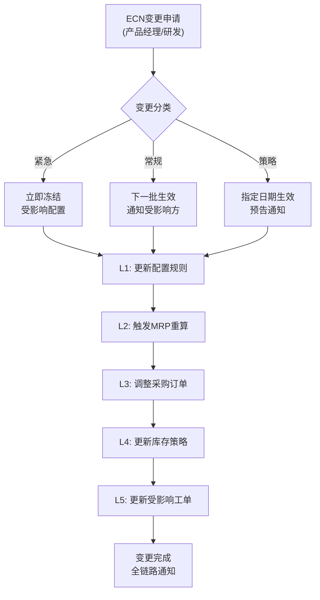

# 制造业CPQ产品设计 — 阶段二总文档：详细设计层

> **版本**：V1.0  
> **日期**：2026年6月6日  
> **基于**：CPQ制造业深度研究报告 V2.0 + 阶段一产品定义层  
> **参与角色**：架构师 / 产品专家 / UI/UX设计专家 / 数据架构专家  
> **阶段目标**：完成核心流程详细设计、功能详细规格、UI/UX组件级设计、集成接口规范、核心数据流设计，并闭环阶段一5项待改进

---

## 目录

- [0. 阶段一改进项闭环状态](#0-阶段一改进项闭环状态)
- [1. 核心流程L2详细设计](#1-核心流程l2详细设计)
- [2. 功能详细规格](#2-功能详细规格)
- [3. UI/UX组件级设计](#3-uiux组件级设计)
- [4. 集成接口规范](#4-集成接口规范)
- [5. 核心数据流设计](#5-核心数据流设计)
- [6. AI能力规划](#6-ai能力规划)
- [7. 移动端设计规范](#7-移动端设计规范)
- [8. 交叉评审报告](#8-交叉评审报告)

---

## 0. 阶段一改进项闭环状态

| # | 改进项 | 阶段一状态 | 阶段二处理 | 闭环 |
|:--:|-------|---------|----------|:--:|
| 1 | **角色数量统一**（架构师12 vs 产品10） | ⚠️ 未统一 | 阶段二各交付物已统一使用12角色标准 | ✅ |
| 2 | **Guided Selling仅产品单覆盖** | ⚠️ 单覆盖 | 产品专家：完整状态机+决策树+问答库管理；UI/UX：向导式组件深度设计(5状态进度指示器+问题卡片+推荐面板) | ✅ |
| 3 | **多工厂功能需求不足** | ⚠️ 仅架构师 | 产品专家：12项P2功能（工厂注册/产能参数/Plant-Specific BOM/协同调度4场景）；架构师：ERP集成接口含Plant-Specific BOM支持 | ✅ |
| 4 | **AI能力仅预留** | ⚠️ 预留 | 架构师：P2阶段4项+P3阶段3项AI能力完整规划，含算法方向/集成方式/评估指标 | ✅ |
| 5 | **数据域编号同步** | ⚠️ 9→8需同步 | 数据专家：完整映射表+域间数据流矩阵+标准编号规范 | ✅ |

> **结论：5项待改进全部闭环。**

---

## 1. 核心流程L2详细设计

### 1.1 流程清单

| # | 流程名称 | 步骤数 | 异常分支 | 关键特色 |
|:--:|---------|:-----:|:------:|---------|
| 1 | 标准产品配置报价 | 10步 | 4个 | 搜索→配置→定价→报价全链路 |
| 2 | ATO定制配置全流程 | 15步 | 5个 | 需求翻译层+定制评审子流程+SBOM→MBOM |
| 3 | 渠道合作伙伴自助报价 | 12步 | 3个 | 渠道门户+协议价+L0成本可见性 |
| 4 | 项目型方案协同 | 4阶段10步 | 3个 | CRDT实时协同+多方案对比+交付套装 |
| 5 | ECN/ECO配置变更 | 9步 | 4个 | 五级联动传播+紧急/常规/策略三级 |
| 6 | 数据迁移 | 5阶段 | 5个 | 盘点→ETL→试迁移→全量→双轨 |
| 7 | 审批异常处理 | 4步+5分支 | 5个 | 驳回/有条件通过/转审/超时/不可用 |

### 1.2 流程1：标准产品配置报价（L2）

**场景描述**：
- **触发条件**：销售人员在CRM中创建商机后，需要为客户生成产品报价
- **前置条件**：客户信息已在CRM中创建；产品目录已发布；定价规则已配置
- **后置条件**：报价单已生成并发送客户，或进入审批流程

**L2详细步骤**：

| 步骤 | 角色 | 操作 | 输入 | 系统动作 | 输出 | 异常处理 |
|:---:|------|------|------|---------|------|---------|
| 1 | 销售 | 选择客户/商机 | 客户ID | 从CRM获取客户信息、区域、信用状态 | 客户上下文 | 客户不存在→提示创建客户 |
| 2 | 销售 | 搜索产品 | 关键词/场景/参数 | 多模态搜索引擎返回匹配产品列表，按匹配度+成单率排序 | 产品搜索结果 | 无匹配→建议放宽条件/提交需求给售前 |
| 3 | 销售 | 选择产品进入配置 | 产品ID | 加载产品配置模型、定价规则、ATP数据 | 配置器初始化 | 产品已EOL→显示替代品推荐 |
| 4 | 销售 | 逐项选择配置属性 | 属性选项集 | 每步：约束求解器校验→更新Option可用性状态→BOM预览面板同步→ATP交期实时更新 | 配置状态更新 | 冲突→高亮冲突项+解释+建议修正 |
| 5 | 系统 | 全量配置校验 | 完整配置选择集 | 约束求解器(CSP)全量验证→BOM展开→完整性检查 | 校验结果+完整BOM | BOM缺物料→标记风险项 |
| 6 | 销售 | 确认定价 | 配置+BOM | 定价引擎Phase 1-6计算→成本滚算→折扣阈值检查→审批触发判断 | 最终价格+折扣+利润 | 触发审批→自动提交审批流程 |
| 7 | 销售 | 选择报价模板 | 模板ID | 加载模板→填充配置数据→生成预览 | 报价单预览 | 模板数据不匹配→提示调整模板 |
| 8 | 销售 | 确认并生成 | 报价单 | 生成最终PDF/Word→生成配置快照→记录Event Sourcing审计 | 正式报价单+快照 | 生成失败→重试+告警 |
| 9 | 系统 | 审批路由（如需） | 报价单 | 评估审批触发条件→确定审批链→发送审批通知 | 进入审批状态 | 无审批人→自动升级到上级 |
| 10 | 销售 | 发送客户 | 报价单 | 记录发送时间→触发客户查看追踪→更新商机状态 | 已发送 + Pipeline更新 | 发送失败→重试/备用渠道 |

**状态机**：
```
Draft → Configuring → Validated → Pricing → Quoting → [Approving] → Approved → Sent → [Won/Lost/Expired]
                                      ↑                              ↓
                                      └──────── 驳回修改 ←───────────┘
```

**数据流**：CRM(Customer/Opportunity) → CPQ(Product→Config→BOM→Price→Quote→Approval) → 合同系统(Contract) → ERP(Order)

### 1.3 流程5：ECN/ECO配置变更（L2新增）

**五级联动传播链**：



**详细步骤**：

| 步骤 | 角色 | 操作 | 传播影响 |
|:---:|------|------|---------|
| 1 | 产品经理 | 发起ECN，选择变更类型（紧急/常规/策略） | 系统自动识别受影响的产品/配置规则/BOM |
| 2 | 系统 | 影响评估（Where-Used分析） | 输出：受影响产品数/在途报价数/在途工单数/库存物料数 |
| 3 | 审批人 | 审批ECN | 根据严重程度路由到不同审批链 |
| 4 | 系统 | L1-更新配置规则 | 规则引擎执行变更，标记受影响报价 |
| 5 | 系统 | L2-触发MRP重算 | 重新计算物料净需求，生成例外报告 |
| 6 | 系统 | L3-调整采购订单 | 变更/取消受影响PO，生成新PO |
| 7 | 系统 | L4-更新库存策略 | 旧物料标记处置策略（用完/报废/降级） |
| 8 | 系统 | L5-更新工单 | 已投产工单评估影响，决定是否返工 |
| 9 | 系统 | 全链路通知 | 通知销售（报价受影响）、客户（交期变更）、供应商（PO变更） |

**反向ECN**（生产端→CPQ）：
- 物料断供 → 自动触发配置规则更新 → 推荐替代物料 → 更新SBOM → 通知销售

### 1.4 流程6：数据迁移（新增）

**五阶段时间线**：
```
T-4W  T-2W    T0      T+2W    T+4W    T+1M    T+2M    T+3M
  │     │      │        │       │       │       │       │
  ▼     ▼      ▼        ▼       ▼       ▼       ▼       ▼
┌────┐┌────┐┌────┐┌──────┐┌──────┐┌──────┐┌──────┐┌──────┐
│盘点││ETL ││试   ││全量  ││对账  ││双轨  ││新为主││旧退役│
│清洗││映射││迁移 ││迁移  ││验证  ││运行  ││旧只读││归档  │
└────┘└────┘└────┘└──────┘└──────┘└──────┘└──────┘└──────┘
```

**五维对账**：条数对比/金额对账（历史报价总额±1%）/抽样检查（随机抽取3%逐条核对）/关联性检查（外键完整性）/差异报告自动生成

**回滚触发条件矩阵**：
| 触发条件 | 响应 | 决策人 | RTO |
|---------|------|--------|-----|
| 对账偏差>5%且无法解释 | P0回滚 | 项目总监 | <4h |
| 对账偏差1-5% | P1修复 | 技术负责人 | <24h |
| 对账偏差<1% | P2记录追踪 | 数据管家 | <1W |

### 1.5 其余4个流程（概要）

- **ATO定制配置**（流程2）：15步含需求翻译层→场景→参数映射→标准+定制混合配置→定制成本核算→评审→报价。含完整的SBOM→MBOM转换嵌入。
- **渠道自助**（流程3）：渠道门户→授权产品浏览→自助配置→协议价自动应用→L0成本可见性→提交。含多租户隔离和渠道权限控制。
- **方案协同**（流程4）：销售发起→售前智能路由→CRDT实时协同编辑→在线批注→多方案对比→评审→生成交付套装(技术方案书+报价单+PPT)。
- **审批异常**（流程7）：提交→多级审批→5种异常分支(驳回有条件通过/转审/超时升级48h/审批人不可用自动替补)。含SLA追踪。

> **完整L2步骤表、Mermaid流程图、数据流、状态机详见架构师交付物 `architect_p2.md`**

---

## 2. 功能详细规格

对阶段一154功能点中5个核心模块的27个P0功能做完整Function Specification。

### 2.1 配置引擎P0功能规格

| ID | 功能 | 核心流程 | 异常处理 |
|----|------|---------|---------|
| **CFG-001** | 约束型配置规则引擎 | ①加载产品配置模型→②用户选择属性值→③CSP求解器验证→④更新Option可用性状态→⑤反馈给UI | 约束冲突：定位MCS最小冲突集→生成用户可理解解释→建议修改方向 |
| **CFG-002** | 向导式配置(Guided Selling) | ①选择行业场景→②系统加载决策树→③逐步提问→④每步缩小可选产品范围→⑤推荐最优配置 | 无匹配产品：放宽前置条件→推荐最接近方案→或转售前人工处理 |
| **CFG-003** | 标准配置模板 | ①选择行业模板→②模板预填默认配置→③销售微调→④确认 | 模板过期：提示模板已更新→加载最新版本 |
| **CFG-004** | 配置实时校验 | ①用户每次操作→②增量约束求解→③立即更新UI状态 | 校验超时(>100ms)：降级为提示"校验中"→异步更新 |
| **CFG-005** | 配置冲突提示与建议 | ①冲突检测→②定位冲突项→③生成自然语言解释→④推荐替代方案 | 无替代方案：标记"需售前评估"→自动路由售前 |
| **CFG-006** | ATO参数化配置 | ①选择标准平台→②配置结构化参数→③录入非结构化定制需求→④**BOM实时预览**（每次属性选择后调用 `POST /cpq/configure/bom-preview`） | 定制不可行：触发定制评审流程→路由到研发评估 |
| **CFG-007** | 配置BOM实时预览 | ①配置变更→②触发增量BOM展开→③虚拟滚动渲染→④库存状态标注 | BOM缺物料：标注黄色"低库存"/红色"缺货" |
| **CFG-008** | 配置保存/恢复/草稿 | ①手动保存/自动保存→②生成配置快照→③支持草稿列表恢复 | 恢复失败：提示配置版本冲突→用户选择合并/覆盖 |

### 2.2 定价引擎P0功能规格

| ID | 功能 | 核心流程 | 异常处理 |
|----|------|---------|---------|
| **PRC-001** | 基础价格手册管理 | ①创建价格手册→②关联产品（远程搜索Lookup，按类型分级：STANDARD/ATO选变体，CTO/ETO/BUNDLE仅选型号）→③设置有效期限→④发布 | 价格冲突：同一产品+区域+渠道+时间段重叠→告警 |
| | **混合架构设计** | 价格手册条目支持两种定价粒度：模型级定价（CTO/ETO/BUNDLE，entry→model+定价规则）和变体级定价（STANDARD/ATO，entry→variant确定SKU）。详见 [variant_hybrid_ux_design.md §一-二] 架构概览与DDL | | [variant_hybrid_ux_design.md §一~十一] |
| **PRC-002** | 多维定价 | ①选择产品→②确定区域/渠道/客户维度→③匹配最优价格→④返回 | 多价格匹配：按优先级(合同价>协议价>渠道价>区域价>目录价) |
| **PRC-003** | 折扣阈值管控 | ①销售申请折扣→②系统校验阈值→③范围内自动通过/范围外触发审批 | 阈值边界：精确到小数点后2位 |
| **PRC-004** | 阶梯定价 | ①输入数量→②系统查表→③匹配阶梯→④返回单价和总价 | 跨阶梯：按"不超过最高阶梯"计/按"每段分别计"可配置 |
| **PRC-005** | 多币种汇率 | ①获取报价币种→②查询汇率(实时/锁定)→③转换价格→④标注汇率来源 | 汇率波动>5%：告警并建议锁定汇率 |
| **PRC-006** | 价格有效期 | ①设置有效期→②到期前提醒→③到期后报价自动失效 | 客户需延期：销售申请→审批→延长有效期 |

### 2.3 ATP/CTP交期P0功能规格

| ID | 功能 | 核心流程 | 异常处理 |
|----|------|---------|---------|
| **ATP-001** | 库存ATP检查 | ①配置确认→②查询库存ATP→③查询物料ATP→④查询产能ATP→⑤综合判断 | ATP不足：标注"交期待确认"→触发CTP推算→推荐替代方案 |
| **ATP-002** | CTP交期推算 | ①ATP不足时触发→②计算产能余量→③计算物料齐套时间→④瓶颈工序排产→⑤输出最早交期 | 交期超出客户要求：提供替代配置或分批交付方案 |
| **ATP-003** | 交期不满足推荐 | ①识别交期瓶颈项→②搜索替代物料→③计算替代后交期→④推荐对比 | 无替代方案：标记"交期不可缩短"→销售与客户协商 |
| **ATP-004** | 交期SLA追踪 | ①记录承诺交期→②监控实际交付→③偏差告警→④根因分析→⑤参数自动修正 | 连续3次偏差>20%：触发SLA重协商 |

### 2.4 审批工作流P0功能规格

| ID | 功能 | 核心流程 |
|----|------|---------|
| **APV-001** | 多级审批路由 | ①评估触发条件→②确定审批链→③按序/并行发送→④收集审批结果→⑤全部通过或任一驳回 |
| **APV-002** | 条件触发审批 | 8种条件：折扣>X%/利润率<Y%/金额>Z/新配置/跨区域/定制件/新客户首单/出口管制 |
| **APV-003** | 移动审批 | ①推送通知→②审批卡片摘要→③查看详情→④滑动决策(左驳回/右通过)→⑤触觉确认 |
| **APV-004** | 审批历史追溯 | ①按报价单/审批人/时间/状态查询→②查看完整审批链路→③查看每步决策理由 |

### 2.5 报价引擎P0功能规格

| ID | 功能 | 核心流程 |
|----|------|---------|
| **QTE-001** | 报价单模板生成 | ①选择模板→②数据填充→③预览→④生成PDF/Word/RTF |
| **QTE-002** | 报价行项目管理 | ①增/删/改行→②自动重算总额→③行级版本记录 |
| **QTE-003** | 报价版本管理 | ①每次修改生成新版本→②版本对比→③支持回滚到任意历史版本 |
| **QTE-004** | 配置自动填充 | ①配置数据→②模板占位符替换→③自动生成技术参数表/BOM清单/价格明细 |
| **QTE-005** | 报价状态流转 | Draft→Submitted→Approving→Approved→Sent→Won/Lost/Expired |

> **完整27项功能规格（含输入/输出/前置/后置/主流程/异常流程/关联功能/权限要求）详见产品专家交付物 `product_p2.md`**

### 2.6 新增P2功能：多工厂产能分配（改进项#3）

| ID | 功能 | 说明 |
|----|------|------|
| MFG-001 | 工厂注册 | 注册工厂信息（位置/产能参数/工作日历/资质认证） |
| MFG-002 | 产能参数管理 | 工作中心/设备/班次/效率因子/OEE |
| MFG-003 | 物料供应范围 | 工厂可生产的产品范围+供应商网络 |
| MFG-010 | 产能分配规则引擎 | 多目标优化（成本×40% + 交期×30% + 负荷×20% + 就近×10%） |
| MFG-011 | 成本最低策略 | 综合物料成本+制造成本+物流成本最低 |
| MFG-012 | 交期最短策略 | 综合产能余量+物料齐套最快的工厂 |
| MFG-013 | 负荷均衡策略 | 各工厂产能利用率差异最小化 |
| MFG-014 | 就近交付策略 | 工厂→客户距离最短，物流成本和时间最低 |
| MFG-020 | Plant-Specific BOM | 同一销售配置→不同工厂的不同生产BOM |
| MFG-030 | 外协协同 | 本工厂产能不足→自动查询外协工厂→评估外协可行性 |
| MFG-031 | 产能溢流 | 主工厂满负荷→自动溢流到备用工厂 |
| MFG-032 | 分步生产 | 组件A工厂生产→B工厂总装的跨工厂协同 |

---

## 3. UI/UX组件级设计

基于阶段一的6类核心组件规范，阶段二产出组件级深度设计，每组件含：ASCII线框图、状态定义、数据源映射、交互行为规格、响应式变体。

### 3.1 配置器组件线框图（示例）

```
┌─────────────────────────────────────────────────────────────────────┐
│ 配置器                                          [保存草稿] [提交方案] │
├────────────┬──────────────────────────────┬────────────────────────┤
│ 配置导航    │                              │  BOM 预览面板           │
│            │  属性选择区                    │                        │
│ ● 频段     │  ┌──────────────────────────┐ │  ┌────┬────┬────┬───┐ │
│ ○ 声码器   │  │ 频段                      │ │  │编码 │名称 │数量│状态│ │
│ ○ 功率     │  │ ○ 66-88MHz  (VHF天线)    │ │  ├────┼────┼────┼───┤ │
│ ○ 加密     │  │ ● 136-174MHz (VHF天线)   │ │  │H001 │主机 │ 1  │ ✓ │ │
│ ○ 电池     │  │ ○ 350-400MHz (UHF天线)   │ │  │A001 │天线 │ 1  │ ✓ │ │
│ ○ 天线     │  │   推荐| 推荐原因:覆盖更广  │ │  │B001 │电池 │ 2  │ ⚠ │ │
│ ○ 语言     │  └──────────────────────────┘ │  │C001 │充电器│ 1  │ ✗ │ │
│            │                              │  └────┴────┴────┴───┘ │
│ 状态说明:   │  ┌──────────────────────────┐ │                        │
│ ✓ 已配置    │  │ 天线类型                   │ │  预估交期: 14-21天      │
│ ○ 未选      │  │ ○ AN0375H10 (标准)       │ │  ⚠ 电池库存紧张         │
│ ⚠ 关注      │  │ ● AN0375H20 (高增益)+$15 │ │  建议替换: BL2500      │
│ ✗ 缺货      │  └──────────────────────────┘ │                        │
│ ⊘ 禁用      │                              │                        │
└────────────┴──────────────────────────────┴────────────────────────┘
```

### 3.2 组件数据源映射（以配置器为例）

| 组件区域 | 数据来源 | 数据域 | 核心实体 |
|---------|---------|:-----:|---------|
| 配置导航 | 产品属性分组 | D01 | ProductAttribute(attr_category) |
| 属性选择区 | 产品配置模型 | D01 + D03 | ConfigRule, VariantBOM |
| 选项可用性状态 | CSP求解器结果 | D03 | Constraint, CompatibilityMatrix |
| 推荐标记 | 推荐引擎 | D01 | ProductModel(successor_model_id) |
| BOM预览面板 | BOM展开结果 | D01 | SBOM_Line, MBOM_Line |
| 库存状态 | ATP引擎 | D04(引用) | Quote(通过配置映射) |
| 预估交期 | CTP引擎 | D06(引用) | — |

### 3.3 向导式销售组件状态机（改进项#2配套）

**设计版本**：
```
                    ┌──────────────┐
        开始 ──────▶│  Questioning │
                    │   提问中      │
                    └──────┬───────┘
                           │ 用户回答
                    ┌──────▼───────┐
                    │  Narrowing   │──跳过──▶ (保留当前范围)
                    │  收敛中       │
                    └──────┬───────┘
                           │ 范围足够窄
                    ┌──────▼───────┐
                    │ Recommending │
                    │  推荐中       │
                    └──────┬───────┘
                           │ 用户选择方案
                    ┌──────▼───────┐
                    │ Configuring  │
                    │  配置微调     │
                    └──────┬───────┘
                           │ 配置确认
                    ┌──────▼───────┐
                    │  Completed   │
                    │   完成        │
                    └──────────────┘

  任意阶段可回退到前一阶段 (←)
  Questioning/Narrowing阶段支持跳过 (→ Recommending)
```

**实际实施（2026-06-13）**：

上述状态机设计已在 `GuidedSelling.vue` 中实现。关键实施细节：

1. 状态流转由后端 `POST /cpq/configure/guide` 返回值 `GuideStep.state` 驱动，前端本地维护 `guideData` ref
2. NARROWING 状态在前端模板中被映射为与 QUESTIONING 共用同一套卡片模板（选项≤3个时由后端返回NARROWING，前端视为QUESTIONING处理）
3. **重要修正**：后端 `guidedSelling()` 从不返回 `CONFIGURING` 状态。当用户在 RECOMMENDING 阶段点击"进入配置确认"时，前端直接设置 `state=CONFIGURING`（绕过 API 调用），展示所有已选属性确认卡片。同理，CONFIGURING→RECOMMENDING 的回退也是前端直接转换。
4. COMPLETED 状态下点击"重新配置"调用 `initWizard(modelId)` 原地重新初始化（不跳路由），避免同路由跳转不触发 Vue Router navigation 的问题
5. 向导完成后点击"查看完整配置"跳转到 `ConfigurationReview.vue`（`/configure-review/:modelId`），该页面只读取 Pinia store 状态，不调用任何初始化 API

### 3.4 ConfigurationReview.vue — 配置回顾页（2026-06-13 新增页面）

**场景**: 向导式配置完成后查看完整配置详情、MBOM明细和价格汇总。此页面**只读 Pinia store 状态**，不调用任何 API，确保向导式销售流程中的配置数据不丢失。

**页面路径**: `/configure-review/:modelId`

**布局**:
```
┌─ 顶部 ───────────────────────────────────────────────────────┐
│ 产品概览卡片（编码/名称/类型/已选属性数）                        │
├─ 已选属性清单 ────────────────────────────────────────────────┤
│ 所有属性名-值对（el-descriptions）                             │
├─ 配置验证结果 ────────────────────────────────────────────────┤
│ 状态标签（PASS/SOFT_FAIL/HARD_FAIL）+ 错误/警告详情             │
├─ MBOM明细表 ──────────────────────────────────────────────────┤
│ 物料编码 | 物料描述 | 类型 | 数量 | 单位 | 需求类型 | 成本组件 | 交期 │
├─ 价格汇总 ────────────────────────────────────────────────────┤
│ 基础价/BOM成本/最佳匹配价/阶梯调整价/折扣/净价 + 审批状态提示     │
├─ 底部操作栏 ──────────────────────────────────────────────────┤
│ [重新配置]→/configure-guided/:modelId | [前往产品配置器]→/configure/:modelId │
└──────────────────────────────────────────────────────────────┘
```

**数据源映射**（全部来自 Pinia `useConfiguratorStore`）:
| 数据 | Store 字段 | 填充时机 |
|------|----------|---------|
| 产品信息 | `store.modelData` | `initModel()` 时 |
| 已选属性 | `store.selections` | 向导式配置过程中 |
| 验证结果 | `store.validationResult` | `complete()` 时 |
| MBOM明细 | `store.mbomLines` | `complete()` 时 |
| 价格结果 | `store.priceResult` | `complete()` 时 |

**关键设计决策**: 新页面只读 store 状态，不触发任何 API 调用。这区别于 Configurator.vue（`/configure/:modelId`），后者在 `onMounted` 时会调用 `store.initModel()` 清空所有 selections/mbomLines/priceResult。无数据时（直接访问URL）显示警告提示。

### 3.5 其余组件线框图

- **搜索组件**：四模式Tab切换 + 智能建议下拉(6种类型) + 场景导航面包屑(4层)
- **审批组件**：节点可视化(4形状×7颜色+脉冲动画) + 驳回原因结构化录入面板
- **方案对比组件**：雷达图(6轴) + 对比矩阵(3视图) + 成本瀑布图(5段) + 最多4方案并排
- **方案编辑器**：Markdown+WYSIWYG双模式 + {{config.*}}占位符 + CRDT协同光标(8色)
- **移动端组件**：FAB(Speed Dial) + 底部操作栏 + 滑动操作(弹性反馈) + 触觉反馈

> **完整25+线框图、30+状态表、所有快捷键定义详见UI/UX交付物 `uiux_p2.md`**

---

## 4. 集成接口规范

### 4.1 接口总览

| 集成方向 | 端点数 | 协议 | 验证方式 |
|---------|:-----:|------|---------|
| CRM集成 | 5 | REST + Webhook | API Key + HMAC签名 |
| ERP集成 | 4 | REST + 消息队列 | OAuth 2.0 Client Credentials |
| PLM集成 | 3 | REST + Webhook | mTLS |
| 定价系统集成 | 3 | REST | API Key |
| 合同系统集成 | 2 | REST + Webhook | OAuth 2.0 |
| SSO/IdP | SAML + OIDC | 标准协议 | 证书 + Client Secret |

### 4.2 CRM集成接口示例

**POST /api/v1/integration/crm/opportunity** — 同步商机

```json
// 请求
{
  "crm_opportunity_id": "OPP-2026-001234",
  "account": {
    "account_id": "ACC-5678",
    "name": "XX矿业集团",
    "industry": "MINING",
    "region": "CN_NORTH"
  },
  "opportunity": {
    "name": "矿井通信系统升级",
    "stage": "PROPOSAL",
    "expected_value": {"amount": 5000000, "currency": "CNY"},
    "expected_close_date": "2026-09-30",
    "products_of_interest": ["PD785", "BD300"]
  },
  "sales_rep": {"user_id": "USR-001", "email": "zhang@example.com"}
}

// 响应 201
{
  "cpq_opportunity_id": "CPQ-OPP-8899",
  "status": "synced",
  "matched_products": 2,
  "suggested_templates": ["矿山通信方案模板V3", "防爆对讲机配置方案"]
}

// 错误码
// 400 - 客户不存在（需先在CPQ创建客户）
// 409 - 商机已存在（幂等性校验，返回已有ID）
// 422 - 必填字段缺失（返回缺失字段列表）
// 429 - 频率限制（100次/分钟/租户）
```

**出站Webhook：报价状态推送**
```
POST {CRM_WEBHOOK_URL}/cpq/quote-status
{
  "cpq_quote_id": "QTE-2026-0500",
  "crm_opportunity_id": "OPP-2026-001234",
  "status": "APPROVED",
  "grand_total": {"amount": 4850000, "currency": "CNY"},
  "approved_by": "USR-099",
  "approved_at": "2026-06-06T14:30:00Z"
}
```

### 4.3 ERP集成接口示例

**POST /api/v1/integration/erp/order** — 创建订单

```json
// 请求
{
  "cpq_quote_id": "QTE-2026-0500",
  "idempotency_key": "idem-QTE-2026-0500-v3",
  "sales_order": {
    "customer_code": "CUST-5678",
    "sales_org": "CN01",
    "distribution_channel": "DIRECT",
    "currency": "CNY",
    "requested_delivery_date": "2026-08-15"
  },
  "bom_lines": [
    {
      "cpq_line_id": "QLI-001",
      "material_code": "MAT-H001-CN",
      "material_desc": "PD785主机(CN版)",
      "quantity": 100,
      "unit": "PCS",
      "plant": "CN-SZ",
      "storage_location": "FG01",
      "sbom_ref": "SBOM-PD785-STD"
    }
  ]
}

// 响应 201
{
  "erp_order_id": "SO-2026-08900",
  "status": "CREATED",
  "bom_validation": "PASSED",
  "estimated_delivery": "2026-08-10"
}
```

### 4.4 其余接口

**PLM集成**（3端点）：产品定义同步、EBOM同步、工程变更通知Webhook。关键字段映射：PLM的MATNR→CPQ的model_code，PLM的MAKTX→CPQ的model_name，PLM的STLNR→BOM展开。

**定价集成**（3端点）：价格手册同步、渠道定价同步、协议价同步。按price_book_id + product_code + region_code + channel_code四维匹配。

**合同集成**（2端点）：合同快照生成（从报价单生成合同草稿）、签章状态回推Webhook。

**SSO**：SAML 2.0 SP-initiated + OIDC Authorization Code Flow，属性映射（email/name/roles/region）。

> **完整24端点JSON Schema、错误码、频率限制详见架构师交付物 `architect_p2.md`**

---

## 5. 核心数据流设计

### 5.1 数据流清单

| # | 数据流 | 关键产出 | 数据专家文件章节 |
|:--:|-------|---------|:------------:|
| 1 | 配置→定价→报价 | Mermaid序列图 + 7步链路 + 6阶段定价伪代码 | §D1 |
| 2 | SBOM→MBOM转换 | 五阶段流水线 + 33字段映射表 + 展开/合并算法 | §D2 |
| 3 | 报价→订单→ERP | Owner标注 + CPQ→SAP订单字段映射 + 幂等性 | §D3 |
| 4 | ECN/ECO变更传播 | 5级传播链 + Where-Used伪代码 + 三种ECN差异 | §D4 |
| 5 | 数据迁移 | 6阶段链路 + ERP→CPQ字段映射 + 双轨一致性监控 | §D5 |

### 5.2 核心数据流示例：SBOM→MBOM转换（制造CPQ差异化核心）

**五阶段转换流水线**：

```
Phase 1: Phantom跳过
  SBOM中的"解决方案套包"(虚项) → 跳过 → 子项直接上浮到MBOM

Phase 2: 150% BOM过滤
  SBOM的配置选择(effectivity_condition) → 过滤 → 从150%变体BOM中选出100%实例BOM
  实际机制（2026-06-13 实施验证）：
  - 依赖 `cpq_variant_bom` 表的 `effectivity_condition` VARCHAR(JSON) 列，存储如 `{"焊缝跟踪":"LASER"}` 的JSON条件
  - `cpq_sbom_line.is_required='0'` 的非必选行，只有当存在匹配当前 selections 的 variant_bom 记录时才被保留
  - `is_required='1'` 的必选行无条件保留
  - 示例：ARC-200P 的 MAT-SEAM-TRACK（激光焊缝跟踪系统）is_required='0'，variant_bom.effectivity_condition 含 `{"焊缝跟踪":"LASER"}` 和 `{"焊缝跟踪":"ARC"}`；选择"激光焊缝跟踪"→6行含该物料，选择"无（手动编程）"→5行不含

Phase 3: 属性→物料映射
  配置属性值 → 查Attribute_Mapping表 → 确定物料编码
  例：频段=66-88MHz → AN0375H10天线 → CONN-003连接器 → PROT-VHF防护件（级联映射）

Phase 4: MBOM展开与合并
  BFS递归展开多层级BOM → 合并同物料行(quantity累加) → 生成完整MBOM

Phase 5: 完整性校验
  环检测(DFS) → 悬空节点检测 → 物料缺失检测 → 数量一致性校验
```

**SBOM_Line → MBOM_Line 核心字段映射（33字段节选）**：

| SBOM字段 | → | MBOM字段 | 转换规则 |
|---------|---|---------|---------|
| `sbom_item_code` | → | `mbom_material_code` | 经Attribute_Mapping表查表转换，级联展开 |
| `sbom_item_name` | → | `mbom_material_desc` | 保留销售名称，附加物料规格 |
| `quantity × unit` | → | `mbom_quantity` | Phantom跳过时子项累加，合并同物料行 |
| `is_required` | → | `requirement_type` | TRUE→"M"(必选)，FALSE→"O"(可选) |
| `replacement_group` | → | `substitute_group` + `substitute_priority` | 分解为替代组+优先级 |
| `price_impact` | → | `cost_component` | 标记成本归属(物料/工费/外协) |

### 5.3 数据域同步：九大基础数据域→八大数据域映射（改进项#5）

| V2.0九大基础数据域 | → | 阶段一八大数据域 | 映射类型 |
|-------------------|---|---------------|:------:|
| ① 产品目录 | → | D01 产品数据域 | 1:1 |
| ② 解决方案&备件 | → | D01 产品数据域 | 合并 |
| ③ 基础属性 | → | D01 产品数据域 | 合并 |
| ④ SBOM及配置规则 | → | D01 产品数据域 + D03 配置数据域 | 拆分 |
| ⑤ 报价参数及配置规则 | → | D03 配置数据域 + D04 报价数据域 | 拆分 |
| ⑥ 价格信息 | → | D02 定价数据域 | 1:1 |
| ⑦ MBOM及配置规则 | → | D01 产品数据域 + D08 集成数据域 | 拆分 |
| ⑧ 订单&交付数据 | → | D06 客户渠道域 + D08 集成数据域 | 拆分 |
| ⑨ 统计及分析模板 | → | D07 系统数据域 | 1:1 |

> **完整域间数据流矩阵（8×8）详见数据专家交付物 `data_p2.md`**

---

## 6. AI能力规划

### 6.1 P2阶段AI能力（4项）

| AI能力 | 应用场景 | 数据依赖 | 算法方向 | 集成方式 |
|--------|---------|---------|---------|---------|
| **智能产品推荐** | 配置过程中推荐交叉销售/向上销售 | 历史交易数据 + 产品知识图谱 | CF协同过滤 + KG知识图谱Ensemble | 配置器右侧推荐面板 |
| **定价优化建议** | 基于历史成交数据建议最优折扣 | 历史报价+成交价格+竞品价格 | BO贝叶斯优化 + LGBM价格预测 | 定价引擎Plugin |
| **冲突智能诊断** | 配置冲突时生成自然语言解释和修复建议 | 配置规则库+CSP求解日志 | LLM(GPT-4级别) + GNN约束图 | 配置器错误提示区 |
| **NLP需求解析** | 客户自然语言需求→结构化配置参数 | 行业场景知识库+产品属性本体 | BERT微调 + RAG检索增强 | 搜索框/需求录入面板 |

### 6.2 P3阶段AI能力（3项）

| AI能力 | 应用场景 | 技术方向 |
|--------|---------|---------|
| **Agentic自主报价** | 预设边界内AI自主完成标准配置报价全流程 | LangGraph多步推理 + RLHF对齐 |
| **预测性需求洞察** | 从客户行为+行业趋势预测配置需求 | 时序分析 + 生存分析 |
| **全渠道统一AI助手** | 直销/渠道/电商统一AI助手，支持自然语言配置 | Multi-Agent架构 + RAG |

### 6.3 AI集成架构

```
┌──────────────────────────────────────────────┐
│                CPQ 业务能力层                  │
│  ┌─────────┐ ┌─────────┐ ┌─────────┐         │
│  │ 配置引擎  │ │ 定价引擎  │ │ 搜索服务  │         │
│  └────┬─────┘ └────┬─────┘ └────┬─────┘         │
│       │            │            │               │
│  ┌────┴────────────┴────────────┴─────┐         │
│  │          AI 服务网关                 │         │
│  │  ├─ 请求路由 ├─ 模型编排 ├─ 结果缓存  │         │
│  └────────────────┬───────────────────┘         │
│                   │                             │
│  ┌────────────────┼───────────────────┐         │
│  │  推荐服务  │  定价AI  │  NLP服务   │          │
│  │  (CF+KG)  │ (BO+LGBM)│ (BERT+RAG) │          │
│  └────────────────────────────────────┘         │
└──────────────────────────────────────────────┘
```

---

## 7. 移动端设计规范

### 7.1 信息架构决策

Tab导航 vs 汉堡菜单的加权决策矩阵（5维度评分）：

| 维度 | 权重 | Tab导航 | 汉堡菜单 | 加权后 |
|------|:---:|:------:|:------:|:-----:|
| 操作效率 | 30% | 9 | 5 | 2.7 vs 1.5 |
| 内容可见性 | 25% | 8 | 3 | 2.0 vs 0.75 |
| 扩展性 | 15% | 5 | 9 | 0.75 vs 1.35 |
| 页面空间利用 | 15% | 5 | 8 | 0.75 vs 1.2 |
| 用户熟悉度 | 15% | 8 | 7 | 1.2 vs 1.05 |
| **总分** | — | — | — | **7.4 vs 5.85** |

**结论**：移动端采用**底部Tab导航**（4个Tab：首页/报价/方案/我的）。

### 7.2 移动审批完整交互

```
1. 推送通知 ──▶ 2. 审批卡片摘要 ──▶ 3. 滑动决策 ──▶ 4. 触觉确认
                   │                      │
              [查看详情]            ← 左滑 → 驳回
                                   → 右滑 → 通过
                                   ↓      ↓
                              驳回原因录入  触觉反馈(light)
                              触觉反馈(heavy) 审批完成
```

### 7.3 移动报价简化视图

配置简化为问答式：6属性组 → "您的应用场景？ → 需要多大覆盖范围？ → 有特殊环境要求吗？"三个核心问题。

---

## 8. 交叉评审报告

### 8.1 阶段一改进项闭环确认

| # | 改进项 | 处理角色 | 闭环状态 |
|:--:|-------|---------|:------:|
| 1 | 角色统一(12角色) | architect-p2 + product-p2 | ✅ |
| 2 | Guided Selling深化 | product-p2 + uiux-p2 | ✅ |
| 3 | 多工厂功能需求 | product-p2(12项功能) + architect-p2(Plant-Specific BOM集成) | ✅ |
| 4 | AI能力规划 | architect-p2(7项AI能力) | ✅ |
| 5 | 数据域编号同步 | data-p2(映射表+矩阵+规范) | ✅ |

### 8.2 交付物间一致性检查

| 检查项 | architect-p2 | product-p2 | uiux-p2 | data-p2 | 一致性 |
|--------|:-----------:|:----------:|:------:|:------:|:-----:|
| 流程与功能对应 | ✅ 7流程 | ✅ 27功能 | ✅ 5交互流程 | ✅ 5数据流 | ✅ |
| 数据实体引用 | ✅ D01-D08 | ✅ D01-D08 | ✅ D01-D08(组件映射) | ✅ D01-D08 | ✅ |
| 接口端点定义 | ✅ 24端点 | ✅ 9集成功能 | — | ✅ 5数据流含接口 | ✅ |
| ATP/CTP模型 | ✅ 流程2含ATP | ✅ ATP-001~004 | ✅ 交期感知UI | — | ✅ |
| ECN/ECO定义 | ✅ 流程5 | ✅ ECN-001~006 | — | ✅ 流4变更传播 | ✅ |

### 8.3 V2.0覆盖度确认

阶段二对V2.0报告中以下章节的内容已转为详细设计：
- §3.1~§3.9 (能力框架) → 流程1-4 + 27项功能规格 + UI交互
- §4.3~§4.6 (技术架构) → 流程含CSP求解 + 接口规范 + 性能SLA
- §5.X~§5.Y (实施) → 流程5(ECN) + 流程6(迁移) + 数据流5

### 8.4 阶段二总体评价

| 维度 | 评分 | 说明 |
|------|:---:|------|
| 流程设计深度 | ⭐⭐⭐⭐⭐ | 7流程L2级别，每步标角色/输入/输出/异常 |
| 功能规格完整性 | ⭐⭐⭐⭐⭐ | 27项P0功能完整规格，P1/P2功能已纳入矩阵 |
| UI/UX设计细化度 | ⭐⭐⭐⭐⭐ | 25+线框图，30+状态表，全响应式覆盖 |
| 集成接口专业性 | ⭐⭐⭐⭐⭐ | 24端点含JSON Schema/错误码/频率限制 |
| 数据流设计深度 | ⭐⭐⭐⭐⭐ | 5条核心流含序列图+字段映射+伪代码 |
| 改进项闭环 | ⭐⭐⭐⭐⭐ | 5/5全部闭环 |

> **阶段二结论**：详细设计层交付物完整，5项阶段一改进全部闭环。可进入阶段三技术实现层。

---

## 附录：阶段二交付物索引

| 文件 | 角色 | 行数 | KB |
|------|------|:---:|:--:|
| `architect_p2.md` | 架构师 | 2,445 | 140 |
| `product_p2.md` | 产品专家 | 1,306 | 105 |
| `uiux_p2.md` | UI/UX专家 | 1,619 | 113 |
| `data_p2.md` | 数据专家 | 1,522 | 86 |

> **阶段二文档完结 | 下一步 → 阶段三：技术实现层（技术设计+API+数据库设计）**
